# SDM 銷售訂單系統 - 系統分析與設計文件

## 文件資訊
- **專案名稱**: SDM Sale Order System (SdmSaleOrder)
- **版本**: 0.0.1-SNAPSHOT
- **文件建立日期**: 2026-01-26
- **文件作者**: System Analysis

---

## 目錄
1. [系統概述](#1-系統概述)
2. [系統架構](#2-系統架構)
3. [技術堆疊](#3-技術堆疊)
4. [功能模組分析](#4-功能模組分析)
5. [資料模型設計](#5-資料模型設計)
6. [API接口設計](#6-api接口設計)
7. [安全性設計](#7-安全性設計)
8. [部署架構](#8-部署架構)
9. [系統流程圖](#9-系統流程圖)

---

## 1. 系統概述

### 1.1 系統目的
SDM銷售訂單系統是一個基於Web的B2B電子商務平台，主要用於管理客戶訂單、產品目錄、購物車和會員資訊。系統提供完整的線上訂購流程，從產品瀏覽、加入購物車到訂單確認的全流程管理。

### 1.2 主要功能
- **會員管理**: 會員註冊、登入、資料維護、密碼管理
- **產品管理**: 產品分類、系列、品項查詢與展示
- **購物車管理**: 商品加入購物車、數量調整、批次刪除
- **訂單管理**: 訂單建立、查詢、取消、複製
- **公告管理**: 系統公告與廣告輪播
- **客服資訊**: 客服中心資訊展示

### 1.3 目標用戶
- **B2B客戶**: 企業客戶透過系統進行產品訂購
- **業務人員**: 查看客戶訂單狀態
- **系統管理員**: 管理會員、產品、公告等資訊

---

## 2. 系統架構

### 2.1 整體架構

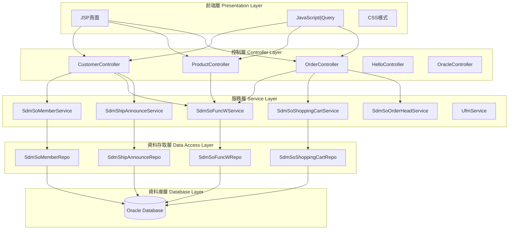
```mermaid
graph TB
    subgraph "前端層 Presentation Layer"
        A[JSP頁面]
        B[JavaScript/jQuery]
        C[CSS樣式]
    end

    subgraph "控制層 Controller Layer"
        D[CustomerController]
        E[ProductController]
        F[OrderController]
        G[HelloController]
        H[OracleController]
    end

    subgraph "服務層 Service Layer"
        I[SdmSoMemberService]
        J[SdmSoFuncWService]
        K[SdmSoShoppingCartService]
        L[SdmSoOrderHeadService]
        M[SdmShipAnnounceService]
        N[UfmService]
    end

    subgraph "資料存取層 Data Access Layer"
        O[SdmSoMemberRepo]
        P[SdmSoFuncWRepo]
        Q[SdmSoShoppingCartRepo]
        R[SdmShipAnnounceRepo]
    end

    subgraph "資料庫層 Database Layer"
        S[(Oracle Database)]
    end

    A --> D
    A --> E
    A --> F
    B --> D
    B --> E
    B --> F

    D --> I
    D --> J
    D --> M
    E --> J
    F --> J
    F --> K
    F --> L

    I --> O
    J --> P
    K --> Q
    M --> R

    O --> S
    P --> S
    Q --> S
    R --> S
```

### 2.2 架構模式
系統採用經典的 **MVC (Model-View-Controller)** 架構模式：

- **Model (模型層)**:
  - Entity類別 (SdmSoMember, SdmSoShoppingCart, SdmShipAnnounce等)
  - Repository介面 (JPA Data Repository)

- **View (視圖層)**:
  - JSP頁面 (index.jsp, login.jsp, products.jsp, cart.jsp, orders.jsp等)
  - 前端資源 (CSS, JavaScript)

- **Controller (控制層)**:
  - Spring MVC Controllers (CustomerController, ProductController, OrderController等)
  - Service層 (業務邏輯處理)

### 2.3 分層職責

#### 2.3.1 表現層 (Presentation Layer)
- **技術**: JSP, HTML, CSS, JavaScript, jQuery
- **職責**:
  - 用戶界面渲染
  - 用戶輸入驗證
  - AJAX請求處理
  - 動態內容更新

#### 2.3.2 控制層 (Controller Layer)
- **技術**: Spring MVC @Controller, @RestController
- **職責**:
  - 接收HTTP請求
  - 參數驗證與轉換
  - 調用Service層業務邏輯
  - 返回視圖或JSON數據

#### 2.3.3 服務層 (Service Layer)
- **技術**: Spring @Service
- **職責**:
  - 業務邏輯處理
  - 事務管理
  - 調用Repository進行數據操作
  - 數據轉換與封裝

#### 2.3.4 資料存取層 (Data Access Layer)
- **技術**: Spring Data JPA, JPA Repository
- **職責**:
  - 數據庫CRUD操作
  - 存儲過程調用
  - 查詢結果映射

#### 2.3.5 資料庫層 (Database Layer)
- **技術**: Oracle Database 11g
- **職責**:
  - 數據持久化
  - 存儲過程執行
  - 事務管理

---

## 3. 技術堆疊

### 3.1 後端技術

| 技術 | 版本 | 用途 |
|------|------|------|
| Java | 1.8 | 開發語言 |
| Spring Boot | 2.1.9.BUILD-SNAPSHOT | 應用框架 |
| Spring MVC | 2.1.9 | Web MVC框架 |
| Spring Data JPA | 2.1.9 | 數據持久化 |
| Hibernate | 5.3.x | ORM框架 |
| Oracle JDBC | 19.3.0.0 | 數據庫驅動 |
| Maven | 3.x | 專案管理工具 |

### 3.2 前端技術

| 技術 | 版本 | 用途 |
|------|------|------|
| JSP | 2.3 | 視圖模板 |
| jQuery | 1.8.3 | JavaScript庫 |
| jQuery UI | - | UI組件庫 |
| DataTables | 1.10.20 | 表格插件 |
| Owl Carousel | - | 輪播圖插件 |
| Bootstrap | 3.3.7 | CSS框架 |
| Font Awesome | 4.7.0 | 圖標庫 |

### 3.3 工具與插件

| 工具 | 用途 |
|------|------|
| Kaptcha | 驗證碼生成 |
| Gson | JSON處理 |
| org.json | JSON處理 |
| Tomcat Embed | 內嵌Web容器 |
| Spring DevTools | 開發熱部署 |

### 3.4 數據庫
- **類型**: Oracle Database
- **版本**: 11g
- **連接方式**: JDBC Thin Driver
- **連接池**: HikariCP (Spring Boot默認)

---

## 4. 功能模組分析

### 4.1 會員管理模組

#### 4.1.1 功能概述
負責會員的註冊、登入、資料維護、密碼管理等功能。

#### 4.1.2 核心類別
- **Controller**: `CustomerController`
- **Service**: `SdmSoMemberService`, `SdmSoFuncWService`
- **Repository**: `SdmSoMemberRepo`
- **Entity**: `SdmSoMember`, `LoginMember`

#### 4.1.3 主要功能

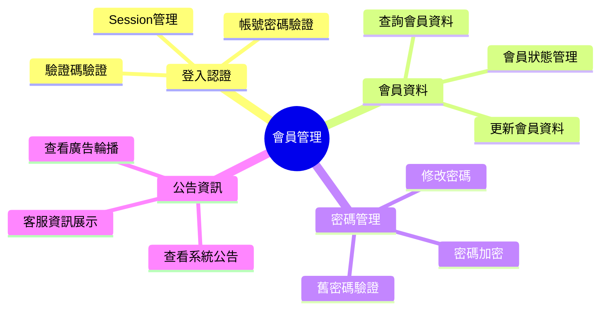
```mermaid
mindmap
  root((會員管理))
    登入認證
      驗證碼驗證
      帳號密碼驗證
      Session管理
    會員資料
      查詢會員資料
      更新會員資料
      會員狀態管理
    密碼管理
      修改密碼
      密碼加密
      舊密碼驗證
    公告資訊
      查看系統公告
      查看廣告輪播
      客服資訊展示
```

#### 4.1.4 關鍵API端點

| 端點 | 方法 | 功能 | 返回類型 |
|------|------|------|----------|
| `/login` | GET | 顯示登入頁面 | JSP |
| `/loginCheck` | POST | 驗證登入 | JSON |
| `/index` | GET | 首頁 | JSP |
| `/loadMember` | GET | 會員資料頁面 | JSP |
| `/getMemberData` | GET | 取得會員資料 | JSON |
| `/postUpdtMember` | POST | 更新會員資料 | JSON |
| `/loadChangePasswordView` | GET | 密碼修改頁面 | JSP |
| `/postUpdtPassword` | POST | 更新密碼 | JSON |
| `/getKaptchaImage` | GET | 取得驗證碼圖片 | Image |

#### 4.1.5 業務流程 - 登入流程

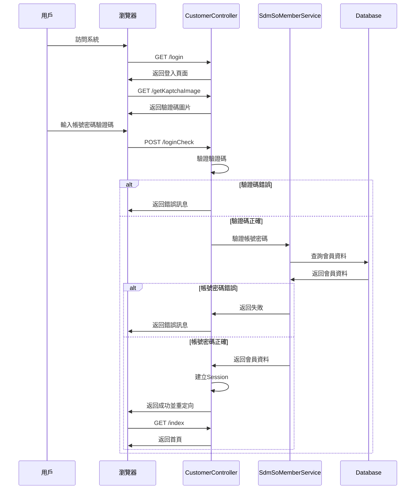
```mermaid
sequenceDiagram
    participant U as 用戶
    participant B as 瀏覽器
    participant C as CustomerController
    participant S as SdmSoMemberService
    participant D as Database

    U->>B: 訪問系統
    B->>C: GET /login
    C->>B: 返回登入頁面
    B->>C: GET /getKaptchaImage
    C->>B: 返回驗證碼圖片

    U->>B: 輸入帳號密碼驗證碼
    B->>C: POST /loginCheck
    C->>C: 驗證驗證碼
    alt 驗證碼錯誤
        C->>B: 返回錯誤訊息
    else 驗證碼正確
        C->>S: 驗證帳號密碼
        S->>D: 查詢會員資料
        D->>S: 返回會員資料
        alt 帳號密碼錯誤
            S->>C: 返回失敗
            C->>B: 返回錯誤訊息
        else 帳號密碼正確
            S->>C: 返回會員資料
            C->>C: 建立Session
            C->>B: 返回成功並重定向
            B->>C: GET /index
            C->>B: 返回首頁
        end
    end
```

### 4.2 產品管理模組

#### 4.2.1 功能概述
提供產品分類、系列、品項的查詢與展示功能，支援多種查詢方式。

#### 4.2.2 核心類別
- **Controller**: `ProductController`
- **Service**: `SdmSoFuncWService`
- **Repository**: `SdmSoFuncWRepo`

#### 4.2.3 主要功能

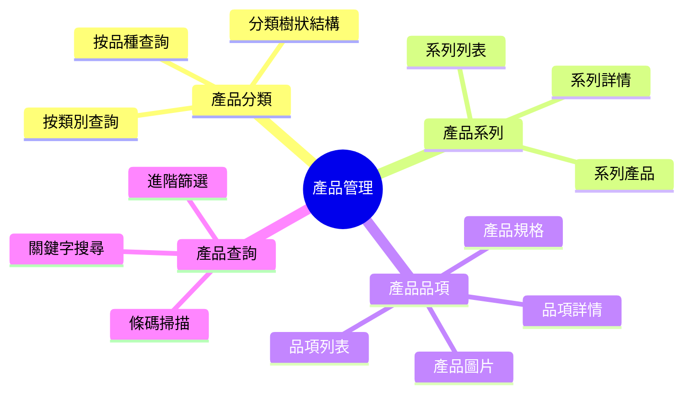
```mermaid
mindmap
  root((產品管理))
    產品分類
      按類別查詢
      按品種查詢
      分類樹狀結構
    產品系列
      系列列表
      系列詳情
      系列產品
    產品品項
      品項列表
      品項詳情
      產品圖片
      產品規格
    產品查詢
      關鍵字搜尋
      條碼掃描
      進階篩選
```

#### 4.2.4 關鍵API端點

| 端點 | 方法 | 功能 | 返回類型 |
|------|------|------|----------|
| `/getIemKindJsonByCategory` | GET | 依類別取得品種 | JSON |
| `/getSeriesJsonByKind` | GET | 依品種取得系列 | JSON |
| `/view_product_series` | GET | 產品系列頁面 | JSP |
| `/view_product_series2` | GET | 產品系列頁面2 | JSP |
| `/getIemJsonBySeries` | GET | 依系列取得品項 | JSON |
| `/getItemJsonByKeyword` | GET | 關鍵字查詢品項 | JSON |
| `/getItemImageJson` | GET | 取得產品圖片 | JSON |
| `/getPartDegreeJson` | GET | 取得產品規格 | JSON |
| `/getAtyEan13CheckResultJson` | GET | 條碼驗證 | JSON |

#### 4.2.5 產品查詢流程

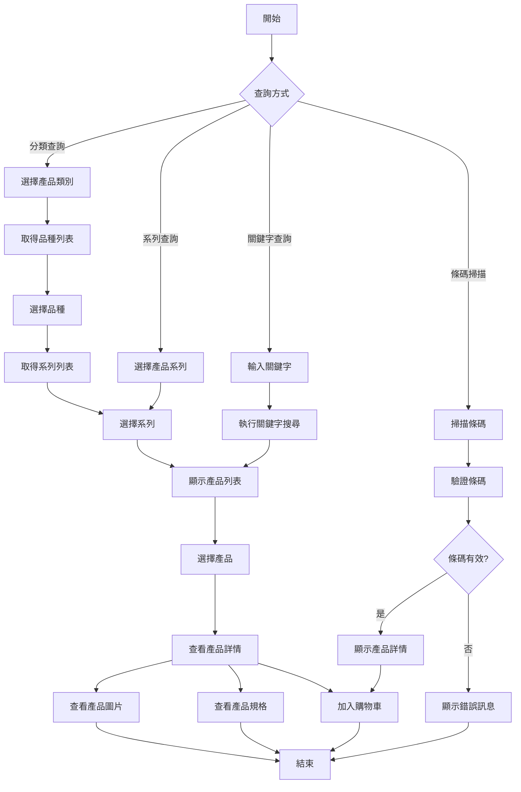
```mermaid
flowchart TD
    A[開始] --> B{查詢方式}
    B -->|分類查詢| C[選擇產品類別]
    B -->|系列查詢| D[選擇產品系列]
    B -->|關鍵字查詢| E[輸入關鍵字]
    B -->|條碼掃描| F[掃描條碼]

    C --> G[取得品種列表]
    G --> H[選擇品種]
    H --> I[取得系列列表]
    I --> J[選擇系列]

    D --> J

    J --> K[顯示產品列表]

    E --> L[執行關鍵字搜尋]
    L --> K

    F --> M[驗證條碼]
    M --> N{條碼有效?}
    N -->|是| O[顯示產品詳情]
    N -->|否| P[顯示錯誤訊息]

    K --> Q[選擇產品]
    Q --> R[查看產品詳情]
    R --> S[查看產品圖片]
    R --> T[查看產品規格]
    R --> U[加入購物車]

    O --> U
    U --> V[結束]
    P --> V
    S --> V
    T --> V
```

### 4.3 購物車管理模組

#### 4.3.1 功能概述
管理用戶的購物車，包括商品的增刪改查、數量調整、批次操作等。

#### 4.3.2 核心類別
- **Controller**: `OrderController`
- **Service**: `SdmSoShoppingCartService`, `SdmSoFuncWService`
- **Repository**: `SdmSoShoppingCartRepo`
- **Entity**: `SdmSoShoppingCart`

#### 4.3.3 主要功能

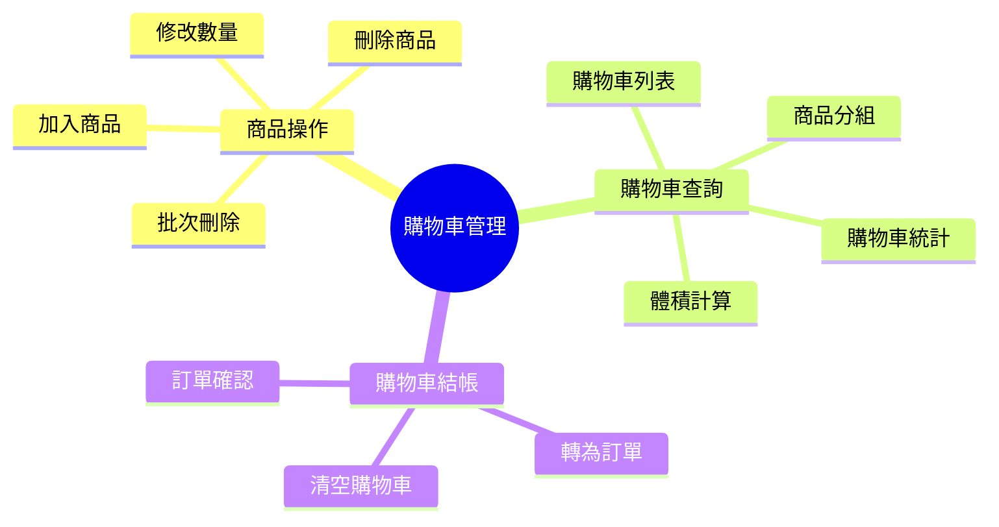
```mermaid
mindmap
  root((購物車管理))
    商品操作
      加入商品
      刪除商品
      修改數量
      批次刪除
    購物車查詢
      購物車列表
      購物車統計
      商品分組
      體積計算
    購物車結帳
      轉為訂單
      清空購物車
      訂單確認
```

#### 4.3.4 關鍵API端點

| 端點 | 方法 | 功能 | 返回類型 |
|------|------|------|----------|
| `/postAddPartToCart` | POST | 加入商品到購物車 | JSON |
| `/view_shopping_cart` | GET | 購物車頁面 | JSP |
| `/delShoppinCart` | POST | 刪除購物車商品 | JSON |
| `/updtShoppinCart` | POST | 更新購物車數量 | JSON |
| `/getCartCount` | GET | 取得購物車數量 | JSON |
| `/getPartGroupCartCount` | GET | 取得分組數量 | JSON |
| `/getCartDetailsCondition` | GET | 取得購物車明細 | JSON |
| `/getCartSummary` | GET | 取得購物車摘要 | JSON |
| `/getCartHead` | GET | 取得購物車表頭 | JSON |
| `/getCartHeadDetail` | GET | 取得購物車詳情 | JSON |
| `/updtShoppinCartPart` | POST | 更新商品規格 | JSON |
| `/postBatchDelShoppingCart` | POST | 批次刪除 | JSON |
| `/getCartVolumnInfo` | GET | 取得體積資訊 | JSON |
| `/postTransferToSale` | POST | 轉為訂單 | JSON |

#### 4.3.5 購物車操作流程

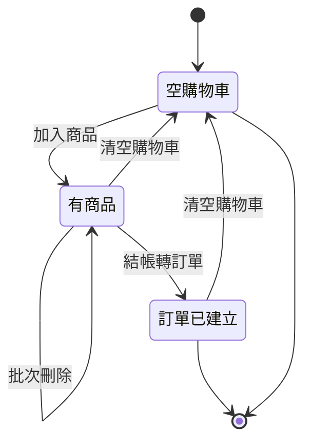
```mermaid
stateDiagram-v2
    [*] --> 空購物車
    空購物車 --> 有商品: 加入商品
    有商品 --> 有商品: 加入商品
    有商品 --> 有商品: 修改數量
    有商品 --> 有商品: 刪除商品
    有商品 --> 有商品: 批次刪除
    有商品 --> 空購物車: 清空購物車
    有商品 --> 訂單已建立: 結帳轉訂單
    訂單已建立 --> 空購物車: 清空購物車
    訂單已建立 --> [*]
    空購物車 --> [*]
```

### 4.4 訂單管理模組

#### 4.4.1 功能概述
管理客戶訂單的查詢、取消、複製等操作。

#### 4.4.2 核心類別
- **Controller**: `OrderController`
- **Service**: `SdmSoOrderHeadService`, `SdmSoFuncWService`
- **Entity**: `SoResult`

#### 4.4.3 主要功能

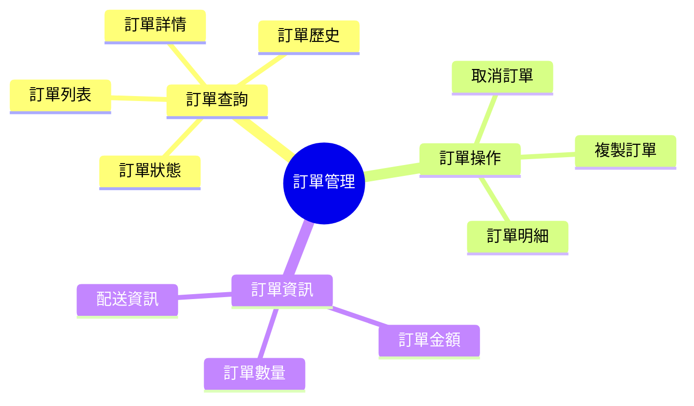
```mermaid
mindmap
  root((訂單管理))
    訂單查詢
      訂單列表
      訂單詳情
      訂單狀態
      訂單歷史
    訂單操作
      取消訂單
      複製訂單
      訂單明細
    訂單資訊
      訂單金額
      訂單數量
      配送資訊
```

#### 4.4.4 關鍵API端點

| 端點 | 方法 | 功能 | 返回類型 |
|------|------|------|----------|
| `/view_orders` | GET | 訂單列表頁面 | JSP |
| `/getOrders` | GET | 取得訂單列表 | JSON |
| `/getOrderDetails` | GET | 取得訂單詳情 | JSON |
| `/getOrderDetailJson` | GET | 取得訂單明細JSON | JSON |
| `/delOrder` | POST | 取消訂單 | JSON |
| `/copyOrder` | POST | 複製訂單 | JSON |

#### 4.4.5 訂單處理流程

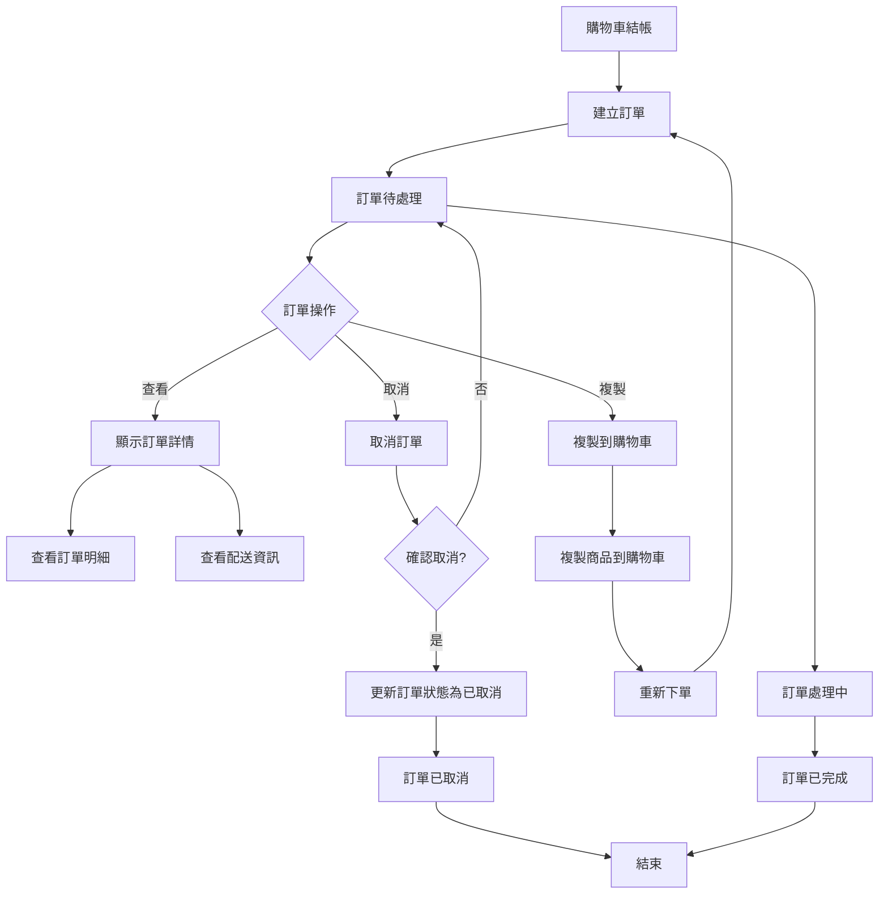
```mermaid
flowchart TD
    A[購物車結帳] --> B[建立訂單]
    B --> C[訂單待處理]

    C --> D{訂單操作}
    D -->|查看| E[顯示訂單詳情]
    D -->|取消| F[取消訂單]
    D -->|複製| G[複製到購物車]

    E --> H[查看訂單明細]
    E --> I[查看配送資訊]

    F --> J{確認取消?}
    J -->|是| K[更新訂單狀態為已取消]
    J -->|否| C

    G --> L[複製商品到購物車]
    L --> M[重新下單]

    K --> N[訂單已取消]
    M --> B

    C --> O[訂單處理中]
    O --> P[訂單已完成]

    N --> Q[結束]
    P --> Q
```

### 4.5 公告管理模組

#### 4.5.1 功能概述
管理系統公告、廣告輪播和客服資訊的展示。

#### 4.5.2 核心類別
- **Controller**: `CustomerController`
- **Service**: `SdmShipAnnounceService`, `SdmSoFuncWService`
- **Repository**: `SdmShipAnnounceRepo`
- **Entity**: `SdmShipAnnounce`, `SdmShipAnnounceCustomer`

#### 4.5.3 主要功能
- 系統公告展示
- 廣告輪播圖管理
- 客服中心資訊展示
- 公告有效期管理

---

## 5. 資料模型設計

### 5.1 核心實體類別

#### 5.1.1 SdmSoMember (會員表)

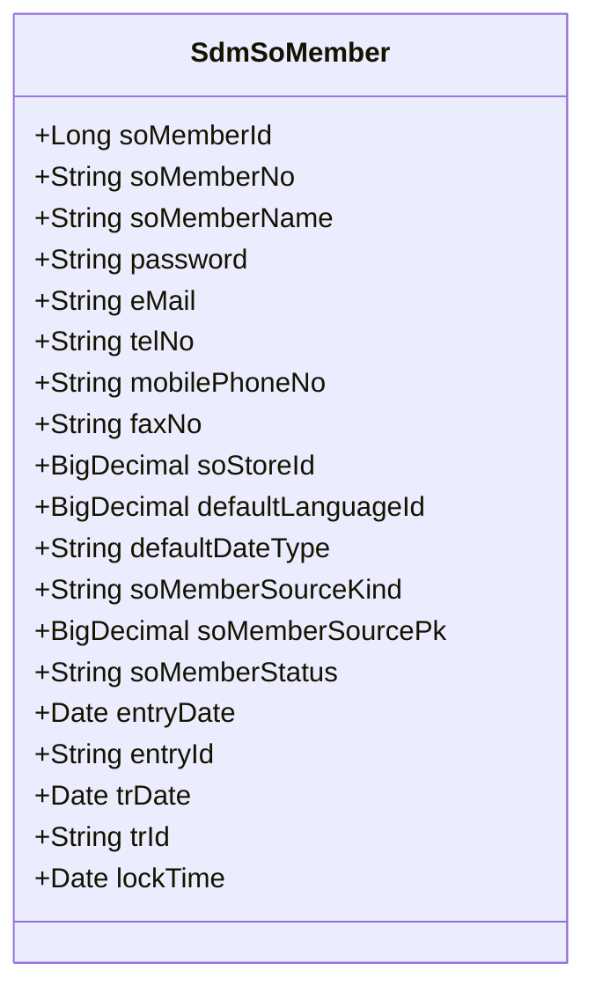
```mermaid
classDiagram
    class SdmSoMember {
        +Long soMemberId
        +String soMemberNo
        +String soMemberName
        +String password
        +String eMail
        +String telNo
        +String mobilePhoneNo
        +String faxNo
        +BigDecimal soStoreId
        +BigDecimal defaultLanguageId
        +String defaultDateType
        +String soMemberSourceKind
        +BigDecimal soMemberSourcePk
        +String soMemberStatus
        +Date entryDate
        +String entryId
        +Date trDate
        +String trId
        +Date lockTime
    }
```

**欄位說明**:
- `soMemberId`: 會員ID (主鍵)
- `soMemberNo`: 會員編號
- `soMemberName`: 會員名稱
- `password`: 密碼 (加密儲存)
- `eMail`: 電子郵件
- `telNo`: 電話號碼
- `mobilePhoneNo`: 手機號碼
- `soStoreId`: 商店ID
- `defaultLanguageId`: 預設語言ID
- `soMemberStatus`: 會員狀態
- `entryDate`: 建立日期
- `trDate`: 異動日期

#### 5.1.2 SdmSoShoppingCart (購物車表)

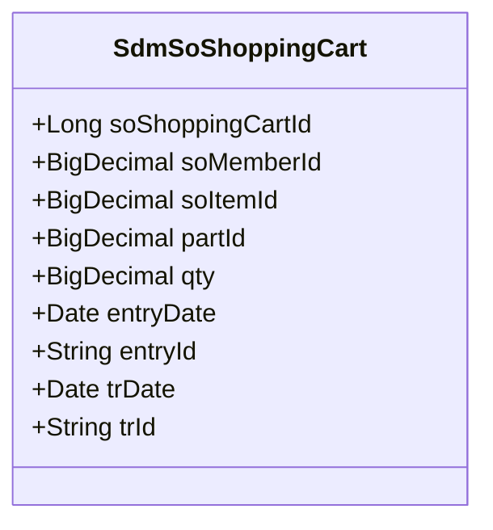
```mermaid
classDiagram
    class SdmSoShoppingCart {
        +Long soShoppingCartId
        +BigDecimal soMemberId
        +BigDecimal soItemId
        +BigDecimal partId
        +BigDecimal qty
        +Date entryDate
        +String entryId
        +Date trDate
        +String trId
    }
```

**欄位說明**:
- `soShoppingCartId`: 購物車ID (主鍵)
- `soMemberId`: 會員ID (外鍵)
- `soItemId`: 產品ID
- `partId`: 規格ID
- `qty`: 數量
- `entryDate`: 建立日期
- `trDate`: 異動日期

#### 5.1.3 SdmShipAnnounce (公告表)

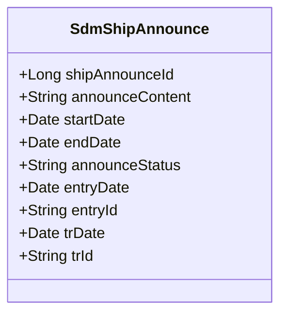
```mermaid
classDiagram
    class SdmShipAnnounce {
        +Long shipAnnounceId
        +String announceContent
        +Date startDate
        +Date endDate
        +String announceStatus
        +Date entryDate
        +String entryId
        +Date trDate
        +String trId
    }
```

#### 5.1.4 LoginMember (登入會員資訊)

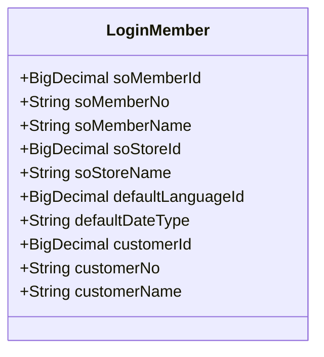
```mermaid
classDiagram
    class LoginMember {
        +BigDecimal soMemberId
        +String soMemberNo
        +String soMemberName
        +BigDecimal soStoreId
        +String soStoreName
        +BigDecimal defaultLanguageId
        +String defaultDateType
        +BigDecimal customerId
        +String customerNo
        +String customerName
    }
```

### 5.2 實體關係圖 (ER Diagram)

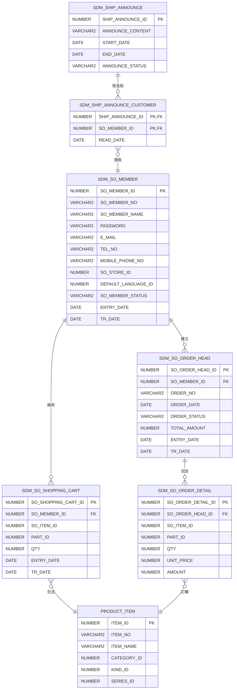
```mermaid
erDiagram
    SDM_SO_MEMBER ||--o{ SDM_SO_SHOPPING_CART : "擁有"
    SDM_SO_MEMBER ||--o{ SDM_SO_ORDER_HEAD : "建立"
    SDM_SO_SHOPPING_CART }o--|| PRODUCT_ITEM : "包含"
    SDM_SO_ORDER_HEAD ||--o{ SDM_SO_ORDER_DETAIL : "包含"
    SDM_SO_ORDER_DETAIL }o--|| PRODUCT_ITEM : "訂購"
    SDM_SHIP_ANNOUNCE ||--o{ SDM_SHIP_ANNOUNCE_CUSTOMER : "發送給"
    SDM_SHIP_ANNOUNCE_CUSTOMER }o--|| SDM_SO_MEMBER : "接收"

    SDM_SO_MEMBER {
        NUMBER SO_MEMBER_ID PK
        VARCHAR2 SO_MEMBER_NO
        VARCHAR2 SO_MEMBER_NAME
        VARCHAR2 PASSWORD
        VARCHAR2 E_MAIL
        VARCHAR2 TEL_NO
        VARCHAR2 MOBILE_PHONE_NO
        NUMBER SO_STORE_ID
        NUMBER DEFAULT_LANGUAGE_ID
        VARCHAR2 SO_MEMBER_STATUS
        DATE ENTRY_DATE
        DATE TR_DATE
    }

    SDM_SO_SHOPPING_CART {
        NUMBER SO_SHOPPING_CART_ID PK
        NUMBER SO_MEMBER_ID FK
        NUMBER SO_ITEM_ID
        NUMBER PART_ID
        NUMBER QTY
        DATE ENTRY_DATE
        DATE TR_DATE
    }

    SDM_SO_ORDER_HEAD {
        NUMBER SO_ORDER_HEAD_ID PK
        NUMBER SO_MEMBER_ID FK
        VARCHAR2 ORDER_NO
        DATE ORDER_DATE
        VARCHAR2 ORDER_STATUS
        NUMBER TOTAL_AMOUNT
        DATE ENTRY_DATE
        DATE TR_DATE
    }

    SDM_SO_ORDER_DETAIL {
        NUMBER SO_ORDER_DETAIL_ID PK
        NUMBER SO_ORDER_HEAD_ID FK
        NUMBER SO_ITEM_ID
        NUMBER PART_ID
        NUMBER QTY
        NUMBER UNIT_PRICE
        NUMBER AMOUNT
    }

    PRODUCT_ITEM {
        NUMBER ITEM_ID PK
        VARCHAR2 ITEM_NO
        VARCHAR2 ITEM_NAME
        NUMBER CATEGORY_ID
        NUMBER KIND_ID
        NUMBER SERIES_ID
    }

    SDM_SHIP_ANNOUNCE {
        NUMBER SHIP_ANNOUNCE_ID PK
        VARCHAR2 ANNOUNCE_CONTENT
        DATE START_DATE
        DATE END_DATE
        VARCHAR2 ANNOUNCE_STATUS
    }

    SDM_SHIP_ANNOUNCE_CUSTOMER {
        NUMBER SHIP_ANNOUNCE_ID PK,FK
        NUMBER SO_MEMBER_ID PK,FK
        DATE READ_DATE
    }
```

### 5.3 資料庫設計說明

#### 5.3.1 命名規範
- 表名: 使用大寫字母和底線分隔，前綴為 `SDM_SO_`
- 欄位名: 使用大寫字母和底線分隔
- 主鍵: 表名 + `_ID`
- 外鍵: 參照表名 + `_ID`

#### 5.3.2 索引策略
- 主鍵自動建立唯一索引
- 外鍵欄位建立索引以提升查詢效能
- 常用查詢欄位建立複合索引

#### 5.3.3 資料完整性
- 主鍵約束: 確保每筆記錄唯一性
- 外鍵約束: 維護資料參照完整性
- 非空約束: 必填欄位不允許NULL
- 檢查約束: 狀態欄位限定值域

---

## 6. API接口設計

### 6.1 RESTful API設計原則

雖然系統部分採用傳統的MVC模式，但API設計遵循以下原則：
- 使用HTTP方法表達操作意圖 (GET查詢, POST新增/更新, DELETE刪除)
- 返回統一的JSON格式
- 適當的HTTP狀態碼
- 錯誤訊息標準化

### 6.2 API分類

#### 6.2.1 會員相關API

| API端點 | HTTP方法 | 功能 | 請求參數 | 響應格式 |
|---------|----------|------|----------|----------|
| `/loginCheck` | POST | 登入驗證 | username, password, code | `{success: boolean, message: string}` |
| `/getMemberData` | GET | 取得會員資料 | - | `{soMemberId, soMemberName, email, ...}` |
| `/postUpdtMember` | POST | 更新會員資料 | memberData | `{success: boolean, message: string}` |
| `/postUpdtPassword` | POST | 修改密碼 | oldPassword, newPassword | `{success: boolean, message: string}` |

#### 6.2.2 產品相關API

| API端點 | HTTP方法 | 功能 | 請求參數 | 響應格式 |
|---------|----------|------|----------|----------|
| `/getIemKindJsonByCategory` | GET | 取得品種 | categoryId | `[{kindId, kindName, ...}]` |
| `/getSeriesJsonByKind` | GET | 取得系列 | kindId | `[{seriesId, seriesName, ...}]` |
| `/getIemJsonBySeries` | GET | 取得品項 | seriesId | `[{itemId, itemName, price, ...}]` |
| `/getItemJsonByKeyword` | GET | 關鍵字查詢 | keyword | `[{itemId, itemName, ...}]` |
| `/getItemImageJson` | GET | 取得產品圖片 | itemId | `[{imageUrl, imageType, ...}]` |

#### 6.2.3 購物車相關API

| API端點 | HTTP方法 | 功能 | 請求參數 | 響應格式 |
|---------|----------|------|----------|----------|
| `/postAddPartToCart` | POST | 加入購物車 | itemId, partId, qty | `{success: boolean, message: string}` |
| `/getCartCount` | GET | 購物車數量 | - | `{count: number}` |
| `/getCartSummary` | GET | 購物車摘要 | - | `{totalQty, totalAmount, ...}` |
| `/getCartHeadDetail` | GET | 購物車詳情 | - | `[{cartId, itemName, qty, price, ...}]` |
| `/updtShoppinCart` | POST | 更新數量 | cartId, qty | `{success: boolean, message: string}` |
| `/delShoppinCart` | POST | 刪除商品 | cartId | `{success: boolean, message: string}` |
| `/postBatchDelShoppingCart` | POST | 批次刪除 | cartIds[] | `{success: boolean, message: string}` |
| `/postTransferToSale` | POST | 轉為訂單 | - | `{success: boolean, orderId, message: string}` |

#### 6.2.4 訂單相關API

| API端點 | HTTP方法 | 功能 | 請求參數 | 響應格式 |
|---------|----------|------|----------|----------|
| `/getOrders` | GET | 訂單列表 | startDate, endDate | `[{orderId, orderNo, orderDate, status, ...}]` |
| `/getOrderDetails` | GET | 訂單詳情 | orderId | `{orderHead, orderDetails[]}` |
| `/delOrder` | POST | 取消訂單 | orderId | `{success: boolean, message: string}` |
| `/copyOrder` | POST | 複製訂單 | orderId | `{success: boolean, message: string}` |

### 6.3 統一響應格式

#### 6.3.1 成功響應
```json
{
  "success": true,
  "data": {
    // 業務數據
  },
  "message": "操作成功"
}
```

#### 6.3.2 錯誤響應
```json
{
  "success": false,
  "error": {
    "code": "ERROR_CODE",
    "message": "錯誤訊息"
  }
}
```

#### 6.3.3 列表響應
```json
{
  "success": true,
  "data": [
    {
      // 列表項目1
    },
    {
      // 列表項目2
    }
  ],
  "total": 100,
  "page": 1,
  "pageSize": 20
}
```

---

## 7. 安全性設計

### 7.1 認證與授權

#### 7.1.1 Session管理
- 使用Spring Session管理用戶會話
- Session超時時間設定
- 登入狀態驗證

#### 7.1.2 過濾器 (A3Filter)

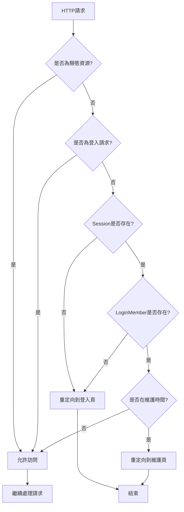
```mermaid
flowchart TD
    A[HTTP請求] --> B{是否為靜態資源?}
    B -->|是| C[允許訪問]
    B -->|否| D{是否為登入請求?}
    D -->|是| C
    D -->|否| E{Session是否存在?}
    E -->|否| F[重定向到登入頁]
    E -->|是| G{LoginMember是否存在?}
    G -->|否| F
    G -->|是| H{是否在維護時間?}
    H -->|是| I[重定向到維護頁]
    H -->|否| C

    C --> J[繼續處理請求]
    F --> K[結束]
    I --> K
```

**過濾規則**:
1. 靜態資源 (CSS, JS, 圖片等) 直接放行
2. 登入相關請求直接放行
3. 其他請求檢查Session中是否有LoginMember
4. 未登入用戶重定向到登入頁面
5. 支援系統維護時間設定

#### 7.1.3 驗證碼機制
- 使用Kaptcha生成驗證碼
- 驗證碼儲存在Session中
- 登入時驗證驗證碼正確性
- 防止暴力破解

### 7.2 密碼安全

#### 7.2.1 密碼加密
- 使用EncryptionUtil進行密碼加密
- 不儲存明文密碼
- 密碼修改需驗證舊密碼

#### 7.2.2 密碼策略
- 密碼長度限制
- 密碼複雜度要求
- 定期修改密碼提醒

### 7.3 SQL注入防護

- 使用JPA參數化查詢
- 避免字串拼接SQL
- 使用存儲過程調用

### 7.4 XSS防護

- 輸入驗證與過濾
- 輸出編碼
- Content-Type設定

### 7.5 CSRF防護

- 使用Spring Security CSRF Token
- 表單提交驗證Token
- AJAX請求攜帶Token

---

## 8. 部署架構

### 8.1 部署環境

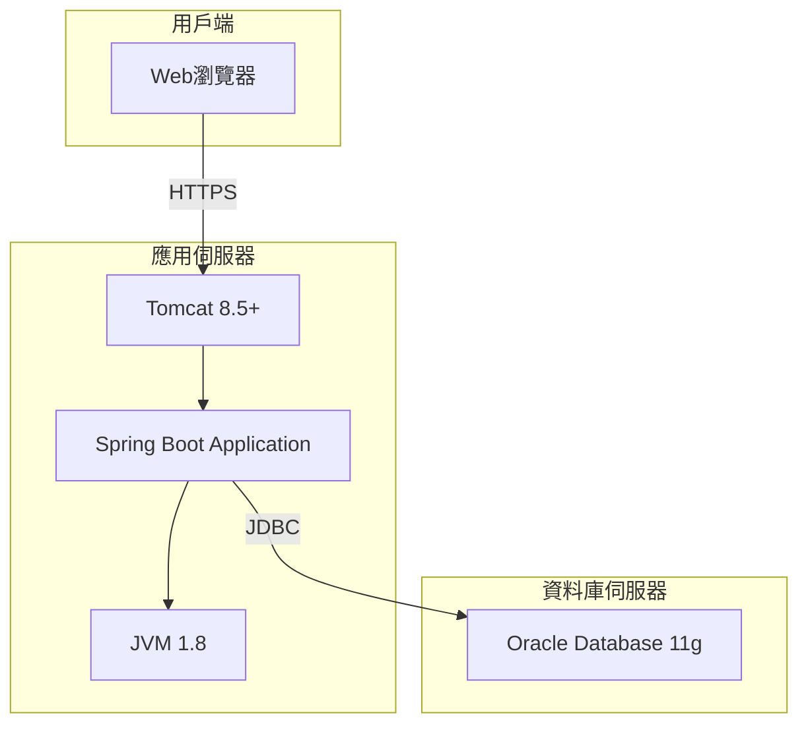
```mermaid
graph TB
    subgraph "用戶端"
        A[Web瀏覽器]
    end

    subgraph "應用伺服器"
        B[Tomcat 8.5+]
        C[Spring Boot Application]
        D[JVM 1.8]
    end

    subgraph "資料庫伺服器"
        E[Oracle Database 11g]
    end

    A -->|HTTPS| B
    B --> C
    C --> D
    C -->|JDBC| E
```

### 8.2 部署配置

#### 8.2.1 應用配置 (application.properties)

```properties
# 伺服器配置
server.servlet.contextPath=/sdmsaleorder
server.port=8080

# 視圖配置
spring.mvc.view.prefix=/WEB-INF/jsp/
spring.mvc.view.suffix=.jsp

# JPA配置
spring.jpa.properties.hibernate.proc.param_null_passing=true
spring.jpa.generate-ddl=false
spring.jpa.hibernate.ddl-auto=none
spring.jpa.show-sql=true

# 環境配置
spring.profiles.active=test
```

#### 8.2.2 資料庫配置 (application-test.properties)

```properties
spring.datasource.driver-class-name=oracle.jdbc.driver.OracleDriver
spring.datasource.url=jdbc:oracle:thin:@//60.249.24.174:1521/db11g.ginko.com.tw
spring.datasource.username=prg
spring.datasource.password=prg7695
```

### 8.3 打包部署

#### 8.3.1 Maven打包
```bash
mvn clean package
```

#### 8.3.2 WAR部署
- 打包格式: WAR
- 部署到Tomcat webapps目錄
- 或使用Spring Boot內嵌Tomcat運行

#### 8.3.3 運行方式
```bash
# 方式1: 使用Maven運行
mvn spring-boot:run

# 方式2: 使用java -jar運行
java -jar SdmSaleOrderTest.war

# 方式3: 部署到外部Tomcat
cp SdmSaleOrderTest.war $TOMCAT_HOME/webapps/
```

### 8.4 環境要求

| 組件 | 版本要求 |
|------|----------|
| JDK | 1.8+ |
| Tomcat | 8.5+ |
| Oracle Database | 11g+ |
| Maven | 3.x |
| 記憶體 | 最小2GB |
| 磁碟空間 | 最小500MB |

---

## 9. 系統流程圖

### 9.1 整體業務流程

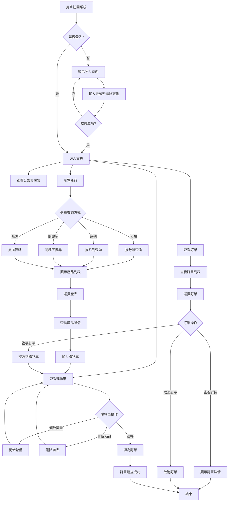
```mermaid
flowchart TD
    A[用戶訪問系統] --> B{是否登入?}
    B -->|否| C[顯示登入頁面]
    C --> D[輸入帳號密碼驗證碼]
    D --> E{驗證成功?}
    E -->|否| C
    E -->|是| F[進入首頁]
    B -->|是| F

    F --> G[查看公告與廣告]
    F --> H[瀏覽產品]
    F --> I[查看購物車]
    F --> J[查看訂單]

    H --> K{選擇查詢方式}
    K -->|分類| L[按分類查詢]
    K -->|系列| M[按系列查詢]
    K -->|關鍵字| N[關鍵字搜尋]
    K -->|條碼| O[掃描條碼]

    L --> P[顯示產品列表]
    M --> P
    N --> P
    O --> P

    P --> Q[選擇產品]
    Q --> R[查看產品詳情]
    R --> S[加入購物車]

    S --> I
    I --> T{購物車操作}
    T -->|修改數量| U[更新數量]
    T -->|刪除商品| V[刪除商品]
    T -->|結帳| W[轉為訂單]

    U --> I
    V --> I
    W --> X[訂單建立成功]

    J --> Y[查看訂單列表]
    Y --> Z[選擇訂單]
    Z --> AA{訂單操作}
    AA -->|查看詳情| AB[顯示訂單詳情]
    AA -->|取消訂單| AC[取消訂單]
    AA -->|複製訂單| AD[複製到購物車]

    AD --> I

    AB --> AE[結束]
    AC --> AE
    X --> AE
```

### 9.2 購物車到訂單流程

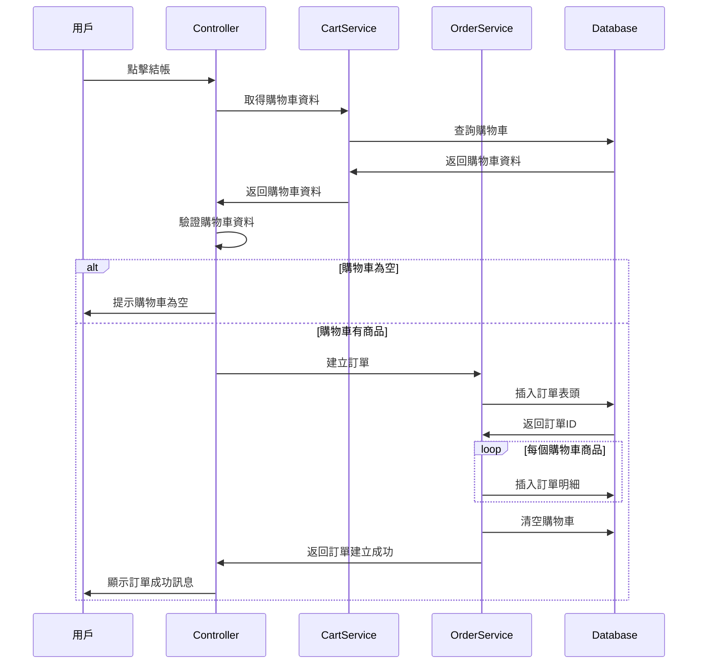
```mermaid
sequenceDiagram
    participant U as 用戶
    participant C as Controller
    participant CS as CartService
    participant OS as OrderService
    participant DB as Database

    U->>C: 點擊結帳
    C->>CS: 取得購物車資料
    CS->>DB: 查詢購物車
    DB->>CS: 返回購物車資料
    CS->>C: 返回購物車資料

    C->>C: 驗證購物車資料
    alt 購物車為空
        C->>U: 提示購物車為空
    else 購物車有商品
        C->>OS: 建立訂單
        OS->>DB: 插入訂單表頭
        DB->>OS: 返回訂單ID

        loop 每個購物車商品
            OS->>DB: 插入訂單明細
        end

        OS->>DB: 清空購物車
        OS->>C: 返回訂單建立成功
        C->>U: 顯示訂單成功訊息
    end
```

### 9.3 產品查詢流程

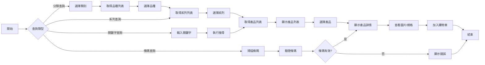
```mermaid
flowchart LR
    A[開始] --> B{查詢類型}

    B -->|分類查詢| C[選擇類別]
    C --> D[取得品種列表]
    D --> E[選擇品種]
    E --> F[取得系列列表]
    F --> G[選擇系列]
    G --> H[取得產品列表]

    B -->|系列查詢| F

    B -->|關鍵字查詢| I[輸入關鍵字]
    I --> J[執行搜尋]
    J --> H

    B -->|條碼查詢| K[掃描條碼]
    K --> L[驗證條碼]
    L --> M{條碼有效?}
    M -->|是| N[顯示產品詳情]
    M -->|否| O[顯示錯誤]

    H --> P[顯示產品列表]
    P --> Q[選擇產品]
    Q --> N

    N --> R[查看圖片/規格]
    R --> S[加入購物車]
    S --> T[結束]
    O --> T
```

---

## 10. 附錄

### 10.1 專案結構

```
SdmSaleOrder/
├── src/
│   ├── main/
│   │   ├── java/
│   │   │   └── com/
│   │   │       └── sdm/
│   │   │           ├── SdmSaleOrderApplication.java
│   │   │           ├── ServletInitializer.java
│   │   │           ├── config/
│   │   │           │   ├── CaptchaConfig.java
│   │   │           │   └── FilterConfig.java
│   │   │           ├── controller/
│   │   │           │   ├── CustomerController.java
│   │   │           │   ├── ProductController.java
│   │   │           │   ├── OrderController.java
│   │   │           │   ├── HelloController.java
│   │   │           │   └── OracleController.java
│   │   │           ├── service/
│   │   │           │   ├── SdmSoMemberService.java
│   │   │           │   ├── SdmSoFuncWService.java
│   │   │           │   ├── SdmSoShoppingCartService.java
│   │   │           │   ├── SdmSoOrderHeadService.java
│   │   │           │   ├── SdmShipAnnounceService.java
│   │   │           │   ├── UfmService.java
│   │   │           │   └── FunStr.java
│   │   │           ├── dao/
│   │   │           │   ├── SdmSoMemberRepo.java
│   │   │           │   ├── SdmSoFuncWRepo.java
│   │   │           │   ├── SdmSoShoppingCartRepo.java
│   │   │           │   └── SdmShipAnnounceRepo.java
│   │   │           ├── entity/
│   │   │           │   ├── SdmSoMember.java
│   │   │           │   ├── SdmSoShoppingCart.java
│   │   │           │   ├── SdmSoFuncW.java
│   │   │           │   ├── SdmShipAnnounce.java
│   │   │           │   ├── SdmShipAnnounceCustomer.java
│   │   │           │   ├── LoginMember.java
│   │   │           │   ├── RespBean.java
│   │   │           │   ├── SoResult.java
│   │   │           │   └── CmmCustomerV.java
│   │   │           ├── filter/
│   │   │           │   └── A3Filter.java
│   │   │           └── utility/
│   │   │               ├── ConvertUtility.java
│   │   │               ├── DateUtil.java
│   │   │               ├── EncryptionUtil.java
│   │   │               └── SpringContextUtil.java
│   │   ├── resources/
│   │   │   ├── application.properties
│   │   │   ├── application-test.properties
│   │   │   ├── application-prod.properties
│   │   │   └── application-tw.properties
│   │   └── webapp/
│   │       └── WEB-INF/
│   │           └── jsp/
│   │               ├── index.jsp
│   │               ├── login.jsp
│   │               ├── header.jsp
│   │               ├── footer.jsp
│   │               ├── products.jsp
│   │               ├── series.jsp
│   │               ├── cart.jsp
│   │               ├── orders.jsp
│   │               ├── member_data.jsp
│   │               ├── password.jsp
│   │               ├── bulletin_board.jsp
│   │               ├── about.jsp
│   │               └── admin.jsp
│   └── test/
│       └── java/
├── pom.xml
└── README.md
```

### 10.2 關鍵技術點

#### 10.2.1 JPA存儲過程調用
系統大量使用Oracle存儲過程，透過JPA的`@Procedure`註解進行調用：

```java
@Repository
public interface SdmSoFuncWRepo extends JpaRepository<SdmSoFuncW, BigDecimal> {
    @Procedure(name = "procedureName")
    List<Object[]> callProcedure(
        @Param("param1") BigDecimal param1,
        @Param("param2") String param2
    );
}
```

#### 10.2.2 CLOB處理
處理Oracle CLOB類型數據：

```java
public String clobStringConversion(Clob clb) throws SQLException, IOException {
    if (clb == null) {
        return "";
    }
    StringBuffer strOut = new StringBuffer();
    String str = "";
    BufferedReader br = new BufferedReader(clb.getCharacterStream());
    while ((str = br.readLine()) != null) {
        strOut.append(str);
    }
    return strOut.toString();
}
```

#### 10.2.3 Session管理
使用HttpSession儲存登入會員資訊：

```java
LoginMember loginMember = new LoginMember();
// 設定會員資訊
session.setAttribute("loginMember", loginMember);
```

### 10.3 常見問題與解決方案

#### 10.3.1 Session超時問題
**問題**: 用戶長時間未操作導致Session超時
**解決**:
- 設定合理的Session超時時間
- 提供Session即將過期提醒
- 自動保存用戶操作數據

#### 10.3.2 購物車數據同步
**問題**: 多個頁面同時操作購物車可能導致數據不一致
**解決**:
- 使用資料庫事務保證數據一致性
- 操作後重新查詢購物車數據
- 使用樂觀鎖或悲觀鎖

#### 10.3.3 大量數據查詢性能
**問題**: 產品列表、訂單列表數據量大時查詢慢
**解決**:
- 實現分頁查詢
- 建立適當的資料庫索引
- 使用緩存機制

### 10.4 未來改進方向

1. **微服務架構**: 將單體應用拆分為微服務
2. **前後端分離**: 使用Vue.js或React重構前端
3. **緩存機制**: 引入Redis緩存熱點數據
4. **消息隊列**: 使用RabbitMQ處理異步任務
5. **容器化部署**: 使用Docker和Kubernetes
6. **API網關**: 統一API入口和安全控制
7. **分布式事務**: 使用Seata等分布式事務框架
8. **監控告警**: 集成Prometheus和Grafana
9. **日誌分析**: 使用ELK Stack進行日誌分析
10. **自動化測試**: 增加單元測試和集成測試覆蓋率

---

## 文件版本歷史

| 版本 | 日期 | 作者 | 變更說明 |
|------|------|------|----------|
| 1.0 | 2026-01-26 | System Analysis | 初始版本 |

---

**文件結束**
