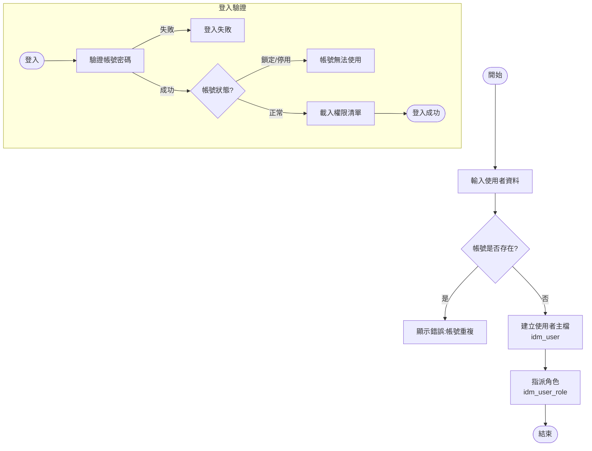
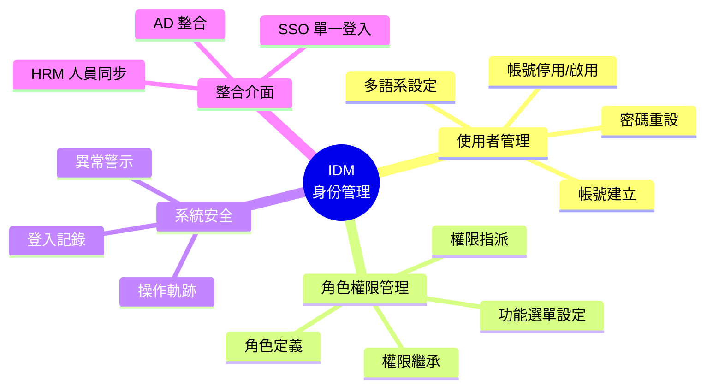
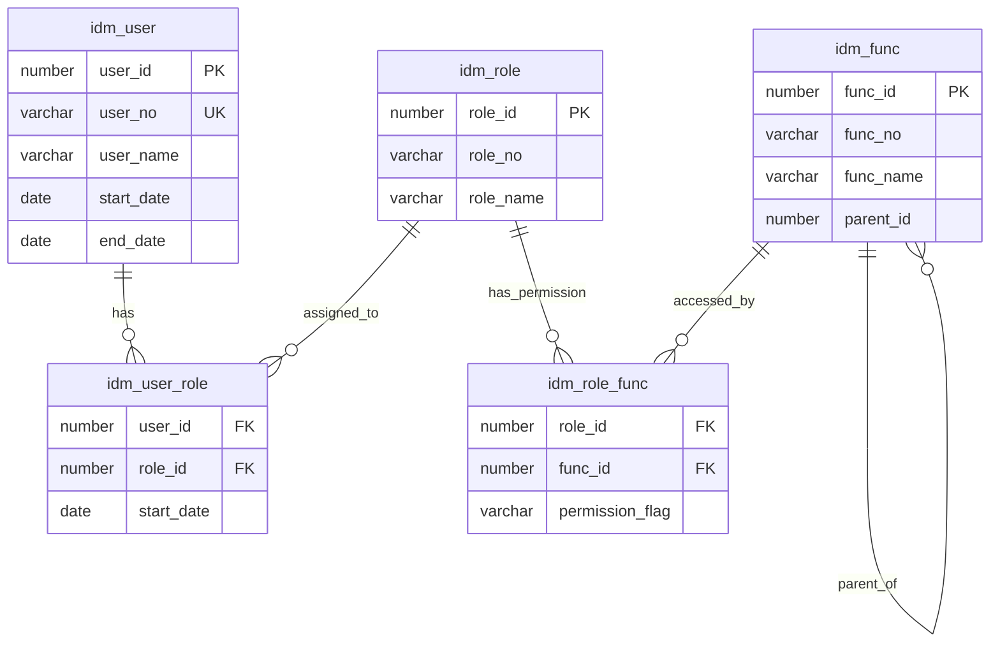

# IDM 身份管理系統 (Identity Management System)

## 系統概述

IDM (Identity Management) 是整個 MIS 系統的核心身份認證與權限管理模組，負責使用者帳號、角色、權限、程式功能等管理。

### 系統目的
- 統一管理系統使用者帳號
- 控制使用者角色與權限
- 管理系統功能程式的存取權限
- 提供單一登入 (SSO) 功能
- 記錄使用者登入/登出行為
- 提供警示通知機制

---

## 資料庫架構

### 核心資料表

#### 1. 使用者管理 (User Management)

##### idm_user - 使用者主檔
```sql
主要欄位:
- user_id (PK): 使用者ID
- user_no (UK): 使用者編號
- user_name: 使用者名稱
- employee_id: 員工資料ID
- person_id: 個人資料ID
- start_date: 啟用日期
- end_date: 結束日期
- last_password_change_date: 上次密碼變更日期
- language_id: 語言ID
- lock_date: 鎖定日期
- date_type: 日期型態
- phone: 電話
```

**功能說明:**
- 儲存系統所有使用者基本資料
- 與員工檔 (employee_id) 和個人檔 (person_id) 關聯
- 支援帳號鎖定機制 (lock_date)
- 追蹤密碼變更歷程

##### idm_user_password - 使用者密碼檔
**功能說明:**
- 儲存使用者密碼（加密）
- 密碼歷史記錄

##### idm_user_control - 使用者控制檔
**功能說明:**
- 使用者個人化設定
- 系統參數控制

##### idm_user_agent - 使用者代理人
**功能說明:**
- 設定使用者代理人機制
- 支援職務代理功能

---

#### 2. 角色管理 (Role Management)

##### idm_role_classification - 角色分類主檔
**功能說明:**
- 角色分類管理
- 支援多語系 (_l 語言檔, _v 視圖檔)

##### idm_role - 角色主檔
```sql
主要功能:
- 定義系統角色
- 角色啟用/停用控制
- 角色有效期間管理
```

##### idm_role_l - 角色語言檔
**功能說明:**
- 支援多語系角色名稱

##### idm_user_role - 使用者角色關聯檔
**功能說明:**
- 建立使用者與角色的多對多關係
- 一個使用者可擁有多個角色
- 支援角色有效期間設定

##### idm_user_role_default - 使用者預設角色
**功能說明:**
- 設定使用者登入時的預設角色

---

#### 3. 權限管理 (Privilege Management)

##### idm_privilege_item - 權限項目主檔
**功能說明:**
- 定義系統權限項目
- 如：新增、修改、刪除、查詢、列印等

##### idm_user_role_privilege - 使用者角色權限
**功能說明:**
- 設定角色擁有的權限項目

---

#### 4. 程式功能管理 (Program Management)

##### idm_program - 程式主檔
```sql
主要功能:
- 註冊系統所有程式
- 程式類型分類（表單、報表、批次等）
- 程式路徑與檔名管理
```

##### idm_program_l - 程式語言檔
**功能說明:**
- 程式多語系名稱

##### idm_program_maintain - 程式維護檔
**功能說明:**
- 記錄程式維護資訊
- 程式版本控制

##### idm_program_prompt_text - 程式提示文字
**功能說明:**
- 程式內提示訊息多語系管理

##### idm_program_mac_address - 程式 MAC 位址控制
**功能說明:**
- 限制特定程式只能在特定電腦執行

---

#### 5. 功能選單管理 (Function Menu Management)

##### idm_role_function - 角色功能主檔
**功能說明:**
- 定義角色可使用的功能選單
- 建立選單階層結構

##### idm_role_function_program - 角色功能程式
**功能說明:**
- 將程式掛載到功能選單下
- 控制角色可執行的程式

---

#### 6. 部門權限管理 (Department Authorization)

##### idm_department_auth - 部門權限主檔
**功能說明:**
- 部門層級的權限控制

##### idm_department_auth_dept - 部門權限部門檔
**功能說明:**
- 設定可存取的部門範圍

##### idm_department_auth_role - 部門權限角色
**功能說明:**
- 部門權限與角色的關聯

---

#### 7. 警示通知系統 (Alert System)

##### idm_alert_item - 警示項目主檔
**功能說明:**
- 定義系統警示類型
- 警示條件設定

##### idm_alert_event - 警示事件主檔
**功能說明:**
- 記錄觸發的警示事件

##### idm_alert_event_notify - 警示通知檔
**功能說明:**
- 警示通知對象設定

##### idm_alert_event_notify_user - 警示通知使用者
**功能說明:**
- 指定接收警示的使用者

##### idm_alert_event_process - 警示處理記錄
**功能說明:**
- 記錄警示處理狀態

##### idm_alert_event_log - 警示日誌
**功能說明:**
- 警示事件歷史記錄

##### idm_alert_event_attachfile - 警示附件檔
**功能說明:**
- 警示相關附件管理

---

#### 8. 智慧查詢 (Smart Query)

##### idm_sq_group - 智慧查詢群組
**功能說明:**
- 查詢條件群組管理

##### idm_sq_program - 智慧查詢程式
**功能說明:**
- 程式查詢條件設定

##### idm_sq_user_group - 使用者查詢群組
**功能說明:**
- 使用者自訂查詢群組

##### idm_sq_user_program - 使用者查詢程式
**功能說明:**
- 使用者自訂查詢條件

---

#### 9. 其他功能

##### idm_logon_off - 登入登出記錄
**功能說明:**
- 記錄使用者登入/登出時間
- 稽核追蹤

##### idm_external_user - 外部使用者
**功能說明:**
- 管理外部系統使用者

##### idm_work_journal - 工作日誌
**功能說明:**
- 使用者工作記錄

##### idm_scheduled_report_head - 排程報表主檔
**功能說明:**
- 報表排程設定

##### idm_mis_help_attachfile - 系統說明附件
**功能說明:**
- 線上說明文件管理

---

## 主要程式套件 (Packages)

### 1. idm_webmis_pkg
**功能:**
- Web MIS 介面整合
- 提供 Web API 服務

**主要程序:**
```sql
- get_employee_role_data: 取得員工角色資料
- get_sso_role_data: 取得 SSO 角色資料
```

### 2. idm_alert
**功能:**
- 警示系統核心邏輯
- 警示事件觸發與處理

### 3. idm_smart_query_password_pkg
**功能:**
- 智慧查詢密碼管理
- 查詢條件加密處理

---

## 主要函數 (Functions)

### 使用者相關
- `f_idm_get_user_control_data`: 取得使用者控制資料
- `f_idm_get_user_language`: 取得使用者語言設定
- `f_idm_get_user_role_default`: 取得使用者預設角色
- `f_idm_is_role_member`: 檢查使用者是否為角色成員
- `f_idm_check_user_section`: 檢查使用者部門權限

### 密碼相關
- `f_idm_check_mis_password`: 檢查 MIS 密碼
- `f_idm_get_encrypt_password`: 取得加密密碼
- `f_idm_validate_password`: 驗證密碼強度
- `f_idm_smart_query_pwd`: 智慧查詢密碼處理

### 程式相關
- `f_idm_chk_program_mac`: 檢查程式 MAC 位址限制
- `f_idm_get_main_menu_html_str`: 產生主選單 HTML 字串

### 日期相關
- `f_idm_get_user_date_type`: 取得使用者日期格式

---

## 觸發器 (Triggers)

### bi_idm_user
**觸發時機:** BEFORE INSERT ON idm_user
**功能:**
- 自動產生 user_id (使用 sequence)

### trig_logon_audit
**功能:**
- 登入稽核記錄

### trig_logoff_audit
**功能:**
- 登出稽核記錄

---

## 視圖 (Views)

### 主要視圖
- `idm_user_v`: 使用者視圖
- `idm_user_employee_v`: 使用者員工視圖
- `idm_user_role_v`: 使用者角色視圖
- `idm_role_function_program_v`: 角色功能程式視圖
- `idm_user_program_v`: 使用者可用程式視圖
- `idm_system_v`: 系統視圖
- `idm_user_auth_department_v`: 使用者授權部門視圖
- `idm_user_prm_department_v`: 使用者採購部門視圖

---

## 系統流程

### 1. 使用者登入流程
```
1. 使用者輸入帳號密碼
2. 驗證帳號是否存在 (idm_user)
3. 檢查帳號是否鎖定 (lock_date)
4. 驗證密碼 (idm_user_password)
5. 檢查帳號有效期間 (start_date, end_date)
6. 取得使用者角色 (idm_user_role)
7. 載入預設角色 (idm_user_role_default)
8. 建立登入記錄 (idm_logon_off)
9. 產生功能選單 (idm_role_function_program)
```

### 2. 權限檢查流程
```
1. 使用者執行程式
2. 檢查程式是否存在 (idm_program)
3. 檢查 MAC 位址限制 (idm_program_mac_address)
4. 取得使用者當前角色
5. 檢查角色功能權限 (idm_role_function_program)
6. 檢查細部權限 (idm_user_role_privilege)
7. 允許/拒絕執行
```

### 3. 警示通知流程
```
1. 系統事件觸發
2. 檢查警示項目設定 (idm_alert_item)
3. 建立警示事件 (idm_alert_event)
4. 取得通知對象 (idm_alert_event_notify_user)
5. 發送通知
6. 記錄處理狀態 (idm_alert_event_process)
7. 保存歷史記錄 (idm_alert_event_h)
```

---

## 安全機制

### 1. 密碼安全
- 密碼加密儲存
- 密碼強度驗證
- 密碼變更歷史追蹤
- 定期密碼變更提醒

### 2. 帳號安全
- 帳號鎖定機制
- 登入失敗次數限制
- 帳號有效期間控制
- 登入/登出稽核

### 3. 程式安全
- MAC 位址綁定
- 角色權限控制
- 功能選單權限
- 細部操作權限

---

## 多語系支援

系統採用 _l (Language) 後綴表示語言檔，支援多語系：
- idm_role_classification_l
- idm_role_l
- idm_privilege_item_l
- idm_program_l
- idm_program_prompt_text_l
- idm_role_function_l
- idm_alert_item_l
- idm_default_item_l

---

## 整合介面

### 1. Web MIS 整合
- idm_webmis_pkg 提供 Web API
- 支援 SSO 單一登入
- JSON 格式資料交換

### 2. 外部系統整合
- idm_external_user 管理外部使用者
- 提供標準認證介面

---

## 資料維護

### 序列 (Sequences)
- idm_user_id: 使用者 ID 序列

### 公用同義詞 (Public Synonyms)
所有主要資料表都建立公用同義詞，方便跨 schema 存取

### 權限設定
```sql
grant all on [table_name] to public with grant option;
```

---

## 系統特色

1. **完整的 RBAC 模型**: 實作角色基礎存取控制 (Role-Based Access Control)
2. **彈性的權限架構**: 支援角色、功能、程式三層權限控制
3. **強大的稽核功能**: 完整記錄使用者行為
4. **智慧查詢機制**: 使用者可自訂查詢條件
5. **警示通知系統**: 主動通知重要事件
6. **多語系支援**: 完整的國際化架構
7. **Web 整合**: 支援 Web 與傳統 Forms 雙介面

---

## 相關系統模組

- **HRM (人力資源)**: 員工資料整合
- **CMM (共用模組)**: 組織、部門資料
- **所有業務模組**: 統一使用 IDM 進行權限控制

---

## 文件資訊

- **系統代碼**: IDM
- **系統名稱**: Identity Management System (身份管理系統)
- **資料來源**: s:\mis\idm\
- **建立日期**: 2026-01-21
- **文件版本**: 1.0

---

## 系統圖表 (System Diagrams)

### 1. 系統流程圖 (Flowchart)



### 2. 系統功能心智圖 (Mindmap)



### 3. 實體關聯圖 (ER Diagram)



