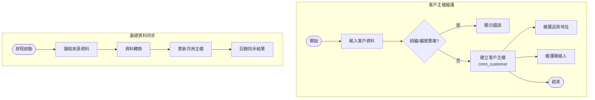
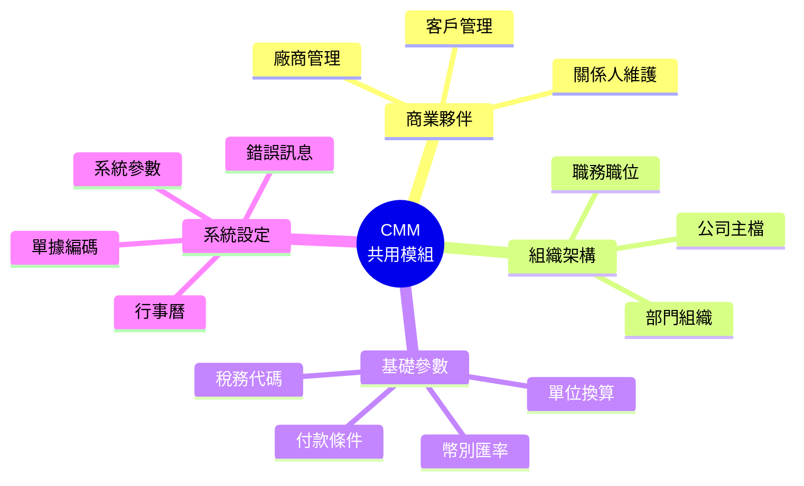
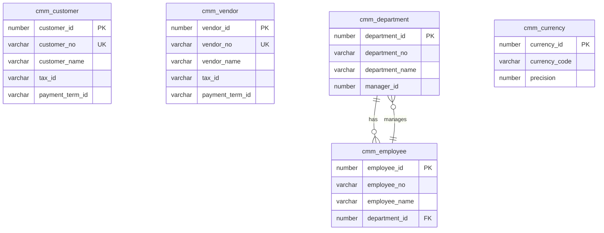

# CMM 共用模組系統 (Common Module System)

## 系統概述

CMM (Common Module) 是整個 MIS 系統的基礎共用模組，提供組織架構、客戶供應商管理、基礎資料維護等核心功能，供其他所有業務模組使用。

### 系統目的
- 統一管理組織架構（公司、部門、人員）
- 客戶與供應商主檔管理
- 基礎代碼資料維護
- 銀行、幣別、國家等基礎資料
- 共用功能與工具
- 滿意度調查系統
- IT 服務管理

---

## 資料庫架構

### 一、組織架構管理 (Organization Structure)

#### 1.1 公司架構

##### cmm_company - 公司主檔
```sql
功能說明:
- 公司基本資料
- 統一編號、公司名稱
- 公司類型分類
```

##### cmm_company_corporation - 公司法人關聯
```sql
功能說明:
- 公司與法人的對應關係
- 支援一公司多法人架構
```

##### cmm_company_control - 公司控制檔
```sql
功能說明:
- 公司層級的參數控制
- 與 cmm_company_control_item 配合使用
```

##### cmm_company_account - 公司帳戶
```sql
功能說明:
- 公司銀行帳戶資料
- 帳戶類型、幣別管理
```

##### cmm_company_role - 公司角色
```sql
功能說明:
- 角色可存取的公司範圍控制
```

---

#### 1.2 法人架構

##### cmm_corporation - 法人主檔
```sql
主要欄位:
- corporation_id (PK): 法人ID
- corporation_no: 法人編號
- corporation_name: 法人名稱
- identity_no: 統一編號
- tax_id_no: 稅籍編號
- start_date/end_date: 有效期間
```

##### cmm_corporation_address - 法人地址
```sql
功能說明:
- 法人多地址管理
- 地址類型（公司地址、工廠地址等）
```

##### cmm_corporation_account - 法人帳戶
```sql
功能說明:
- 法人銀行帳戶
- 支援多幣別帳戶
```

##### cmm_corporation_store - 法人倉庫
```sql
功能說明:
- 法人所屬倉庫資料
```

##### cmm_corporation_log - 法人異動記錄
```sql
功能說明:
- 法人資料變更歷程
```

---

#### 1.3 組織架構

##### cmm_organization - 組織主檔
```sql
功能說明:
- 組織單位基本資料
- 組織階層管理
- 組織類型分類
```

##### cmm_organization_company - 組織公司關聯
```sql
功能說明:
- 組織與公司的對應關係
```

##### cmm_organization_ctl - 組織控制檔
```sql
功能說明:
- 組織層級參數設定
```

##### cmm_organization_role - 組織角色
```sql
功能說明:
- 角色可存取的組織範圍
```

##### cmm_sale_organization - 銷售組織
```sql
功能說明:
- 銷售組織架構
- 銷售區域劃分
```

##### cmm_sale_org_control - 銷售組織控制
```sql
功能說明:
- 銷售組織參數設定
```

---

#### 1.4 部門架構

##### cmm_department - 部門主檔
```sql
主要欄位:
- department_id (PK): 部門ID
- department_no: 部門編號
- department_name: 部門名稱
- parent_department_id: 上層部門ID
- organization_id: 所屬組織ID
- start_date/end_date: 有效期間
```

##### cmm_department_tree - 部門樹狀結構
```sql
功能說明:
- 部門階層關係
- 支援多層級部門架構
```

##### cmm_department_control - 部門控制檔
```sql
功能說明:
- 部門層級參數控制
```

##### cmm_department_role - 部門角色
```sql
功能說明:
- 角色可存取的部門範圍
```

##### cmm_branch - 分支機構
```sql
功能說明:
- 分公司、分店資料
```

##### cmm_branch_department - 分支部門
```sql
功能說明:
- 分支機構與部門的關聯
```

---

#### 1.5 人員資料

##### cmm_person - 個人主檔
```sql
主要欄位:
- person_id (PK): 個人ID
- person_no: 個人編號
- person_name: 姓名
- identity_no: 身分證號
- birthday: 生日
- gender: 性別
- email: 電子郵件
- mobile: 手機
```

##### cmm_person_address - 個人地址
```sql
功能說明:
- 個人多地址管理
- 戶籍地址、通訊地址等
```

##### cmm_person_account - 個人帳戶
```sql
功能說明:
- 個人銀行帳戶資料
```

##### cmm_person_family - 個人家庭
```sql
功能說明:
- 家庭基本資料
```

##### cmm_person_family_member - 家庭成員
```sql
功能說明:
- 家庭成員詳細資料
- 關係、職業等
```

##### cmm_person_diploma_history - 學歷記錄
```sql
功能說明:
- 個人學歷歷程
```

##### cmm_person_license_history - 證照記錄
```sql
功能說明:
- 個人證照歷程
```

##### cmm_person_job_history - 工作經歷
```sql
功能說明:
- 個人工作經歷記錄
```

##### cmm_person_fw_introduction - 外勞介紹
```sql
功能說明:
- 外籍勞工介紹資料
```

##### cmm_person_group - 人員群組
```sql
功能說明:
- 人員分組管理
```

##### cmm_person_memo - 人員備註
```sql
功能說明:
- 人員相關備註記錄
```

##### cmm_person_photo - 人員照片
```sql
功能說明:
- 儲存人員照片
```

---

### 二、客戶管理 (Customer Management)

#### 2.1 客戶主檔

##### cmm_customer - 客戶主檔
```sql
主要欄位:
- customer_id (PK): 客戶ID
- customer_no: 客戶編號
- customer_name: 客戶名稱
- customer_kind_id: 客戶類別ID
- identity_no: 統一編號
- tax_id_no: 稅籍編號
- payment_term_id: 付款條件ID
- currency_id: 幣別ID
- credit_limit: 信用額度
- start_date/end_date: 有效期間
```

##### cmm_customer_kind - 客戶類別
```sql
功能說明:
- 客戶分類管理
- 支援多語系 (_l, _v)
```

##### cmm_customer_kind_ctl - 客戶類別控制
```sql
功能說明:
- 客戶類別參數設定
```

##### cmm_customer_control - 客戶控制檔
```sql
功能說明:
- 客戶層級參數控制
```

##### cmm_customer_info - 客戶資訊
```sql
功能說明:
- 客戶詳細資訊
- 營業項目、資本額等
```

##### cmm_customer_channel - 客戶通路
```sql
功能說明:
- 客戶銷售通路設定
```

##### cmm_customer_channel_type - 通路類型
```sql
功能說明:
- 通路類型定義
```

##### cmm_customer_channel_set - 通路設定
```sql
功能說明:
- 通路參數設定
```

---

#### 2.2 客戶關聯資料

##### cmm_customer_store - 客戶倉庫
```sql
功能說明:
- 客戶倉庫資料
```

##### cmm_customer_warehouse - 客戶倉儲
```sql
功能說明:
- 客戶倉儲設定
```

##### cmm_customer_person - 客戶聯絡人
```sql
功能說明:
- 客戶聯絡人資料
```

##### cmm_customer_attached - 客戶附屬資料
```sql
功能說明:
- 客戶相關附屬資訊
```

##### cmm_customer_corr_company - 客戶對應公司
```sql
功能說明:
- 客戶與公司的對應關係
```

##### cmm_customer_mapping - 客戶對應
```sql
功能說明:
- 客戶代碼對應（跨系統）
```

##### cmm_customer_memo - 客戶備註
```sql
功能說明:
- 客戶備註記錄
```

---

#### 2.3 客戶樹狀結構

##### cmm_customer_tree_head - 客戶樹主檔
```sql
功能說明:
- 客戶階層架構定義
- 總公司、分公司關係
```

##### cmm_customer_tree_detail - 客戶樹明細
```sql
功能說明:
- 客戶階層明細資料
```

---

#### 2.4 客戶異動管理

##### cmm_customer_log - 客戶異動記錄
```sql
功能說明:
- 客戶資料變更歷程
```

##### cmm_customer_modify - 客戶修改申請
```sql
功能說明:
- 客戶資料修改申請單
```

##### cmm_customer_modify_detail - 修改申請明細
```sql
功能說明:
- 修改申請詳細內容
```

##### cmm_customer_modify_check - 修改申請審核
```sql
功能說明:
- 修改申請審核記錄
```

##### cmm_customer_check - 客戶審核
```sql
功能說明:
- 客戶資料審核機制
```

---

### 三、供應商管理 (Vendor Management)

#### 3.1 供應商主檔

##### cmm_vendor - 供應商主檔
```sql
主要欄位:
- vendor_id (PK): 供應商ID
- vendor_no: 供應商編號
- vendor_name: 供應商名稱
- vendor_kind_id: 供應商類別ID
- identity_no: 統一編號
- payment_term_id: 付款條件ID
- currency_id: 幣別ID
```

##### cmm_vendor_kind - 供應商類別
```sql
功能說明:
- 供應商分類管理
- 支援多語系
```

##### cmm_vendor_control - 供應商控制檔
```sql
功能說明:
- 供應商參數控制
```

##### cmm_vendor_certificate - 供應商證書
```sql
功能說明:
- 供應商相關證書管理
```

##### cmm_vendor_setup - 供應商設定
```sql
功能說明:
- 供應商參數設定
```

##### cmm_vendor_log - 供應商異動記錄
```sql
功能說明:
- 供應商資料變更歷程
```

---

#### 3.2 採購代理

##### cmm_purchasing_agent - 採購代理
```sql
功能說明:
- 採購代理商資料
```

##### cmm_agent - 代理商主檔
```sql
功能說明:
- 代理商基本資料
```

##### cmm_agent_city_district - 代理商區域
```sql
功能說明:
- 代理商服務區域
```

---

### 四、基礎資料管理 (Master Data)

#### 4.1 地理資料

##### cmm_country - 國家主檔
```sql
功能說明:
- 國家基本資料
- 支援多語系
```

##### cmm_country_language - 國家語言
```sql
功能說明:
- 國家使用語言
```

##### cmm_province - 省份主檔
```sql
功能說明:
- 省份資料
```

##### cmm_city - 城市主檔
```sql
功能說明:
- 城市資料
```

##### cmm_city_district - 城市區域
```sql
功能說明:
- 城市行政區劃分
```

##### cmm_zip_code - 郵遞區號
```sql
功能說明:
- 郵遞區號資料
```

---

#### 4.2 金融資料

##### cmm_currency - 幣別主檔
```sql
主要欄位:
- currency_id (PK): 幣別ID
- currency_code: 幣別代碼
- currency_name: 幣別名稱
- decimal_places: 小數位數
```

##### cmm_currency_exchange - 匯率
```sql
功能說明:
- 匯率資料
- 匯率日期、買入賣出匯率
```

##### cmm_bank - 銀行主檔
```sql
功能說明:
- 銀行基本資料
- 銀行代碼、名稱
```

##### cmm_bank_branch - 銀行分行
```sql
功能說明:
- 銀行分行資料
```

##### cmm_bank_swift - SWIFT 代碼
```sql
功能說明:
- 國際銀行 SWIFT 代碼
```

##### cmm_bank_file_format - 銀行檔案格式
```sql
功能說明:
- 銀行電子檔案格式定義
```

---

#### 4.3 交易條件

##### cmm_pay_term - 付款條件
```sql
功能說明:
- 付款條件定義
- 付款天數、折扣條件
```

##### cmm_pay_term_item - 付款條件明細
```sql
功能說明:
- 付款條件詳細設定
```

##### cmm_payee_pay_term - 收款人付款條件
```sql
功能說明:
- 收款人付款條件設定
```

##### cmm_trade_term - 貿易條件
```sql
功能說明:
- 貿易條件（FOB, CIF 等）
```

##### cmm_transaction_type - 交易類型
```sql
功能說明:
- 交易類型定義
```

---

#### 4.4 稅務資料

##### cmm_tax_type - 稅別
```sql
功能說明:
- 稅別定義
- 稅率設定
```

##### cmm_tax_regulation - 稅務規定
```sql
功能說明:
- 稅務法規設定
```

---

#### 4.5 期間與日曆

##### cmm_period - 會計期間
```sql
功能說明:
- 會計期間定義
- 期間開關控制
```

##### cmm_period_define - 期間定義
```sql
功能說明:
- 期間結構定義
```

##### cmm_holiday - 假日
```sql
功能說明:
- 國定假日、例假日
```

##### cmm_perpetual_calendar - 萬年曆
```sql
功能說明:
- 萬年曆資料
```

---

### 五、項目分類管理 (Item Classification)

##### cmm_item_group - 項目群組
```sql
功能說明:
- 項目分類群組
```

##### cmm_item_group_type - 群組類型
```sql
功能說明:
- 群組類型定義
```

##### cmm_item_group_set - 群組設定
```sql
功能說明:
- 群組參數設定
```

##### cmm_job_classification - 職務分類
```sql
功能說明:
- 職務類別管理
```

---

### 六、異常資料管理 (Abnormal Data Management)

##### cmm_abnormal_data - 異常資料主檔
```sql
功能說明:
- 異常資料記錄
```

##### cmm_abnormal_data_kind - 異常類別
```sql
功能說明:
- 異常類別定義
```

##### cmm_abnormal_data_detail - 異常明細
```sql
功能說明:
- 異常詳細資料
```

##### cmm_abnormal_data_process - 異常處理
```sql
功能說明:
- 異常處理記錄
```

##### cmm_abnormal_data_kind_dept - 異常類別部門
```sql
功能說明:
- 異常類別負責部門
```

##### cmm_abnormal_data_kind_role - 異常類別角色
```sql
功能說明:
- 異常類別處理角色
```

---

### 七、滿意度調查系統 (Satisfaction Survey)

##### cmm_satisfaction_survey - 滿意度調查主檔
```sql
功能說明:
- 滿意度調查單
```

##### cmm_satis_quest_head - 問卷主檔
```sql
功能說明:
- 問卷定義
```

##### cmm_satis_question - 問題主檔
```sql
功能說明:
- 問卷題目
```

##### cmm_satis_quest_detail - 問卷明細
```sql
功能說明:
- 問卷題目明細
```

##### cmm_satis_quest_rating - 評分標準
```sql
功能說明:
- 問卷評分標準
```

##### cmm_satis_quest_launch - 問卷發放
```sql
功能說明:
- 問卷發放記錄
```

##### cmm_satis_quest_incl_user - 問卷包含使用者
```sql
功能說明:
- 問卷填寫對象
```

##### cmm_satis_quest_excl_user - 問卷排除使用者
```sql
功能說明:
- 問卷排除對象
```

---

### 八、IT 服務管理 (IT Service Management)

##### cmm_it_service - IT 服務主檔
```sql
功能說明:
- IT 服務申請單
- 服務類型、狀態管理
```

##### cmm_it_service_kind - IT 服務類別
```sql
功能說明:
- IT 服務分類
```

##### cmm_it_service_assign - IT 服務指派
```sql
功能說明:
- 服務單指派記錄
```

##### cmm_it_service_process - IT 服務處理
```sql
功能說明:
- 服務處理過程記錄
```

##### cmm_it_service_flow - IT 服務流程
```sql
功能說明:
- 服務流程定義
```

##### cmm_it_service_attachfile - IT 服務附件
```sql
功能說明:
- 服務單附件
```

##### cmm_it_service_role - IT 服務角色
```sql
功能說明:
- 服務處理角色
```

---

### 九、會議室管理 (Meeting Room Management)

##### cmm_meeting_room - 會議室主檔
```sql
功能說明:
- 會議室基本資料
- 容納人數、設備等
```

##### cmm_meeting_room_using - 會議室使用記錄
```sql
功能說明:
- 會議室預約使用記錄
```

---

### 十、專案管理 (Project Management)

##### cmm_project - 專案主檔
```sql
功能說明:
- 專案基本資料
```

##### cmm_project_kind - 專案類別
```sql
功能說明:
- 專案分類
```

##### cmm_project_item - 專案項目
```sql
功能說明:
- 專案工作項目
```

##### cmm_project_item_member - 專案成員
```sql
功能說明:
- 專案參與人員
```

##### cmm_project_item_program - 專案程式
```sql
功能說明:
- 專案相關程式
```

---

### 十一、郵件與通知 (Mail & Notification)

##### cmm_mail_data - 郵件資料
```sql
功能說明:
- 郵件發送記錄
```

##### cmm_mail_data_log - 郵件日誌
```sql
功能說明:
- 郵件發送歷程
```

##### cmm_mail_report_kind - 郵件報表類別
```sql
功能說明:
- 郵件報表分類
```

##### cmm_mail_report_recipient - 郵件報表收件人
```sql
功能說明:
- 報表郵件收件人設定
```

---

### 十二、其他功能模組

##### cmm_schedule - 排程主檔
```sql
功能說明:
- 系統排程設定
```

##### cmm_schedule_detail - 排程明細
```sql
功能說明:
- 排程詳細設定
```

##### cmm_schedule_log - 排程日誌
```sql
功能說明:
- 排程執行記錄
```

##### cmm_attachfile - 附件檔案
```sql
功能說明:
- 通用附件管理
```

##### cmm_carrier_head - 載具主檔
```sql
功能說明:
- 電子發票載具
```

##### cmm_carrier_detail - 載具明細
```sql
功能說明:
- 載具詳細資料
```

##### cmm_token - Token 管理
```sql
功能說明:
- API Token 管理
```

##### cmm_access_monitor - 存取監控
```sql
功能說明:
- 系統存取監控記錄
```

##### cmm_exe_log - 執行日誌
```sql
功能說明:
- 程式執行日誌
```

---

## 主要程式套件 (Packages)

### 1. cmm_fnd
**功能:**
- CMM 基礎函數庫
- 提供共用函數

**主要函數:**
```sql
- f_cmm_get_comp_control_data: 取得公司控制資料
- f_cmm_get_dept_control_data: 取得部門控制資料
- f_cmm_get_org_control_data: 取得組織控制資料
- f_cmm_get_cust_control_data: 取得客戶控制資料
- f_cmm_get_vendor_control_data: 取得供應商控制資料
- f_cmm_get_customer_channel_id: 取得客戶通路ID
- f_cmm_get_address_data: 取得地址資料
- f_cmm_get_bank_no_from_acct: 從帳號取得銀行代碼
```

### 2. cmm_customer_pkg
**功能:**
- 客戶相關處理邏輯
- 客戶資料驗證與處理

### 3. cmm_mail_data_pkg
**功能:**
- 郵件發送處理
- 郵件範本管理

### 4. cmm_mail_report
**功能:**
- 報表郵件發送
- 排程報表郵寄

### 5. cmm_meeting_pkg
**功能:**
- 會議室預約管理
- 會議室使用狀態查詢

**主要函數:**
```sql
- f_cmm_get_meeting_room_idle: 查詢會議室空閒時段
```

### 6. cmm_artemis_api
**功能:**
- Artemis 系統整合 API
- 外部系統介接

---

## 主要函數 (Functions)

### 組織相關
- `f_cmm_get_dept_belong_corp`: 取得部門所屬法人
- `f_cmm_get_dept_tree_label`: 取得部門樹狀標籤
- `f_cmm_get_comp_identity_no`: 取得公司統一編號
- `f_cmm_get_comp_address`: 取得公司地址

### 客戶相關
- `f_cmm_get_new_customer`: 取得新客戶
- `f_cmm_get_old_customer`: 取得舊客戶
- `f_cmm_is_single_customer`: 判斷是否為單一客戶
- `f_cmm_get_cust_accounting_date`: 取得客戶會計日期
- `f_cmm_get_cust_accounting_ym`: 取得客戶會計年月
- `f_cmm_get_cust_corr_company`: 取得客戶對應公司
- `f_cmm_get_cust_kind_ctl_data`: 取得客戶類別控制資料

### 財務相關
- `f_cmm_get_gross_rate`: 取得毛利率
- `f_cmm_get_reaching_rate`: 取得達成率
- `f_cmm_calc_meal_fee`: 計算餐費

### 資料處理
- `f_cmm_get_message_text`: 取得訊息文字
- `f_cmm_extract_email`: 擷取電子郵件
- `f_cmm_get_split_by_colon`: 以冒號分割字串
- `f_cmm_add_months`: 月份加減

### 目標代理
- `f_cmm_get_tx_target_agent`: 取得交易目標代理
- `f_cmm_get_tx_target_name`: 取得交易目標名稱

### 其他
- `f_cmm_get_fw_introduction`: 取得外勞介紹資料
- `f_cmm_get_monthly_pa_value`: 取得月份參數值

---

## 視圖 (Views)

### 組織視圖
- `cmm_company_v`: 公司視圖
- `cmm_corporation_v`: 法人視圖
- `cmm_organization_v`: 組織視圖
- `cmm_department_v`: 部門視圖
- `cmm_department_tree_v`: 部門樹狀視圖
- `cmm_person_v`: 個人視圖

### 客戶視圖
- `cmm_customer_v`: 客戶視圖
- `cmm_customer_kind_v`: 客戶類別視圖
- `cmm_customer_tree_v`: 客戶樹狀視圖
- `cmm_customer_info_v`: 客戶資訊視圖
- `cmm_customer_store_v`: 客戶倉庫視圖
- `cmm_bd_customer_v`: BD 客戶視圖
- `cmm_pay_customer_v`: 付款客戶視圖
- `cmm_invoice_customer_v`: 發票客戶視圖

### 供應商視圖
- `cmm_vendor_v`: 供應商視圖
- `cmm_vendor_kind_v`: 供應商類別視圖
- `cmm_bd_vendor_v`: BD 供應商視圖
- `cmm_payee_vendor_v`: 收款供應商視圖

### 基礎資料視圖
- `cmm_country_v`: 國家視圖
- `cmm_province_v`: 省份視圖
- `cmm_city_v`: 城市視圖
- `cmm_city_district_v`: 城市區域視圖
- `cmm_currency_v`: 幣別視圖
- `cmm_bank_v`: 銀行視圖
- `cmm_bank_branch_v`: 銀行分行視圖
- `cmm_trade_term_v`: 貿易條件視圖
- `cmm_transaction_type_v`: 交易類型視圖
- `cmm_tax_type_v`: 稅別視圖

### 其他視圖
- `cmm_account_v`: 帳戶視圖
- `cmm_area_v`: 區域視圖
- `cmm_agent_v`: 代理商視圖
- `cmm_parent_agent_v`: 上層代理商視圖
- `cmm_person_group_v`: 人員群組視圖
- `cmm_project_v`: 專案視圖
- `cmm_satisfaction_survey_v`: 滿意度調查視圖

---

## 工作視圖 (Working Views)

以 _w 結尾的視圖為工作視圖，用於特定業務邏輯：
- `cmm_company_w`: 公司工作視圖
- `cmm_customer_w`: 客戶工作視圖
- `cmm_vendor_w`: 供應商工作視圖
- `cmm_organization_w`: 組織工作視圖
- `cmm_department_w`: 部門工作視圖
- `cmm_person_w`: 個人工作視圖
- `cmm_currency_w`: 幣別工作視圖
- `cmm_project_w`: 專案工作視圖
- `cmm_satisfaction_survey_w`: 滿意度調查工作視圖
- `cmm_tree_w`: 樹狀結構工作視圖
- `cmm_month_date_w`: 月份日期工作視圖
- `cmm_due_pay_data_w`: 到期付款資料工作視圖

---

## 系統流程

### 1. 組織架構建立流程
```
1. 建立法人 (cmm_corporation)
2. 建立公司 (cmm_company)
3. 建立公司法人關聯 (cmm_company_corporation)
4. 建立組織 (cmm_organization)
5. 建立部門 (cmm_department)
6. 建立部門樹狀結構 (cmm_department_tree)
7. 設定部門控制參數
```

### 2. 客戶建立流程
```
1. 建立客戶基本資料 (cmm_customer)
2. 設定客戶類別 (customer_kind_id)
3. 設定付款條件 (payment_term_id)
4. 建立客戶地址 (cmm_corporation_address)
5. 建立客戶聯絡人 (cmm_customer_person)
6. 設定客戶通路 (cmm_customer_channel)
7. 設定客戶控制參數
8. 審核客戶資料 (cmm_customer_check)
```

### 3. 供應商建立流程
```
1. 建立供應商基本資料 (cmm_vendor)
2. 設定供應商類別 (vendor_kind_id)
3. 設定付款條件 (payment_term_id)
4. 建立供應商證書 (cmm_vendor_certificate)
5. 設定供應商控制參數
```

### 4. IT 服務申請流程
```
1. 建立 IT 服務單 (cmm_it_service)
2. 選擇服務類別 (cmm_it_service_kind)
3. 系統指派處理人員 (cmm_it_service_assign)
4. 處理人員處理 (cmm_it_service_process)
5. 記錄處理流程 (cmm_it_service_flow)
6. 上傳附件 (cmm_it_service_attachfile)
7. 結案
```

### 5. 滿意度調查流程
```
1. 建立問卷 (cmm_satis_quest_head)
2. 設定問題 (cmm_satis_question)
3. 設定問卷明細 (cmm_satis_quest_detail)
4. 設定評分標準 (cmm_satis_quest_rating)
5. 設定填寫對象 (cmm_satis_quest_incl_user)
6. 發放問卷 (cmm_satis_quest_launch)
7. 收集回覆 (cmm_satisfaction_survey)
8. 統計分析
```

---

## 多語系支援

系統採用 _l (Language) 後綴表示語言檔，_v 表示視圖：
- 公司: cmm_company_l
- 法人: cmm_corporation_l
- 組織: cmm_organization_l
- 部門: cmm_department_l, cmm_department_tree_l
- 客戶: cmm_customer_l, cmm_customer_kind_l, cmm_customer_tree_head_l
- 供應商: cmm_vendor_l, cmm_vendor_kind_l
- 國家: cmm_country_l
- 省份: cmm_province_l
- 城市: cmm_city_l, cmm_city_district_l
- 幣別: cmm_currency_l
- 銀行: cmm_bank_l, cmm_bank_branch_l
- 貿易條件: cmm_trade_term_l
- 交易類型: cmm_transaction_type_l
- 稅別: cmm_tax_type_l
- 問卷: cmm_satis_quest_head_l, cmm_satis_question_l, cmm_satis_quest_rating_l

---

## 整合介面

### 1. 與 IDM 整合
- 使用 IDM 的使用者、角色、權限系統
- 組織、部門與 IDM 權限整合

### 2. 與業務模組整合
- 提供客戶、供應商主檔給所有業務模組
- 提供組織架構給所有模組
- 提供基礎代碼資料

### 3. 外部系統整合
- Artemis API (cmm_artemis_api)
- 客戶對應 (cmm_customer_mapping)

---

## 資料維護

### 序列 (Sequences)
系統為每個主要資料表建立序列，命名規則：
- [table_name]_id

### 公用同義詞 (Public Synonyms)
所有資料表都建立公用同義詞

### 權限設定
```sql
grant all on [table_name] to public with grant option;
```

---

## 系統特色

1. **完整的組織架構**: 支援法人→公司→組織→部門多層架構
2. **彈性的客戶供應商管理**: 支援複雜的客戶供應商關係
3. **豐富的基礎資料**: 提供完整的代碼資料
4. **多語系支援**: 完整的國際化架構
5. **控制檔機制**: 彈性的參數控制系統
6. **樹狀結構**: 支援階層式資料管理
7. **工作視圖**: 提供業務邏輯專用視圖
8. **整合性強**: 與所有業務模組緊密整合

---

## 相關系統模組

- **IDM**: 權限控制整合
- **HRM**: 人員資料整合
- **GLM**: 會計科目、法人整合
- **ARM**: 應收帳款客戶整合
- **APM**: 應付帳款供應商整合
- **所有業務模組**: 使用 CMM 基礎資料

---

## 文件資訊

- **系統代碼**: CMM
- **系統名稱**: Common Module System (共用模組系統)
- **資料來源**: s:\mis\cmm\
- **建立日期**: 2026-01-21
- **文件版本**: 1.0

---

## 系統圖表 (System Diagrams)

### 1. 系統流程圖 (Flowchart)



### 2. 系統功能心智圖 (Mindmap)



### 3. 實體關聯圖 (ER Diagram)



