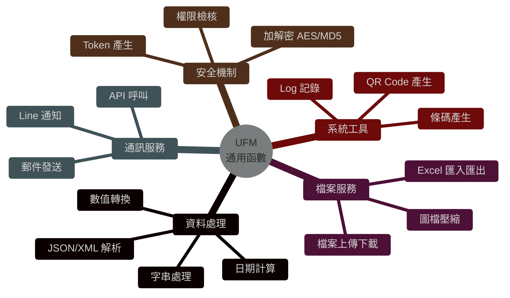

# UFM 通用函數模組 (Utility Function Module)

## 系統概述

UFM (Utility Function Module) 是整個 MIS 系統的工具函數庫，提供各種通用函數、資料處理工具、Web API 整合、郵件發送、Excel 處理等功能，供所有業務模組使用。

### 系統目的
- 提供通用函數庫
- 資料格式轉換與驗證
- Web API 整合與文件產生
- Excel 檔案讀寫
- 郵件發送功能
- QR Code 產生
- 加密與安全功能
- JSON/XML 處理
- 動態 SQL 執行

---

## 主要功能模組

### 一、基礎函數庫 (Basic Functions)

#### 1.1 日期時間函數

##### f_add_months
```sql
功能: 月份加減運算
參數: 日期, 月數
回傳: 計算後的日期
範例:
```sql
SELECT f_add_months(sysdate, 1) FROM dual;
-- 結果: 下個月的今天
```

##### f_sysdate
```sql
功能: 取得系統日期
回傳: 當前系統日期時間
範例:
```sql
SELECT f_sysdate() FROM dual;
-- 結果: 2026-01-22 10:00:00
```

##### f_to_date
```sql
功能: 字串轉日期
參數: 日期字串, 格式
回傳: 日期型態
範例:
```sql
SELECT f_to_date('2026/01/01', 'yyyy/mm/dd') FROM dual;
```

##### f_to_datetime
```sql
功能: 字串轉日期時間
參數: 日期時間字串
回傳: 日期時間型態
```

##### f_number_to_date
```sql
功能: 數字轉日期
參數: 數字格式日期 (如: 20260121)
回傳: 日期型態
範例:
```sql
SELECT f_number_to_date(20260121) FROM dual;
-- 結果: 2026/01/21 (Date Type)
```

##### f_excel_date_to_date
```sql
功能: Excel 日期序號轉日期
參數: Excel 日期序號
回傳: 日期型態
說明: Excel 以 1900/1/1 為基準的序號
範例:
```sql
SELECT f_excel_date_to_date(45678) FROM dual;
-- 結果: 2025/01/21 (示意)
```

##### f_get_weekday
```sql
功能: 取得星期幾
參數: 日期
回傳: 星期幾 (1-7)
範例:
```sql
SELECT f_get_weekday(sysdate) FROM dual;
-- 結果: 4 (若為星期四)
```

##### f_get_weeks
```sql
功能: 取得週數
參數: 日期
回傳: 該年度第幾週
```

##### f_get_ten_days
```sql
功能: 取得旬別
參數: 日期
回傳: 上旬/中旬/下旬
```

##### f_ceil_minute
```sql
功能: 分鐘無條件進位
參數: 時間, 進位分鐘數
回傳: 進位後時間
```

##### f_floor_minute
```sql
功能: 分鐘無條件捨去
參數: 時間, 捨去分鐘數
回傳: 捨去後時間
```

##### f_ufm_to_timestamp
```sql
功能: 轉換為 Timestamp
參數: 日期時間字串
回傳: Timestamp 型態
```

---

#### 1.2 字串處理函數

##### f_length
```sql
功能: 取得字串長度
參數: 字串
回傳: 字元數
範例:
```sql
SELECT f_length('中文ABC') FROM dual;
-- 結果: 5
```

##### f_lengthb
```sql
功能: 取得字串位元組長度
參數: 字串
回傳: 位元組數
範例:
```sql
SELECT f_lengthb('中文ABC') FROM dual;
-- 結果: 系統編碼相關 (UTF8通常為 6+3=9)
```

##### f_substrb
```sql
功能: 依位元組擷取字串
參數: 字串, 起始位置, 長度
回傳: 擷取的字串
範例:
```sql
SELECT f_substrb('ABCDEFG', 1, 3) FROM dual;
-- 結果: ABC
```

##### f_replace_clob
```sql
功能: CLOB 字串取代
參數: CLOB 內容, 搜尋字串, 取代字串
回傳: 取代後的 CLOB
```

##### f_split_clob
```sql
功能: 分割 CLOB 字串
參數: CLOB 內容, 分隔符號
回傳: 分割後的陣列
範例:
```sql
SELECT * FROM table(f_split_clob('A,B,C', ','));
-- 結果:
-- COLUMN_VALUE
-- A
-- B
-- C
```

##### f_ufm_split
```sql
功能: 字串分割
參數: 字串, 分隔符號
回傳: 分割後的陣列
範例:
```sql
DECLARE
  v_arr ufm_split_tbl;
BEGIN
  v_arr := f_ufm_split('A-B-C', '-');
END;
```

##### f_string_split_two_lines
```sql
功能: 字串分割成兩行 (以長度一半為基準)
參數: 字串
回傳: 分割後的字串
範例:
```sql
SELECT f_string_split_two_lines('ThisIsALongString') FROM dual;
-- 結果: ThisIsA
--       LongString
```

##### f_ufm_assemble
```sql
功能: 字串組合
參數: 多個字串
回傳: 組合後的字串
範例:
```sql
SELECT f_ufm_assemble('Hello', ' ', 'World') FROM dual;
-- 結果: Hello World
```

---

#### 1.3 數值處理函數

##### f_get_numeric
```sql
功能: 擷取字串中的數字
參數: 字串
回傳: 數字部分
範例:
```sql
SELECT f_get_numeric('Order#12345') FROM dual;
-- 結果: 12345
```

##### f_get_start_numeric
```sql
功能: 擷取字串中指定位置開始的連續數字
參數: 字串, 起始位置
回傳: 開頭數字
範例:
```sql
SELECT f_get_start_numeric('ABC123XYZ', 4) FROM dual;
-- 結果: 123
```

##### f_is_numeric
```sql
功能: 判斷是否為數字
參數: 字串
回傳: TRUE/FALSE
範例:
```sql
IF f_is_numeric('123.45') THEN
  dbms_output.put_line('Is Number');
END IF;
```

##### f_get_is_numeric
```sql
功能: 判斷是否為數字 (回傳 Y/N)
參數: 字串
回傳: 'Y' 或 'N'
範例:
```sql
SELECT f_get_is_numeric('123') FROM dual;
-- 結果: Y
```

##### f_to_number
```sql
功能: 字串轉數字
參數: 字串
回傳: 數字型態
範例:
```sql
SELECT f_to_number('1,234.56') FROM dual;
-- 結果: 1234.56
```

##### f_ceil
```sql
功能: 無條件進位
參數: 數字, 小數位數 (預設0)
回傳: 進位後數字
範例:
```sql
SELECT f_ceil(123.456, 2) FROM dual;
-- 結果: 123.46
```

##### f_number_to_hex
```sql
功能: 數字轉十六進位
參數: 數字
回傳: 十六進位字串
範例:
```sql
SELECT f_number_to_hex(255) FROM dual;
-- 結果: FF
```

---

#### 1.4 資料驗證函數

##### f_is_date
```sql
功能: 判斷是否為有效日期
參數: 日期字串
回傳: TRUE/FALSE
範例:
```sql
SELECT f_is_date('2026/02/30') FROM dual;
-- 結果: FALSE (2月無30日)
```

##### f_is_tw_identity_no
```sql
功能: 驗證台灣身分證號
參數: 身分證號
回傳: TRUE/FALSE
說明: 檢查格式與檢查碼
範例:
```sql
IF f_is_tw_identity_no('A123456789') THEN
  -- Valid ID
END IF;
```

##### f_is_tw_corp_id
```sql
功能: 驗證台灣公司統一編號
參數: 統一編號
回傳: TRUE/FALSE
說明: 檢查格式與檢查碼
```

##### f_is_cn_identity_no
```sql
功能: 驗證中國大陸身分證號
參數: 身分證號
回傳: TRUE/FALSE
範例:
```sql
SELECT f_is_cn_identity_no('110101199003071234') FROM dual;
```

##### f_is_personal_id
```sql
功能: 驗證個人識別號
參數: 識別號
回傳: TRUE/FALSE
範例:
```sql
SELECT f_is_personal_id('A123456789') FROM dual;
```

##### f_get_email
```sql
功能: 擷取電子郵件地址
參數: 字串
回傳: 電子郵件地址
說明: 從字串中擷取符合 email 格式的內容
範例:
```sql
SELECT f_get_email('Contact me at test@example.com ASAP') FROM dual;
-- 結果: test@example.com
```

---

#### 1.5 格式轉換函數

##### f_to_char
```sql
功能: 資料轉字串
參數: 資料, 格式
回傳: 字串
範例:
```sql
SELECT f_to_char(sysdate, 'YYYY/MM/DD') FROM dual;
```

##### f_to_char_ms
```sql
功能: 轉換為民國年字串
參數: 日期
回傳: 民國年格式字串
範例:
```sql
SELECT f_to_char_ms(DATE '2026-01-22') FROM dual;
-- 結果: 1150122
```

##### f_to_chinese
```sql
功能: 數字轉中文
參數: 數字
回傳: 中文數字
範例:
```sql
SELECT f_to_chinese(123) FROM dual;
-- 結果: 一二三
```

##### f_to_quickcode
```sql
功能: 轉換為快速碼
參數: 中文字串
回傳: 注音快速碼
說明: 將中文轉換為注音符號快速碼
```

---

#### 1.6 金額大寫函數

##### f_spell_dollar
```sql
功能: 金額轉英文大寫
參數: 金額
回傳: 英文大寫金額
範例:
```sql
SELECT f_spell_dollar(1234.56) FROM dual;
-- 結果: ONE THOUSAND TWO HUNDRED THIRTY FOUR AND 56/100
```

##### f_spell_number
```sql
功能: 數字轉英文
參數: 數字
回傳: 英文數字
範例:
```sql
SELECT f_spell_number(123) FROM dual;
-- 結果: ONE HUNDRED TWENTY THREE
```

##### f_spell_tw_dollar
```sql
功能: 金額轉中文大寫 (台幣)
參數: 金額
回傳: 中文大寫金額
範例:
```sql
SELECT f_spell_tw_dollar(1234) FROM dual;
-- 結果: 壹仟貳佰參拾肆元整
```

##### f_spell_rmb_dollar
```sql
功能: 金額轉中文大寫 (人民幣)
參數: 金額
回傳: 中文大寫金額
```

##### Number_To_English
```sql
功能: 數字轉英文完整拼寫
參數: 數字
回傳: 英文拼寫
```

---

### 二、Web API 整合 (Web API Integration)

#### 2.1 Web API 核心套件

##### ufm_webapi_pkg
```sql
功能: Web API 核心處理套件
主要程序:
- get_project_login: 專案登入
- get_project_authorize: 專案授權
- get_project_access_token: 取得存取 Token
- get_project_refresh_token: 更新 Token
- get_project_temp_access_token: 取得臨時 Token
- check_ip_pass: 檢查 IP 是否允許
範例:
```sql
DECLARE
  v_token VARCHAR2(4000);
BEGIN
  -- 取得 API Token
  ufm_webapi_pkg.get_project_access_token(
    i_project_no => 'MIS_PRJ',
    o_access_token => v_token
  );
END;
```

##### ufm_webapi_util
```sql
功能: Web API 工具函數
主要功能:
- HTTP 請求處理
- JSON 資料解析
- API 回應格式化
```

##### ufm_webapi_doc_pkg
```sql
功能: Web API 文件產生
主要功能:
- 自動產生 API 文件
- Swagger/OpenAPI 格式輸出
```

##### f_ufm_webapi_to_yaml
```sql
功能: 將 Web API 定義轉換為 YAML 格式
回傳: YAML 格式的 API 文件
```

---

#### 2.2 HTTP 工具

##### ufm_http_utl
```sql
功能: HTTP 請求工具
主要功能:
- HTTP GET/POST 請求
- HTTP Header 處理
- Cookie 管理
- SSL 連線支援
```

---

### 三、郵件發送 (Mail Service)

#### 3.1 郵件核心套件

##### ufm_mail_pkg
```sql
功能: 郵件發送核心套件
主要程序:
- send_mail: 發送郵件
- send_mail_with_attachment: 發送帶附件郵件
- send_html_mail: 發送 HTML 郵件
- send_mail_with_pdf: 發送 PDF 附件郵件
範例:
```sql
BEGIN
  ufm_mail_pkg.send_mail(
    p_sender    => 'no-reply@company.com',
    p_receiver  => 'user@company.com',
    p_subject   => 'System Notification',
    p_message   => 'This is a test mail.'
  );
END;
```

##### ufm_mail_tom_pkg
```sql
功能: Tom 郵件系統整合
主要功能:
- Tom 郵件伺服器整合
- 郵件範本管理
```

---

#### 3.2 PDF 報表郵件

##### p_ufm_run_pdf
```sql
功能: 執行 PDF 報表產生
參數: 報表參數
功能: 產生 PDF 格式報表
```

##### p_ufm_run_pdf_mail
```sql
功能: 產生 PDF 並郵寄
參數: 報表參數, 收件人
功能: 產生 PDF 報表並自動發送郵件
```

---

### 四、Excel 處理 (Excel Processing)

#### 4.1 Excel 讀取

##### as_read_xlsx
```sql
功能: 讀取 Excel 檔案 (XLSX)
參數: Excel 檔案 BLOB
回傳: Excel 資料
說明: 支援 Office 2007+ 格式
```

##### p_ufm_imp_from_xlsx
```sql
功能: 從 Excel 匯入資料
參數: Excel 檔案, 目標資料表
功能: 將 Excel 資料匯入資料庫
```

---

#### 4.2 Excel 產生

##### as_xlsx
```sql
功能: 產生 Excel 檔案 (XLSX)
參數: 資料, 格式設定
回傳: Excel 檔案 BLOB
說明: 動態產生 Excel 檔案
```

##### as_xlsx_stream
```sql
功能: 串流方式產生 Excel
參數: 資料來源
回傳: Excel 串流
說明: 適用於大量資料
```

---

### 五、QR Code 產生 (QR Code Generation)

##### f_ufm_gen_qrcode_blob
```sql
功能: 產生 QR Code 圖片 (BLOB)
參數: QR Code 內容, 尺寸
回傳: QR Code 圖片 BLOB
```

##### p_ufm_gen_qrcode_to_blob_w
```sql
功能: 產生 QR Code 並儲存
參數: QR Code 內容, 儲存位置
功能: 產生 QR Code 並儲存到資料庫
```

##### ufm_gen_qrcode_as_image
```sql
功能: 產生 QR Code 圖片檔
參數: QR Code 內容, 檔案路徑
功能: 產生 QR Code 並儲存為圖片檔
```

**使用的 Java 函式庫:**
- qrgen-1.2.jar
- core-1.7.jar
- javase-1.7.jar

---

### 六、加密與安全 (Security & Encryption)

#### 6.1 雜湊函數

##### ufm_sha256
```sql
功能: SHA-256 雜湊套件
主要函數:
- hash: 計算 SHA-256 雜湊值
- hash_hex: 回傳十六進位雜湊值
範例:
```sql
SELECT ufm_sha256.hash_hex('my_password') FROM dual;
```

##### f_ufm_hmac_sha1
```sql
功能: HMAC-SHA1 加密
參數: 資料, 金鑰
回傳: HMAC-SHA1 雜湊值
```

##### f_ufm_hmac_sha256
```sql
功能: HMAC-SHA256 加密
參數: 資料, 金鑰
回傳: HMAC-SHA256 雜湊值
```

---

#### 6.2 安全工具

##### ufm_secure
```sql
功能: 安全工具套件
主要功能:
- 密碼加密
- 資料加密解密
```

##### ufm_fnd_secure
```sql
功能: 基礎安全函數
主要功能:
- 加密演算法
- 金鑰管理
```

##### get_encrypt_password
```sql
功能: 取得加密密碼
參數: 明文密碼
回傳: 加密後密碼
範例:
```sql
SELECT get_encrypt_password('123456') FROM dual;
```

---

### 七、JSON/XML 處理 (JSON/XML Processing)

#### 7.1 JSON 處理

##### ufm_json
```sql
功能: JSON 處理套件
主要功能:
- JSON 解析
- JSON 產生
- JSON 驗證
```

##### f_ufm_json_2_text
```sql
功能: JSON 轉文字
參數: JSON 物件
回傳: 格式化文字
```

**使用的函式庫:**
- pljson-3.7.1.zip (PL/JSON 函式庫)

---

#### 7.2 XML 處理

##### ufm_xml2data
```sql
功能: XML 轉資料
參數: XML 內容
回傳: 結構化資料
```

---

### 八、資料處理工具 (Data Processing Tools)

#### 8.1 動態 SQL

##### ufm_sql_util
```sql
功能: SQL 工具套件
主要功能:
- 動態 SQL 執行
- SQL 語法產生
```

##### ufm_exec
```sql
功能: 動態執行 SQL
參數: SQL 語句
功能: 執行動態 SQL 語句
```

##### p_ufm_execute_non_query
```sql
功能: 執行非查詢 SQL
參數: SQL 語句
功能: 執行 INSERT/UPDATE/DELETE
```

---

#### 8.2 資料表工具

##### f_ufm_get_table_count
```sql
功能: 取得資料表筆數
參數: 資料表名稱
回傳: 資料筆數
```

##### get_dir_list
```sql
功能: 取得目錄清單
參數: 目錄路徑
回傳: 檔案清單
```

##### get_bd_dir_list
```sql
功能: 取得 BD 目錄清單
參數: 目錄路徑
回傳: 檔案清單
```

---

#### 8.3 樞紐分析表

##### ufm_pivot_table_gen
```sql
功能: 樞紐分析表產生器
主要功能:
- 動態產生樞紐分析表
- 交叉分析報表
```

##### ufm_pivot_table_detail
```sql
功能: 樞紐分析表明細
```

---

### 九、快速碼處理 (Quick Code)

##### f_get_quickcode_sql
```sql
功能: 產生快速碼 SQL
參數: 資料表, 欄位
回傳: 快速碼查詢 SQL
```

##### f_get_quickcode_cursor
```sql
功能: 取得快速碼游標
參數: 查詢條件
回傳: 游標
```

##### f_ufm_get_quickcode_value
```sql
功能: 取得快速碼值
參數: 快速碼
回傳: 對應值
```

##### f_ufm_get_quickcode_ext_uid
```sql
功能: 取得快速碼擴充 UID
參數: 快速碼
回傳: UID
```

---

### 十、Unicode 與編碼處理 (Unicode & Encoding)

##### f_ufm_decode_unicode
```sql
功能: Unicode 解碼
參數: Unicode 字串
回傳: 解碼後字串
```

##### f_ufm_decode_unicode_clob
```sql
功能: Unicode 解碼 (CLOB)
參數: Unicode CLOB
回傳: 解碼後 CLOB
```

##### f_unicode_to_zh
```sql
功能: Unicode 轉中文
參數: Unicode 編碼
回傳: 中文字串
```

##### f_unicode_to_zh_clob
```sql
功能: Unicode 轉中文 (CLOB)
參數: Unicode CLOB
回傳: 中文 CLOB
```

---

### 十一、網路工具 (Network Tools)

#### 11.1 IP 位址處理

##### f_ufm_ipv4_to_number
```sql
功能: IPv4 轉數字
參數: IP 位址 (如: 192.168.1.1)
回傳: 數字表示
```

##### f_ufm_ipv4_apply_netmask
```sql
功能: 套用網路遮罩
參數: IP 位址, 網路遮罩
回傳: 網路位址
```

##### f_ping_host
```sql
功能: Ping 主機
參數: 主機位址
回傳: Ping 結果
```

---

### 十二、檔案處理 (File Processing)

##### ufm_blob_to_file
```sql
功能: BLOB 轉檔案
參數: BLOB 資料, 檔案路徑
功能: 將 BLOB 儲存為檔案
```

##### f_ufm_read_file
```sql
功能: 讀取檔案
參數: 檔案路徑
回傳: 檔案內容
```

##### utl_file
```sql
功能: 檔案工具
主要功能:
- 檔案讀寫
- 目錄操作
```

---

### 十三、其他工具 (Other Utilities)

#### 13.1 UUID 產生

##### f_ufm_get_random_uuid
```sql
功能: 產生隨機 UUID
回傳: UUID 字串
範例: 550e8400-e29b-41d4-a716-446655440000
```

---

#### 13.2 EAN 條碼

##### ufm_ean_body
```sql
功能: EAN 條碼處理
主要功能:
- EAN-13 條碼產生
- 檢查碼計算
```

##### ufm_kent_ean
```sql
功能: Kent EAN 條碼處理
```

---

#### 13.3 文字分類

##### f_ufm_classify_text_type
```sql
功能: 分類文字類型
參數: 文字
回傳: 文字類型 (中文/英文/數字/混合)
```

---

#### 13.4 自然語言處理

##### ufm_nlp_utl
```sql
功能: 自然語言處理工具
主要功能:
- 中文分詞
- 關鍵字擷取
```

##### ufm_hanlp_dict
```sql
功能: HanLP 字典管理
```

---

#### 13.5 LOV 工具

##### ufm_lov_utl
```sql
功能: List of Values 工具
主要功能:
- 下拉選單資料產生
- LOV 快取管理
```

---

#### 13.6 錯誤處理

##### ufm_err_pkg
```sql
功能: 錯誤處理套件
主要程序:
- log_error: 記錄錯誤
- raise_error: 拋出錯誤
- get_error_message: 取得錯誤訊息
```

##### log4pl
```sql
功能: 日誌記錄
主要功能:
- 日誌分級 (DEBUG/INFO/WARN/ERROR)
- 日誌輸出管理
```

---

#### 13.7 工作鎖定

##### p_ufm_lock_job
```sql
功能: 鎖定工作
參數: 工作名稱
功能: 防止重複執行
```

##### ufm_lock_job
```sql
功能: 工作鎖定管理
```

---

#### 13.8 其他

##### f_ufm_get_mis_name
```sql
功能: 取得 MIS 名稱
回傳: 系統名稱
```

##### insert_exe_log
```sql
功能: 插入執行日誌
參數: 程式名稱, 執行資訊
```

##### p_ufm_insert_action_log
```sql
功能: 插入操作日誌
參數: 操作資訊
```

---

## 核心套件 (Core Packages)

### ufm_fnd
```sql
功能: UFM 基礎函數庫
主要函數:
- 資料格式轉換
- 字串處理
- 日期計算
- 數值運算
```

### ufm_util
```sql
功能: UFM 工具套件
主要功能:
- 通用工具函數
- 系統工具
```

### ufm_ec_util
```sql
功能: EC 工具套件
主要功能:
- 電子商務相關工具
```

### ufm_dymanic_datablock
```sql
功能: 動態資料區塊
主要功能:
- 動態表單產生
- 動態資料綁定
```

---

## PostgreSQL 支援

系統也提供 PostgreSQL 版本的函數：

### pgsql/ufm_webapi_pkg
```sql
功能: PostgreSQL 版本的 Web API 套件
主要程序:
- check_ip_pass
- get_project_access_token
- get_project_authorize
- get_project_login
- get_project_refresh_kaptcha
- get_project_refresh_token
- get_project_temp_access_token
- get_project_temp_refresh_token
```

### pgsql/f_ufm_ipv4_apply_netmask
```sql
功能: PostgreSQL 版本的 IPv4 網路遮罩處理
```

### pgsql/f_ufm_ipv4_to_number
```sql
功能: PostgreSQL 版本的 IPv4 轉數字
```

---

## 資料表

### ufm_pivot_table_detail
```sql
功能: 樞紐分析表明細資料表
```

### t_ret_table
```sql
功能: 回傳結果資料表
```

---

## 系統特色

1. **豐富的函數庫**: 提供超過 100 個通用函數
2. **Web API 整合**: 完整的 Web API 開發框架
3. **Excel 處理**: 支援 Excel 讀寫與匯入匯出
4. **郵件系統**: 完整的郵件發送功能，支援附件與 HTML
5. **QR Code**: 內建 QR Code 產生功能
6. **安全加密**: 提供多種加密演算法
7. **JSON/XML**: 完整的 JSON 與 XML 處理能力
8. **動態 SQL**: 支援動態 SQL 執行
9. **跨資料庫**: 支援 Oracle 與 PostgreSQL
10. **國際化**: 支援多語系與 Unicode 處理

---

## 使用範例

### 1. 發送郵件範例
```sql
BEGIN
  ufm_mail_pkg.send_mail(
    p_to => 'user@example.com',
    p_subject => '測試郵件',
    p_message => '這是測試郵件內容'
  );
END;
```

### 2. 產生 Excel 範例
```sql
DECLARE
  l_blob BLOB;
BEGIN
  l_blob := as_xlsx.generate(
    p_query => 'SELECT * FROM employees'
  );
  -- 儲存或下載 l_blob
END;
```

### 3. 產生 QR Code 範例
```sql
DECLARE
  l_qrcode BLOB;
BEGIN
  l_qrcode := f_ufm_gen_qrcode_blob(
    p_content => 'https://www.example.com',
    p_size => 300
  );
END;
```

### 4. 驗證身分證號範例
```sql
SELECT f_is_tw_identity_no('A123456789') FROM DUAL;
-- 回傳: TRUE 或 FALSE
```

### 5. 金額轉大寫範例
```sql
SELECT f_spell_tw_dollar(12345.67) FROM DUAL;
-- 回傳: 壹萬貳仟參佰肆拾伍元陸角柒分
```

---

## 整合介面

### 1. 與所有業務模組整合
- 提供通用函數供所有模組使用
- 統一的資料處理標準

### 2. Web API 整合
- RESTful API 支援
- JSON 資料交換
- Token 認證機制

### 3. 外部系統整合
- HTTP 請求支援
- 郵件伺服器整合
- 檔案系統存取

---

## 效能優化

1. **函數快取**: 常用函數結果快取
2. **批次處理**: 支援大量資料批次處理
3. **串流處理**: Excel 等大檔案採用串流方式
4. **連線池**: HTTP 連線池管理

---

## 安全性

1. **輸入驗證**: 所有輸入參數驗證
2. **SQL 注入防護**: 動態 SQL 參數化
3. **加密傳輸**: 支援 SSL/TLS
4. **權限控制**: 函數執行權限管理

---

## 相關系統模組

- **所有業務模組**: 使用 UFM 提供的通用函數
- **IDM**: 整合認證與授權
- **CMM**: 使用基礎資料處理函數

---

## 文件資訊

- **系統代碼**: UFM
- **系統名稱**: Utility Function Module (通用函數模組)
- **資料來源**: s:\mis\ufm\
- **建立日期**: 2026-01-21
- **文件版本**: 1.0

---

## 系統圖表 (System Diagrams)

### 1. 系統流程圖 (Flowchart)


### 2. 系統功能心智圖 (Mindmap)



### 3. 實體關聯圖 (ER Diagram)


