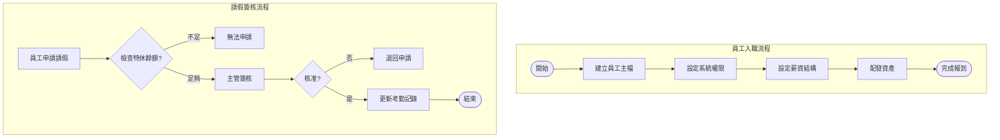
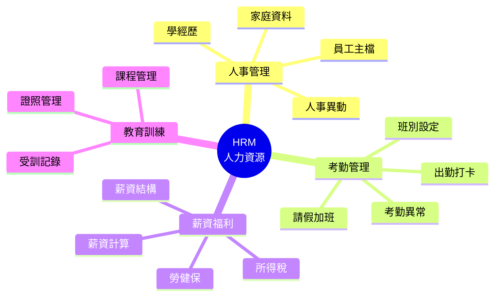
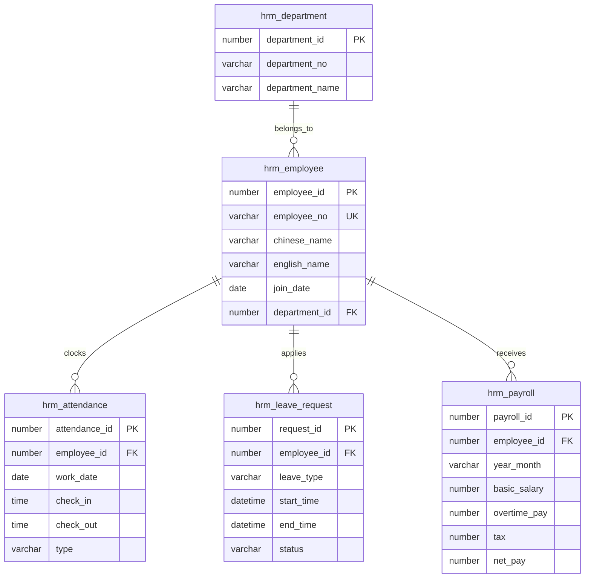

# HRM 人力資源管理系統 (Human Resource Management System)

## 系統概述

HRM (Human Resource Management) 是企業人力資源管理的核心系統，涵蓋員工從招募、任用、薪資、考勤、績效、訓練到離職的完整生命週期管理。

### 系統目的
- 員工基本資料管理
- 出勤與排班管理
- 薪資計算與發放
- 績效考核管理
- 訓練發展管理
- 勞健保管理
- 請假加班管理
- 獎懲管理

---

## 資料庫架構

### 一、員工基本資料 (Employee Master Data)

#### 1.1 員工主檔

##### hrm_employee - 員工主檔
```sql
主要欄位:
- employee_id (PK): 員工ID
- employee_no: 員工編號
- person_id: 個人資料ID (關聯 cmm_person)
- employee_kind_id: 員工類別ID
- department_id: 部門ID
- position_id: 職位ID
- sponsor_id: 主管ID
- entry_date: 到職日期
- probation_end_date: 試用期結束日期
- regular_date: 正式任用日期
- leave_date: 離職日期
- seniority: 年資
```

**功能說明:**
- 員工完整資料管理
- 與個人檔 (cmm_person) 整合
- 支援員工歷史記錄
- 員工狀態追蹤（在職/離職/留職停薪）

##### hrm_employee_kind - 員工類別
```sql
功能說明:
- 員工分類（正職/約聘/派遣/工讀等）
- 支援多語系
- 類別控制參數設定
```

##### hrm_employee_v - 員工視圖
```sql
功能說明:
- 整合員工、個人、部門、職位資料
- 提供完整員工資訊查詢
```

---

#### 1.2 員工歷史記錄

##### hrm_em_job_history - 工作經歷
```sql
功能說明:
- 員工工作經歷記錄
- 前公司任職資料
```

##### hrm_em_diploma_history - 學歷記錄
```sql
功能說明:
- 員工學歷資料
- 學位、學校、科系
```

##### hrm_em_department_history_v - 部門異動歷史
```sql
功能說明:
- 員工部門調動記錄
- 異動日期、原因追蹤
```

##### hrm_em_position_history_v - 職位異動歷史
```sql
功能說明:
- 員工職位變更記錄
- 升遷降調追蹤
```

##### hrm_em_comp_corp_history_v - 公司法人異動歷史
```sql
功能說明:
- 員工所屬公司法人變更記錄
```

---

#### 1.3 員工合約

##### hrm_contract - 合約主檔
```sql
功能說明:
- 勞動合約管理
- 合約類型、期間
```

##### hrm_contract_kind - 合約類別
```sql
功能說明:
- 合約類型定義
- 定期/不定期合約
```

##### hrm_em_contract - 員工合約
```sql
功能說明:
- 員工合約記錄
- 合約起訖日期
```

---

### 二、組織與職位 (Organization & Position)

#### 2.1 職位管理

##### hrm_position - 職位主檔
```sql
主要欄位:
- position_id (PK): 職位ID
- position_no: 職位編號
- position_name: 職位名稱
- position_level: 職位層級
- department_id: 所屬部門ID
```

**功能說明:**
- 職位定義與管理
- 職位階層結構
- 職位權重設定

##### hrm_position_wage - 職位薪資
```sql
功能說明:
- 職位薪資範圍設定
- 最低/最高薪資
```

##### hrm_position_weight - 職位權重
```sql
功能說明:
- 職位重要性權重
- 用於績效評估
```

---

#### 2.2 成本中心

##### hrm_cost_center - 成本中心
```sql
功能說明:
- 成本中心定義
- 費用歸屬管理
```

##### hrm_cost_center_department - 成本中心部門
```sql
功能說明:
- 成本中心與部門對應
```

---

### 三、出勤管理 (Attendance Management)

#### 3.1 打卡記錄

##### hrm_time_card - 打卡主檔
```sql
主要欄位:
- time_card_id (PK): 打卡ID
- employee_id: 員工ID
- card_date: 打卡日期
- card_time: 打卡時間
- card_type: 打卡類型（上班/下班）
- machine_no: 打卡機編號
```

**功能說明:**
- 員工打卡記錄
- 支援多種打卡機
- 異常打卡處理

##### hrm_time_card_machine - 打卡機
```sql
功能說明:
- 打卡機設備管理
- 打卡機位置設定
```

##### hrm_time_card_log - 打卡日誌
```sql
功能說明:
- 打卡原始記錄
- 資料來源追蹤
```

---

#### 3.2 出勤卡

##### hrm_em_time_card - 員工出勤卡
```sql
主要欄位:
- employee_id: 員工ID
- card_date: 出勤日期
- roster_id: 班別ID
- on_duty_time: 上班時間
- off_duty_time: 下班時間
- work_hours: 工作時數
- late_minutes: 遲到分鐘數
- early_leave_minutes: 早退分鐘數
- absent_hours: 曠職時數
```

**功能說明:**
- 每日出勤統計
- 遲到早退計算
- 工時統計

##### hrm_em_time_card_modify - 出勤修改
```sql
功能說明:
- 出勤異常修正
- 修改申請與審核
```

##### hrm_em_time_card_abnormal - 出勤異常
```sql
功能說明:
- 異常出勤記錄
- 異常原因追蹤
```

---

#### 3.3 排班管理

##### hrm_roster - 班別主檔
```sql
主要欄位:
- roster_id (PK): 班別ID
- roster_no: 班別編號
- roster_name: 班別名稱
- on_duty_time: 上班時間
- off_duty_time: 下班時間
- work_hours: 標準工時
- rest_hours: 休息時數
```

**功能說明:**
- 班別定義
- 工時設定
- 彈性工時支援

##### hrm_group_roster - 群組排班
```sql
功能說明:
- 排班群組設定
- 輪班模式定義
```

##### hrm_group_roster_detail - 群組排班明細
```sql
功能說明:
- 排班明細資料
- 每日班別設定
```

##### hrm_em_group_roster - 員工群組排班
```sql
功能說明:
- 員工排班記錄
- 排班週期管理
```

---

#### 3.4 值勤時間

##### hrm_duty_time_head - 值勤時間主檔
```sql
功能說明:
- 值勤時間定義
- 特殊值勤設定
```

##### hrm_duty_time_detail - 值勤時間明細
```sql
功能說明:
- 值勤時段設定
```

---

### 四、請假管理 (Leave Management)

#### 4.1 假別設定

##### hrm_leave - 假別主檔
```sql
主要欄位:
- leave_id (PK): 假別ID
- leave_no: 假別編號
- leave_name: 假別名稱
- paid_flag: 是否給薪
- need_proof: 是否需證明
- max_hours: 最大時數
```

**功能說明:**
- 假別定義（特休/病假/事假等）
- 給薪/不給薪設定
- 請假規則設定

##### hrm_leave_booking - 假別預約
```sql
功能說明:
- 特殊假別預約機制
- 如：年度特休預約
```

---

#### 4.2 請假申請

##### hrm_em_ask_for_leave - 員工請假申請
```sql
主要欄位:
- ask_for_leave_id (PK): 請假ID
- employee_id: 員工ID
- leave_id: 假別ID
- start_date: 開始日期
- start_time: 開始時間
- end_date: 結束日期
- end_time: 結束時間
- leave_hours: 請假時數
- reason: 請假原因
- status: 狀態（申請中/核准/駁回）
```

**功能說明:**
- 請假申請單
- 支援小時/天數請假
- 請假審核流程

##### hrm_em_ask_for_leave_abort - 請假作廢
```sql
功能說明:
- 請假單作廢記錄
- 作廢原因追蹤
```

##### hrm_em_ask_for_leave_modify - 請假修改
```sql
功能說明:
- 請假單修改記錄
```

---

#### 4.3 假期額度

##### hrm_em_leave_allow_hours - 員工可請假時數
```sql
主要欄位:
- employee_id: 員工ID
- leave_id: 假別ID
- year: 年度
- allow_hours: 可請時數
- used_hours: 已請時數
- remain_hours: 剩餘時數
```

**功能說明:**
- 員工假期額度管理
- 特休年資計算
- 假期結轉

##### hrm_em_sabbatical_leave - 特休假
```sql
功能說明:
- 特休假額度計算
- 年資對應特休天數
```

---

### 五、加班管理 (Overtime Management)

#### 5.1 加班申請

##### hrm_em_overtime - 員工加班申請
```sql
主要欄位:
- overtime_id (PK): 加班ID
- employee_id: 員工ID
- overtime_date: 加班日期
- start_time: 開始時間
- end_time: 結束時間
- overtime_hours: 加班時數
- overtime_type: 加班類型（平日/假日）
- compensatory_type: 補償方式（加班費/補休）
- status: 狀態
```

**功能說明:**
- 加班申請單
- 加班時數計算
- 加班費/補休選擇

##### hrm_em_overtime_abort - 加班作廢
```sql
功能說明:
- 加班單作廢
```

##### hrm_em_exg_overtime - 換休加班
```sql
功能說明:
- 加班換補休記錄
- 補休使用追蹤
```

---

#### 5.2 加班倍率

##### hrm_overtime_multiple_factor - 加班倍率係數
```sql
功能說明:
- 加班費計算倍率
- 平日/假日/國定假日倍率
```

---

### 六、薪資管理 (Payroll Management)

#### 6.1 薪資項目

##### hrm_wage_item - 薪資項目主檔
```sql
主要欄位:
- wage_item_id (PK): 薪資項目ID
- wage_item_no: 薪資項目編號
- wage_item_name: 薪資項目名稱
- wage_type: 薪資類型（固定/變動）
- calc_method: 計算方式
- is_taxable: 是否課稅
- is_labor_insurance: 是否計入勞保
```

**功能說明:**
- 薪資項目定義
- 本薪、津貼、獎金等
- 計算公式設定

##### hrm_wage_calc_method - 薪資計算方式
```sql
功能說明:
- 薪資計算公式
- 支援複雜計算邏輯
```

---

#### 6.2 員工薪資

##### hrm_em_wage_history - 員工薪資歷史
```sql
主要欄位:
- employee_id: 員工ID
- effective_date: 生效日期
- base_salary: 本薪
- position_allowance: 職務加給
- monthly_wage: 月薪
```

**功能說明:**
- 員工薪資記錄
- 調薪歷史追蹤
```

---

#### 6.3 薪資計算

##### hrm_em_salary_head - 員工薪資主檔
```sql
主要欄位:
- salary_head_id (PK): 薪資主檔ID
- employee_id: 員工ID
- salary_year_month: 薪資年月
- work_days: 工作天數
- gross_salary: 應發薪資
- deduction: 扣款
- net_salary: 實發薪資
- status: 狀態（計算中/已確認/已發放）
```

**功能說明:**
- 月薪資計算結果
- 薪資發放記錄

##### hrm_em_salary_detail - 員工薪資明細
```sql
主要欄位:
- salary_head_id: 薪資主檔ID
- wage_item_id: 薪資項目ID
- amount: 金額
- hours: 時數
- days: 天數
```

**功能說明:**
- 薪資明細項目
- 各項收入/扣款明細

##### hrm_em_salary_payment - 薪資發放
```sql
功能說明:
- 薪資發放記錄
- 銀行轉帳資料
```

---

#### 6.4 薪資銀行

##### hrm_salary_bank - 薪資銀行
```sql
功能說明:
- 薪資轉帳銀行設定
```

##### hrm_salary_bank_detail - 薪資銀行明細
```sql
功能說明:
- 員工薪資轉帳帳號
```

---

### 七、勞健保管理 (Labor & Health Insurance)

#### 7.1 勞保

##### hrm_em_labor_insurance - 員工勞保
```sql
主要欄位:
- employee_id: 員工ID
- insurance_start_date: 加保日期
- insurance_end_date: 退保日期
- insurance_salary: 投保薪資
- insurance_grade: 投保級距
```

**功能說明:**
- 員工勞保記錄
- 投保薪資級距
- 加退保管理

##### hrm_labor_insurance_detail - 勞保明細
```sql
功能說明:
- 勞保費用明細
- 個人/公司負擔金額
```

##### hrm_labor_insurance_head - 勞保主檔
```sql
功能說明:
- 勞保繳費主檔
- 月份彙總資料
```

---

#### 7.2 健保

##### hrm_em_health_insurance - 員工健保
```sql
功能說明:
- 員工健保記錄
- 投保薪資級距
```

##### hrm_health_insurance_detail - 健保明細
```sql
功能說明:
- 健保費用明細
```

##### hrm_health_insurance_head - 健保主檔
```sql
功能說明:
- 健保繳費主檔
```

---

#### 7.3 二代健保

##### hrm_em_2nd_nhi_detail_w - 二代健保明細
```sql
功能說明:
- 二代健保補充保費計算
```

##### hrm_em_2nd_nhi_head_w - 二代健保主檔
```sql
功能說明:
- 二代健保彙總
```

---

#### 7.4 保險級距

##### hrm_insurance_base - 保險投保基數
```sql
功能說明:
- 勞健保投保薪資級距表
```

##### hrm_group_insurance_grade - 群組保險級距
```sql
功能說明:
- 保險級距設定
```

---

### 八、績效考核 (Performance Appraisal)

#### 8.1 年度考核

##### hrm_em_year_assess_head - 員工年度考核主檔
```sql
主要欄位:
- assess_head_id (PK): 考核主檔ID
- employee_id: 員工ID
- assess_year: 考核年度
- total_score: 總分
- grade: 等第
- status: 狀態
```

**功能說明:**
- 年度績效考核
- 考核等第評定

##### hrm_em_year_assess_detail - 員工年度考核明細
```sql
功能說明:
- 考核項目明細
- 各項目評分
```

##### hrm_em_year_assess_manager - 考核主管
```sql
功能說明:
- 考核主管設定
- 多層級考核
```

---

#### 8.2 考核設定

##### hrm_assess_item - 考核項目
```sql
功能說明:
- 考核項目定義
- 評分標準
```

##### hrm_assess_head - 考核主檔
```sql
功能說明:
- 考核制度設定
```

##### hrm_assess_detail - 考核明細
```sql
功能說明:
- 考核項目配置
```

---

#### 8.3 績效獎金

##### hrm_em_perf_bonus - 員工績效獎金
```sql
功能說明:
- 績效獎金計算
- 依考核等第發放
```

##### hrm_performance_bonus_base - 績效獎金基數
```sql
功能說明:
- 獎金基數設定
```

---

### 九、訓練發展 (Training & Development)

#### 9.1 訓練課程

##### hrm_training_class - 訓練課程
```sql
主要欄位:
- training_class_id (PK): 課程ID
- class_name: 課程名稱
- start_date: 開始日期
- end_date: 結束日期
- hours: 時數
- location: 地點
```

**功能說明:**
- 訓練課程管理
- 課程時間地點

##### hrm_training_offering - 訓練開課
```sql
功能說明:
- 開課資訊
```

##### hrm_training_class_teacher - 訓練講師
```sql
功能說明:
- 課程講師設定
```

---

#### 9.2 訓練記錄

##### hrm_em_training_log - 員工訓練記錄
```sql
主要欄位:
- employee_id: 員工ID
- training_class_id: 課程ID
- attend_date: 參加日期
- hours: 時數
- score: 成績
- pass_flag: 是否通過
```

**功能說明:**
- 員工訓練歷程
- 訓練成效追蹤

##### hrm_new_training - 新進訓練
```sql
功能說明:
- 新進員工訓練
```

##### hrm_new_training_log - 新進訓練記錄
```sql
功能說明:
- 新進訓練完成記錄
```

---

### 十、獎懲管理 (Reward & Punishment)

#### 10.1 獎懲記錄

##### hrm_em_punish_prize - 員工獎懲
```sql
主要欄位:
- punish_prize_id (PK): 獎懲ID
- employee_id: 員工ID
- punish_prize_type: 獎懲類型（獎勵/懲處）
- punish_prize_kind: 獎懲種類
- occur_date: 發生日期
- amount: 金額
- reason: 原因
```

**功能說明:**
- 員工獎懲記錄
- 獎金/罰款管理

##### hrm_punish_prize - 獎懲類別
```sql
功能說明:
- 獎懲類別定義
- 嘉獎/申誡/記過等
```

##### hrm_em_punish_prize_deduct - 獎懲扣款
```sql
功能說明:
- 獎懲金額扣款記錄
```

---

### 十一、其他管理功能

#### 11.1 餐費管理

##### hrm_em_meal - 員工餐費
```sql
功能說明:
- 員工用餐記錄
- 餐費計算
```

##### hrm_meal - 餐別
```sql
功能說明:
- 餐別定義（早/午/晚餐）
```

##### hrm_meal_fee - 餐費標準
```sql
功能說明:
- 餐費標準設定
```

---

#### 11.2 宿舍管理

##### hrm_bedspace - 床位
```sql
功能說明:
- 宿舍床位管理
```

##### hrm_bedspace_history - 床位歷史
```sql
功能說明:
- 員工住宿記錄
```

---

#### 11.3 制服管理

##### hrm_uniform - 制服
```sql
功能說明:
- 制服類別
```

##### hrm_em_uniform - 員工制服
```sql
功能說明:
- 員工制服領用記錄
```

---

#### 11.4 借款管理

##### hrm_em_loan - 員工借款
```sql
功能說明:
- 員工借款記錄
```

##### hrm_em_loan_return - 借款歸還
```sql
功能說明:
- 借款還款記錄
```

---

#### 11.5 健康檢查

##### hrm_em_health_check - 員工健康檢查
```sql
功能說明:
- 員工健檢記錄
```

---

## 主要程式套件 (Packages)

### 1. hrm_job_pkg
**功能:**
- 排程作業處理
- 定期薪資計算
- 勞健保計算

---

## 主要函數 (Functions)

### 薪資計算
- `f_hrm_calc_em_salary_amt`: 計算員工薪資金額
- `f_hrm_calc_em_monthly_wage`: 計算員工月薪
- `f_hrm_calc_em_income`: 計算員工所得
- `f_hrm_calc_em_period_income`: 計算期間所得

### 勞健保計算
- `f_hrm_calc_em_health_insurance`: 計算健保費
- `f_hrm_calc_em_retire_self`: 計算退休金自提

### 工時計算
- `f_hrm_calc_leave_hours`: 計算請假時數
- `f_hrm_calc_feo_process_hours`: 計算加工時數
- `f_hrm_calc_rf_process_hours`: 計算RF加工時數

### 年資計算
- `f_hrm_calc_em_service_age`: 計算員工年資
- `f_hrm_calc_em_service_age_bd`: 計算BD員工年資

### 稅務計算
- `f_hrm_calc_tw_income_tax`: 計算台灣所得稅
- `f_hrm_calc_foreign_works_tax`: 計算外籍勞工稅

### 其他
- `f_hrm_calc_meal_fee`: 計算餐費
- `f_hrm_calc_power_usage_fee`: 計算電費
- `f_hrm_calc_wage_compensatory`: 計算補償工資

---

## 系統流程

### 1. 員工到職流程
```
1. 建立個人資料 (cmm_person)
2. 建立員工資料 (hrm_employee)
3. 設定部門職位
4. 簽訂勞動合約 (hrm_em_contract)
5. 設定薪資 (hrm_em_wage_history)
6. 加入勞健保 (hrm_em_labor_insurance, hrm_em_health_insurance)
7. 設定銀行帳號
8. 新進訓練 (hrm_new_training_log)
```

### 2. 月薪資計算流程
```
1. 取得員工出勤資料 (hrm_em_time_card)
2. 計算工作天數/時數
3. 計算請假扣款 (hrm_em_ask_for_leave)
4. 計算加班費 (hrm_em_overtime)
5. 計算各項津貼
6. 計算勞健保費用
7. 計算所得稅
8. 產生薪資單 (hrm_em_salary_head/detail)
9. 薪資發放 (hrm_em_salary_payment)
```

### 3. 請假申請流程
```
1. 員工提出請假申請 (hrm_em_ask_for_leave)
2. 檢查假期額度 (hrm_em_leave_allow_hours)
3. 主管審核
4. 核准後扣除額度
5. 更新出勤記錄
6. 薪資計算時扣款
```

### 4. 年度考核流程
```
1. 設定考核項目 (hrm_assess_item)
2. 建立考核主檔 (hrm_em_year_assess_head)
3. 主管評分 (hrm_em_year_assess_detail)
4. 計算總分與等第
5. 核定績效獎金 (hrm_em_perf_bonus)
6. 調薪建議
```

---

## 系統特色

1. **完整生命週期管理**: 從招募到離職完整追蹤
2. **彈性薪資計算**: 支援複雜薪資結構與計算公式
3. **智慧排班**: 支援多種排班模式與輪班機制
4. **自動化計算**: 勞健保、所得稅自動計算
5. **多公司法人**: 支援集團多公司管理
6. **歷史追蹤**: 完整的異動歷史記錄
7. **整合性強**: 與財務、成本系統緊密整合

---

## 整合介面

### 1. 與 CMM 整合
- 使用 cmm_person 個人資料
- 使用 cmm_department 部門資料
- 使用 cmm_company_corporation 公司法人

### 2. 與 GLM 整合
- 薪資費用傳票產生
- 成本中心費用分攤

### 3. 與 IDM 整合
- 使用者帳號整合
- 權限控制

---

## 相關系統模組

- **CMM**: 組織架構、個人資料
- **GLM**: 薪資費用會計處理
- **IDM**: 使用者權限管理

---

## 文件資訊

- **系統代碼**: HRM
- **系統名稱**: Human Resource Management System (人力資源管理系統)
- **資料來源**: s:\mis\hrm\
- **建立日期**: 2026-01-21
- **文件版本**: 1.0

---

## 系統圖表 (System Diagrams)

### 1. 系統流程圖 (Flowchart)



### 2. 系統功能心智圖 (Mindmap)



### 3. 實體關聯圖 (ER Diagram)



