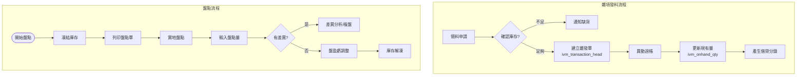
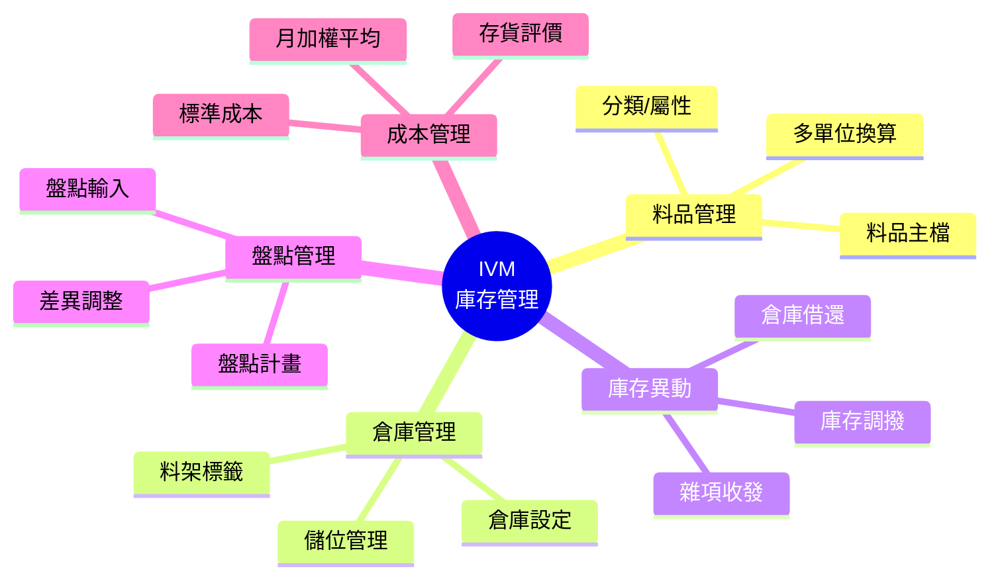
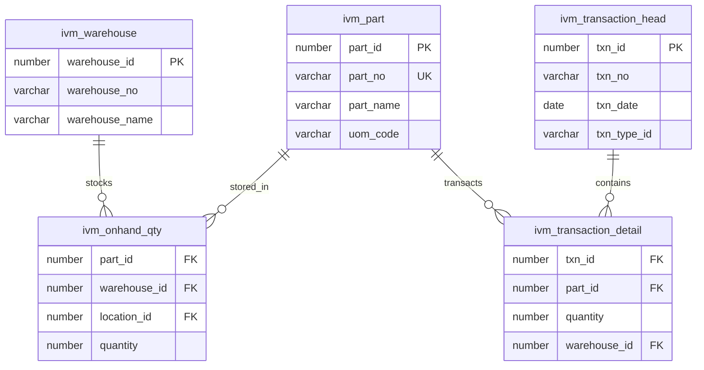

# IVM 庫存管理系統 (Inventory Management System)

## 系統概述

IVM (Inventory Management) 是企業物料庫存管理的核心系統，負責料品主檔、倉庫管理、庫存異動、盤點作業等功能，是連接採購、生產、銷售的樞紐。

### 系統目的
- 料品主檔管理
- 倉庫與儲位管理
- 庫存異動控制
- 庫存盤點作業
- 批號/序號追蹤
- 安全庫存管理
- 庫存成本計算

---

## 資料庫架構

### 一、料品主檔 (Item Master)

#### 1.1 料品基本資料

##### ivm_part - 料品主檔
```sql
主要欄位:
- part_id (PK): 料品ID
- part_no: 料號
- part_name: 品名
- part_spec: 規格
- part_group_id: 料品群組ID
- part_kind_id: 料品類別ID
- unit_id: 單位ID
- safety_stock: 安全庫存量
- max_stock: 最大庫存量
- min_stock: 最小庫存量
- lead_time: 前置時間
- abc_class: ABC 分類
- status: 狀態（使用中/停用）
```

**功能說明:**
- 料品完整資料管理
- 支援多單位轉換
- ABC 分類管理
- 安全庫存控制

##### ivm_part_group - 料品群組
```sql
功能說明:
- 料品分類管理
- 階層式群組結構
- 支援多語系
```

##### ivm_part_kind - 料品類別
```sql
功能說明:
- 料品類別定義
- 原物料/半成品/成品等
```

##### ivm_part_unit - 料品單位
```sql
功能說明:
- 料品多單位設定
- 單位換算關係
```

---

#### 1.2 料品擴充資料

##### ivm_part_warehouse - 料品倉庫
```sql
主要欄位:
- part_id: 料品ID
- warehouse_id: 倉庫ID
- safety_stock: 安全庫存
- max_stock: 最大庫存
- reorder_point: 再訂購點
- reorder_qty: 再訂購量
```

**功能說明:**
- 料品在各倉庫的參數設定
- 倉庫別安全庫存

##### ivm_part_supplier - 料品供應商
```sql
功能說明:
- 料品供應商對應
- 供應商料號對照
- 採購優先順序
```

##### ivm_part_customer - 料品客戶
```sql
功能說明:
- 料品客戶對應
- 客戶料號對照
```

##### ivm_part_substitute - 料品替代
```sql
功能說明:
- 替代料設定
- 替代優先順序
```

##### ivm_part_price - 料品價格
```sql
功能說明:
- 料品價格歷史
- 標準成本/實際成本
```

---

### 二、倉庫管理 (Warehouse Management)

#### 2.1 倉庫設定

##### ivm_warehouse - 倉庫主檔
```sql
主要欄位:
- warehouse_id (PK): 倉庫ID
- warehouse_no: 倉庫編號
- warehouse_name: 倉庫名稱
- warehouse_type: 倉庫類型
- organization_id: 所屬組織ID
- location: 位置
- manager_id: 倉管員ID
```

**功能說明:**
- 倉庫基本資料
- 倉庫類型分類（原料倉/成品倉等）
- 倉管員設定

##### ivm_location - 儲位主檔
```sql
主要欄位:
- location_id (PK): 儲位ID
- location_no: 儲位編號
- warehouse_id: 倉庫ID
- aisle: 走道
- rack: 貨架
- level: 層
- bin: 格
- capacity: 容量
```

**功能說明:**
- 儲位編碼管理
- 立體倉儲支援
- 儲位容量控制

##### ivm_warehouse_role - 倉庫角色
```sql
功能說明:
- 倉庫存取權限控制
- 角色可存取倉庫範圍
```

---

### 三、庫存管理 (Stock Management)

#### 3.1 庫存主檔

##### ivm_stock - 庫存主檔
```sql
主要欄位:
- stock_id (PK): 庫存ID
- part_id: 料品ID
- warehouse_id: 倉庫ID
- location_id: 儲位ID
- on_hand_qty: 現有量
- available_qty: 可用量
- allocated_qty: 已分配量
- on_order_qty: 在途量
- reserved_qty: 保留量
```

**功能說明:**
- 即時庫存數量
- 可用量計算 = 現有量 - 已分配量 - 保留量
- 支援多倉多儲位

##### ivm_stock_lot - 批號庫存
```sql
主要欄位:
- part_id: 料品ID
- warehouse_id: 倉庫ID
- lot_number: 批號
- on_hand_qty: 現有量
- manufacture_date: 製造日期
- expire_date: 有效期限
```

**功能說明:**
- 批號管理
- 效期控制
- 先進先出 (FIFO) 管理

##### ivm_stock_serial - 序號庫存
```sql
功能說明:
- 序號管理
- 序號追蹤
- 一物一號控制
```

---

#### 3.2 庫存異動

##### ivm_transaction - 庫存異動主檔
```sql
主要欄位:
- transaction_id (PK): 異動ID
- transaction_no: 異動單號
- transaction_type: 異動類型
- transaction_date: 異動日期
- part_id: 料品ID
- warehouse_id: 倉庫ID
- location_id: 儲位ID
- quantity: 數量
- unit_cost: 單位成本
- source_type: 來源類型
- source_id: 來源單據ID
- status: 狀態
```

**功能說明:**
- 所有庫存異動記錄
- 異動類型：進貨/出貨/調撥/調整/盤點等
- 來源單據追蹤

##### ivm_transaction_lot - 批號異動
```sql
功能說明:
- 批號異動記錄
- 批號進出追蹤
```

##### ivm_transaction_serial - 序號異動
```sql
功能說明:
- 序號異動記錄
- 序號流向追蹤
```

---

### 四、庫存作業 (Inventory Operations)

#### 4.1 庫存調整

##### ivm_adjustment_head - 庫存調整主檔
```sql
主要欄位:
- adjustment_id (PK): 調整單ID
- adjustment_no: 調整單號
- adjustment_date: 調整日期
- warehouse_id: 倉庫ID
- reason: 調整原因
- status: 狀態
```

**功能說明:**
- 庫存調整單
- 盤盈盤虧處理
- 損耗報廢

##### ivm_adjustment_detail - 庫存調整明細
```sql
主要欄位:
- adjustment_id: 調整單ID
- line_no: 行號
- part_id: 料品ID
- location_id: 儲位ID
- lot_number: 批號
- adjust_qty: 調整數量
- before_qty: 調整前數量
- after_qty: 調整後數量
```

**功能說明:**
- 調整明細資料
- 調整前後數量記錄
```

---

#### 4.2 庫存調撥

##### ivm_transfer_head - 調撥主檔
```sql
主要欄位:
- transfer_id (PK): 調撥單ID
- transfer_no: 調撥單號
- transfer_date: 調撥日期
- from_warehouse_id: 來源倉庫
- to_warehouse_id: 目的倉庫
- status: 狀態
```

**功能說明:**
- 倉庫間調撥
- 儲位間調撥

##### ivm_transfer_detail - 調撥明細
```sql
主要欄位:
- transfer_id: 調撥單ID
- part_id: 料品ID
- from_location_id: 來源儲位
- to_location_id: 目的儲位
- transfer_qty: 調撥數量
```

**功能說明:**
- 調撥明細資料
```

---

#### 4.3 庫存盤點

##### ivm_inventory_head - 盤點主檔
```sql
主要欄位:
- inventory_id (PK): 盤點單ID
- inventory_no: 盤點單號
- inventory_date: 盤點日期
- warehouse_id: 倉庫ID
- inventory_type: 盤點類型（全盤/抽盤/循環盤）
- status: 狀態
```

**功能說明:**
- 盤點作業管理
- 支援多種盤點方式

##### ivm_inventory_detail - 盤點明細
```sql
主要欄位:
- inventory_id: 盤點單ID
- part_id: 料品ID
- location_id: 儲位ID
- lot_number: 批號
- book_qty: 帳面數量
- count_qty: 盤點數量
- diff_qty: 差異數量
- count_user_id: 盤點人員
```

**功能說明:**
- 盤點明細記錄
- 帳實差異分析

##### ivm_inventory_count - 盤點次數
```sql
功能說明:
- 複盤記錄
- 多次盤點管理
```

---

### 五、批號序號管理 (Lot & Serial Number)

#### 5.1 批號管理

##### ivm_lot_number - 批號主檔
```sql
主要欄位:
- lot_number_id (PK): 批號ID
- lot_number: 批號
- part_id: 料品ID
- manufacture_date: 製造日期
- expire_date: 有效期限
- vendor_lot_no: 供應商批號
- status: 狀態
```

**功能說明:**
- 批號資料管理
- 效期追蹤
- 供應商批號對照

##### ivm_lot_attribute - 批號屬性
```sql
功能說明:
- 批號擴充屬性
- 品質檢驗資料
```

---

#### 5.2 序號管理

##### ivm_serial_number - 序號主檔
```sql
主要欄位:
- serial_number_id (PK): 序號ID
- serial_number: 序號
- part_id: 料品ID
- lot_number: 批號
- manufacture_date: 製造日期
- warranty_date: 保固期限
- status: 狀態（在庫/已出貨）
```

**功能說明:**
- 序號資料管理
- 保固追蹤
- 序號狀態控制

---

### 六、庫存分析 (Inventory Analysis)

#### 6.1 ABC 分析

##### ivm_abc_analysis - ABC 分析
```sql
功能說明:
- ABC 分類分析
- 依金額/數量分類
- 重點管理料品識別
```

---

#### 6.2 呆滯料分析

##### ivm_slow_moving - 呆滯料
```sql
功能說明:
- 呆滯料識別
- 無異動天數追蹤
- 呆滯料處理建議
```

---

#### 6.3 安全庫存分析

##### ivm_safety_stock_analysis - 安全庫存分析
```sql
功能說明:
- 安全庫存計算
- 再訂購點建議
- 缺料預警
```

---

### 七、成本管理 (Cost Management)

#### 7.1 成本計算

##### ivm_cost_layer - 成本層
```sql
主要欄位:
- cost_layer_id (PK): 成本層ID
- part_id: 料品ID
- warehouse_id: 倉庫ID
- transaction_id: 異動ID
- quantity: 數量
- unit_cost: 單位成本
- total_cost: 總成本
- remain_qty: 剩餘數量
```

**功能說明:**
- 移動平均成本法
- 先進先出成本法
- 成本層次追蹤

##### ivm_cost_adjustment - 成本調整
```sql
功能說明:
- 成本調整記錄
- 成本重計算
```

---

### 八、進出貨管理 (Receipt & Issue)

#### 8.1 進貨作業

##### ivm_receipt_head - 進貨主檔
```sql
主要欄位:
- receipt_id (PK): 進貨單ID
- receipt_no: 進貨單號
- receipt_date: 進貨日期
- warehouse_id: 倉庫ID
- vendor_id: 供應商ID
- purchase_order_id: 採購單ID
- status: 狀態
```

**功能說明:**
- 進貨單管理
- 與採購單整合

##### ivm_receipt_detail - 進貨明細
```sql
主要欄位:
- receipt_id: 進貨單ID
- part_id: 料品ID
- location_id: 儲位ID
- lot_number: 批號
- receipt_qty: 進貨數量
- inspect_qty: 檢驗數量
- accept_qty: 合格數量
- reject_qty: 不良數量
```

**功能說明:**
- 進貨明細資料
- 檢驗數量記錄
```

---

#### 8.2 出貨作業

##### ivm_issue_head - 出貨主檔
```sql
主要欄位:
- issue_id (PK): 出貨單ID
- issue_no: 出貨單號
- issue_date: 出貨日期
- warehouse_id: 倉庫ID
- customer_id: 客戶ID
- sales_order_id: 銷售訂單ID
- status: 狀態
```

**功能說明:**
- 出貨單管理
- 與銷售訂單整合

##### ivm_issue_detail - 出貨明細
```sql
主要欄位:
- issue_id: 出貨單ID
- part_id: 料品ID
- location_id: 儲位ID
- lot_number: 批號
- issue_qty: 出貨數量
```

**功能說明:**
- 出貨明細資料
- 批號先進先出
```

---

### 九、預留與分配 (Reservation & Allocation)

#### 9.1 庫存預留

##### ivm_reservation - 庫存預留
```sql
主要欄位:
- reservation_id (PK): 預留ID
- part_id: 料品ID
- warehouse_id: 倉庫ID
- reserved_qty: 預留數量
- source_type: 來源類型
- source_id: 來源單據ID
- expire_date: 失效日期
```

**功能說明:**
- 庫存預留管理
- 銷售訂單預留
- 工單預留

---

#### 9.2 庫存分配

##### ivm_allocation - 庫存分配
```sql
功能說明:
- 庫存分配記錄
- 分配優先順序
```

---

### 十、報表與查詢 (Reports & Queries)

#### 10.1 庫存報表

- 庫存明細表
- 庫存彙總表
- 庫存異動表
- 批號庫存表
- 序號庫存表

#### 10.2 分析報表

- ABC 分析表
- 呆滯料分析表
- 庫存週轉率分析
- 安全庫存分析
- 缺料分析表

---

## 主要程式套件 (Packages)

### 1. ivm_stock_pkg
**功能:**
- 庫存數量更新
- 可用量計算
- 庫存鎖定/解鎖

**主要程序:**
```sql
- update_stock: 更新庫存
- calculate_available: 計算可用量
- lock_stock: 鎖定庫存
- unlock_stock: 解鎖庫存
```

### 2. ivm_transaction_pkg
**功能:**
- 庫存異動處理
- 異動單據產生
- 成本計算

**主要程序:**
```sql
- create_transaction: 建立異動
- post_transaction: 過帳異動
- reverse_transaction: 沖銷異動
```

### 3. ivm_cost_pkg
**功能:**
- 成本計算
- 成本層管理
- 移動平均成本

**主要程序:**
```sql
- calculate_cost: 計算成本
- update_cost_layer: 更新成本層
- recalculate_cost: 重算成本
```

---

## 主要函數 (Functions)

### 庫存查詢
- `f_ivm_get_on_hand_qty`: 取得現有量
- `f_ivm_get_available_qty`: 取得可用量
- `f_ivm_get_allocated_qty`: 取得已分配量
- `f_ivm_get_on_order_qty`: 取得在途量

### 成本計算
- `f_ivm_get_unit_cost`: 取得單位成本
- `f_ivm_get_avg_cost`: 取得平均成本
- `f_ivm_calculate_fifo_cost`: 計算 FIFO 成本

### 批號序號
- `f_ivm_get_lot_qty`: 取得批號數量
- `f_ivm_get_serial_status`: 取得序號狀態
- `f_ivm_validate_lot`: 驗證批號有效性

---

## 系統流程

### 1. 進貨入庫流程
```
1. 建立進貨單 (ivm_receipt_head)
2. 輸入進貨明細 (ivm_receipt_detail)
3. 指定儲位與批號
4. 品質檢驗（選擇性）
5. 確認入庫
6. 產生庫存異動 (ivm_transaction)
7. 更新庫存數量 (ivm_stock)
8. 更新成本層 (ivm_cost_layer)
```

### 2. 出貨出庫流程
```
1. 建立出貨單 (ivm_issue_head)
2. 輸入出貨明細 (ivm_issue_detail)
3. 檢查庫存可用量
4. 分配儲位與批號（FIFO）
5. 確認出庫
6. 產生庫存異動 (ivm_transaction)
7. 更新庫存數量 (ivm_stock)
8. 更新成本層 (ivm_cost_layer)
```

### 3. 庫存盤點流程
```
1. 建立盤點單 (ivm_inventory_head)
2. 產生盤點清單 (ivm_inventory_detail)
3. 現場盤點輸入
4. 計算差異數量
5. 複盤（如需要）
6. 確認盤點結果
7. 產生調整單 (ivm_adjustment_head)
8. 過帳調整
9. 更新庫存
```

### 4. 庫存調撥流程
```
1. 建立調撥單 (ivm_transfer_head)
2. 輸入調撥明細 (ivm_transfer_detail)
3. 檢查來源倉庫庫存
4. 確認調撥
5. 產生出庫異動（來源倉）
6. 產生入庫異動（目的倉）
7. 更新兩倉庫存
```

---

## 成本計算方法

### 1. 移動平均成本法 (Moving Average)
```
新平均成本 = (原庫存金額 + 新進貨金額) / (原庫存量 + 新進貨量)
```

### 2. 先進先出法 (FIFO)
```
出貨成本 = 依進貨順序取最早批次成本
維護成本層次記錄
```

### 3. 標準成本法 (Standard Cost)
```
使用預設標準成本
定期與實際成本比較
產生成本差異分析
```

---

## 系統特色

1. **即時庫存**: 所有異動即時更新庫存數量
2. **多倉多儲位**: 支援複雜倉儲結構
3. **批號序號追蹤**: 完整的批號序號管理
4. **成本管理**: 支援多種成本計算方法
5. **效期管理**: 自動效期預警
6. **安全庫存**: 自動缺料預警
7. **ABC 分析**: 重點料品管理
8. **整合性強**: 與採購、生產、銷售緊密整合

---

## 整合介面

### 1. 與 PRM (採購) 整合
```
PRM 採購單 → IVM 進貨單 → 庫存增加
```

### 2. 與 WIP (生產) 整合
```
WIP 領料單 → IVM 出庫 → 庫存減少
WIP 入庫單 → IVM 進貨 → 庫存增加
```

### 3. 與 OAM (銷售) 整合
```
OAM 銷售訂單 → IVM 庫存預留
OAM 出貨單 → IVM 出庫 → 庫存減少
```

### 4. 與 GLM (總帳) 整合
```
IVM 庫存異動 → GLM 會計傳票
成本計算 → 存貨科目金額
```

---

## 關鍵控制點

### 1. 庫存準確性
- 嚴格進出庫管制
- 定期盤點作業
- 差異分析與調整

### 2. 成本準確性
- 正確的成本計算方法
- 及時的成本更新
- 成本差異分析

### 3. 效期管理
- 效期預警機制
- 先進先出控制
- 過期料處理

### 4. 安全庫存
- 安全庫存設定
- 缺料預警
- 自動請購建議

---

## 相關系統模組

- **PRM**: 採購進貨整合
- **WIP**: 生產領退料整合
- **OAM**: 銷售出貨整合
- **GLM**: 庫存成本會計整合
- **BOM**: 物料需求計算

---

## 文件資訊

- **系統代碼**: IVM
- **系統名稱**: Inventory Management System (庫存管理系統)
- **資料來源**: s:\mis\ivm\
- **建立日期**: 2026-01-21
- **文件版本**: 1.0

---

## 系統圖表 (System Diagrams)

### 1. 系統流程圖 (Flowchart)



### 2. 系統功能心智圖 (Mindmap)



### 3. 實體關聯圖 (ER Diagram)



