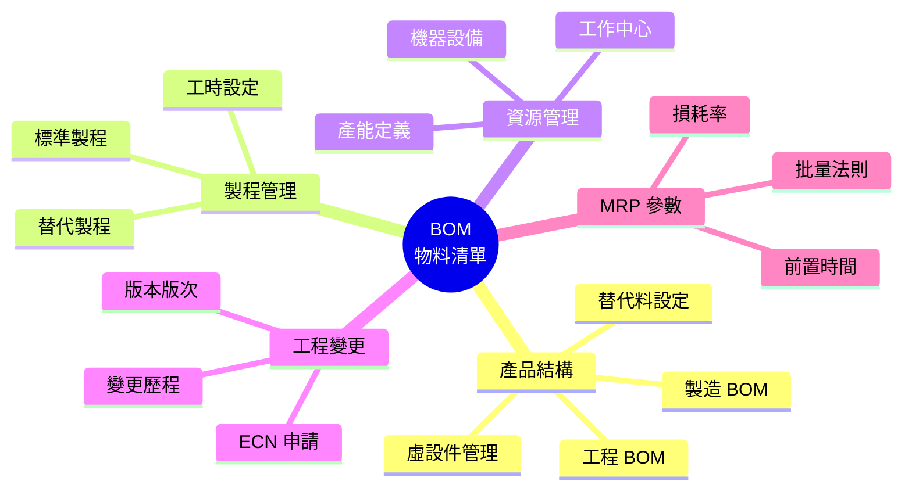
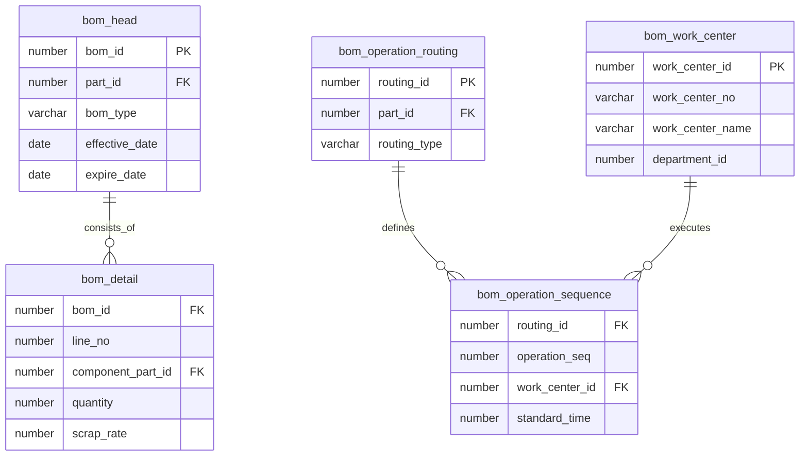

# BOM 物料清單系統 (Bill of Materials System)

## 系統概述

BOM (Bill of Materials) 是生產製造的核心系統，定義產品的物料結構、製程路線、工作中心等資訊，是生產計劃、成本計算、物料需求的基礎。

### 系統目的
- 產品結構管理 (BOM)
- 製程路線管理
- 工作中心管理
- 標準工時設定
- 物料需求計算 (MRP)
- 成本結構分析

---

## 資料庫架構

### 一、BOM 結構管理 (BOM Structure)

#### 1.1 BOM 主檔

##### bom_head - BOM 主檔
```sql
主要欄位:
- bom_id (PK): BOM ID
- part_id: 成品料號ID
- bom_no: BOM 編號
- bom_version: BOM 版本
- effective_date: 生效日期
- expire_date: 失效日期
- bom_type: BOM 類型（工程/製造/銷售）
- status: 狀態（草稿/核准/生效/失效）
```

**功能說明:**
- 產品 BOM 定義
- 支援多版本管理
- 生效日期控制
- BOM 類型分類

##### bom_detail - BOM 明細
```sql
主要欄位:
- bom_id: BOM ID
- line_no: 行號
- component_part_id: 組件料號ID
- quantity: 用量
- unit_id: 單位ID
- scrap_rate: 損耗率
- operation_seq: 作業序號
- reference_designator: 位號
- substitute_group: 替代群組
- phantom_flag: 虛設件標記
```

**功能說明:**
- BOM 組成明細
- 用量與損耗率設定
- 替代料群組
- 虛設件處理

---

#### 1.2 BOM 展開

##### bom_explosion - BOM 展開
```sql
功能說明:
- BOM 多階展開結果
- 階層式物料清單
- 用量累計計算
```

##### bom_where_used - 反查用途
```sql
功能說明:
- 料品使用在哪些產品
- 反向追溯
```

---

### 二、製程路線管理 (Routing)

#### 2.1 製程路線

##### bom_operation_routing - 製程路線主檔
```sql
主要欄位:
- routing_id (PK): 路線ID
- part_id: 料號ID
- routing_no: 路線編號
- routing_version: 路線版本
- effective_date: 生效日期
- expire_date: 失效日期
- status: 狀態
```

**功能說明:**
- 製程路線定義
- 支援多版本
- 生效期間控制

##### bom_operation_sequence - 製程工序
```sql
主要欄位:
- routing_id: 路線ID
- operation_seq: 工序序號
- operation_id: 作業ID
- work_center_id: 工作中心ID
- setup_time: 整備時間
- run_time: 加工時間
- queue_time: 等待時間
- move_time: 移動時間
- overlap_qty: 重疊數量
```

**功能說明:**
- 工序明細定義
- 標準工時設定
- 工序重疊設定

---

#### 2.2 標準作業

##### bom_standard_operation - 標準作業主檔
```sql
主要欄位:
- operation_id (PK): 作業ID
- operation_no: 作業編號
- operation_name: 作業名稱
- operation_type: 作業類型
- description: 說明
```

**功能說明:**
- 標準作業定義
- 作業類型分類
- 作業說明文件

##### bom_std_op_resource - 作業資源
```sql
功能說明:
- 作業所需資源
- 人力/機器/工具
```

##### bom_std_op_process - 作業流程
```sql
功能說明:
- 作業步驟說明
- SOP 標準作業程序
```

---

### 三、工作中心管理 (Work Center)

#### 3.1 工作中心

##### bom_work_center - 工作中心主檔
```sql
主要欄位:
- work_center_id (PK): 工作中心ID
- work_center_no: 工作中心編號
- work_center_name: 工作中心名稱
- work_center_type: 工作中心類型
- department_id: 所屬部門ID
- capacity: 產能
- efficiency: 效率
- utilization: 利用率
```

**功能說明:**
- 工作中心定義
- 產能設定
- 效率與利用率

##### bom_work_center_class - 工作中心分類
```sql
功能說明:
- 工作中心分類
- 類別管理
```

##### bom_work_center_resource - 工作中心資源
```sql
功能說明:
- 工作中心可用資源
- 機器設備清單
```

---

#### 3.2 工作中心日曆

##### bom_work_center_calendar - 工作中心日曆
```sql
功能說明:
- 工作日曆設定
- 工作時間定義
- 例假日設定
```

---

### 四、資源管理 (Resource)

#### 4.1 資源主檔

##### bom_resource - 資源主檔
```sql
主要欄位:
- resource_id (PK): 資源ID
- resource_no: 資源編號
- resource_name: 資源名稱
- resource_type: 資源類型（人力/機器/工具）
- unit_cost: 單位成本
- capacity: 產能
```

**功能說明:**
- 生產資源定義
- 資源成本設定
- 產能管理

##### bom_machine - 機器設備
```sql
功能說明:
- 機器設備主檔
- 機器規格參數
```

##### bom_machine_type - 機器類型
```sql
功能說明:
- 機器分類
```

---

### 五、替代料管理 (Substitute)

#### 5.1 替代料設定

##### bom_part_replacement - 料品替代
```sql
主要欄位:
- part_id: 主料ID
- substitute_part_id: 替代料ID
- priority: 優先順序
- ratio: 替代比例
- effective_date: 生效日期
- expire_date: 失效日期
```

**功能說明:**
- 替代料定義
- 替代優先順序
- 替代比例設定

---

### 六、工程變更管理 (ECN)

#### 6.1 工程變更

##### bom_ecn_head - 工程變更主檔
```sql
主要欄位:
- ecn_id (PK): ECN ID
- ecn_no: ECN 編號
- ecn_date: 變更日期
- part_id: 料號ID
- change_type: 變更類型
- reason: 變更原因
- status: 狀態
```

**功能說明:**
- 工程變更單
- 變更原因追蹤
- 變更審核流程

##### bom_ecn_detail - 工程變更明細
```sql
功能說明:
- 變更明細內容
- 變更前後對照
```

---

### 七、成本結構 (Cost Structure)

#### 7.1 成本展開

##### bom_cost_rollup - 成本展開
```sql
主要欄位:
- part_id: 料號ID
- material_cost: 材料成本
- labor_cost: 人工成本
- overhead_cost: 製造費用
- total_cost: 總成本
- cost_date: 成本日期
```

**功能說明:**
- BOM 成本展開
- 材料成本彙總
- 人工成本計算
- 製造費用分攤

---

### 八、物料需求計算 (MRP)

#### 8.1 MRP 計算

##### bom_mrp_demand - 需求主檔
```sql
功能說明:
- 獨立需求（銷售訂單）
- 相依需求（BOM 展開）
```

##### bom_mrp_supply - 供給主檔
```sql
功能說明:
- 現有庫存
- 在途採購
- 計劃生產
```

##### bom_mrp_plan - MRP 計劃
```sql
功能說明:
- MRP 計算結果
- 建議採購量
- 建議生產量
```

---

### 九、配方管理 (Formula)

#### 9.1 配方主檔

##### bom_formula_head - 配方主檔
```sql
功能說明:
- 配方定義（化工/食品業）
- 配方版本管理
```

##### bom_formula_detail - 配方明細
```sql
功能說明:
- 配方組成
- 配方比例
```

---

### 十、品質管制 (Quality Control)

#### 10.1 品質檢驗

##### bom_quality_plan - 品質計劃
```sql
功能說明:
- 工序品質檢驗計劃
- 檢驗項目設定
```

##### bom_inspection_point - 檢驗點
```sql
功能說明:
- 工序檢驗點設定
- 檢驗標準
```

---

## 主要程式套件 (Packages)

### 1. bom_explosion_pkg
**功能:**
- BOM 展開計算
- 多階 BOM 展開
- 用量計算

**主要程序:**
```sql
- explode_bom: 展開 BOM
- calculate_requirement: 計算需求量
- get_component_list: 取得組件清單
```

### 2. bom_cost_pkg
**功能:**
- 成本展開計算
- 成本彙總
- 成本分析

**主要程序:**
```sql
- rollup_cost: 成本展開
- calculate_material_cost: 計算材料成本
- calculate_labor_cost: 計算人工成本
```

### 3. bom_mrp_pkg
**功能:**
- MRP 計算
- 需求展開
- 供需平衡

**主要程序:**
```sql
- run_mrp: 執行 MRP
- calculate_net_requirement: 計算淨需求
- generate_plan_order: 產生計劃單
```

---

## 主要函數 (Functions)

### BOM 查詢
- `f_bom_get_component_qty`: 取得組件用量
- `f_bom_get_level`: 取得 BOM 階層
- `f_bom_check_circular`: 檢查循環參照

### 成本計算
- `f_bom_get_material_cost`: 取得材料成本
- `f_bom_get_labor_cost`: 取得人工成本
- `f_bom_get_total_cost`: 取得總成本

### 工時計算
- `f_bom_get_setup_time`: 取得整備時間
- `f_bom_get_run_time`: 取得加工時間
- `f_bom_get_total_time`: 取得總工時

---

## 系統流程

### 1. BOM 建立流程
```
1. 建立 BOM 主檔 (bom_head)
2. 設定 BOM 版本與生效日期
3. 輸入 BOM 明細 (bom_detail)
4. 設定組件用量與損耗率
5. 設定替代料（如需要）
6. BOM 審核
7. BOM 生效
```

### 2. 製程路線建立流程
```
1. 建立路線主檔 (bom_operation_routing)
2. 設定路線版本
3. 輸入工序明細 (bom_operation_sequence)
4. 設定工作中心
5. 設定標準工時
6. 設定工序資源需求
7. 路線審核生效
```

### 3. MRP 計算流程
```
1. 取得獨立需求（銷售訂單）
2. BOM 展開計算相依需求
3. 取得現有庫存
4. 取得在途採購/生產
5. 計算淨需求
6. 產生建議採購單
7. 產生建議工單
```

### 4. 成本展開流程
```
1. 取得料品標準成本
2. BOM 展開取得組件
3. 計算材料成本
4. 取得製程路線
5. 計算人工成本
6. 計算製造費用
7. 彙總總成本
```

---

## BOM 類型

### 1. 工程 BOM (EBOM)
- 產品設計階段使用
- 完整的產品結構
- 包含所有組件

### 2. 製造 BOM (MBOM)
- 生產製造使用
- 考慮製程需求
- 可能與 EBOM 不同

### 3. 銷售 BOM (SBOM)
- 銷售配置使用
- 選配件管理
- 客製化產品

### 4. 虛設 BOM (Phantom BOM)
- 不實際生產的中間件
- 簡化 BOM 結構
- 直接展開到下一階

---

## 系統特色

1. **多階 BOM**: 支援無限階層 BOM 結構
2. **版本管理**: 完整的 BOM 版本控制
3. **生效日期**: 時間點 BOM 管理
4. **替代料**: 彈性的替代料機制
5. **成本展開**: 自動成本計算與展開
6. **MRP 計算**: 物料需求計劃
7. **工程變更**: ECN 變更追蹤
8. **整合性強**: 與生產、成本緊密整合

---

## 整合介面

### 1. 與 IVM (庫存) 整合
```
BOM 展開 → 計算物料需求 → 檢查庫存
```

### 2. 與 WIP (生產) 整合
```
BOM → 工單展開 → 領料清單
製程路線 → 工序排程 → 生產進度
```

### 3. 與 PRM (採購) 整合
```
MRP 計算 → 建議採購量 → 採購請購單
```

### 4. 與 GLM (總帳) 整合
```
成本展開 → 標準成本 → 成本差異分析
```

---

## 關鍵控制點

### 1. BOM 準確性
- 嚴格的 BOM 審核流程
- 工程變更管制
- 定期 BOM 檢視

### 2. 版本控制
- 版本號碼管理
- 生效日期控制
- 歷史版本保存

### 3. 循環參照
- 檢查 BOM 循環
- 防止無限迴圈

### 4. 成本準確性
- 正確的用量設定
- 及時的成本更新
- 成本展開驗證

---

## 相關系統模組

- **IVM**: 物料需求與庫存整合
- **WIP**: 生產工單與製程整合
- **PRM**: MRP 採購建議
- **GLM**: 成本會計整合
- **TDM**: 工程圖面整合

---

## 文件資訊

- **系統代碼**: BOM
- **系統名稱**: Bill of Materials System (物料清單系統)
- **資料來源**: s:\mis\bom\
- **建立日期**: 2026-01-21
- **文件版本**: 1.0

---

## 系統圖表 (System Diagrams)

### 1. 系統流程圖 (Flowchart)

```mermaid
graph TD
    subgraph BOM 維護流程
    Start([開始]) --> CreateHead[建立 BOM 表頭]
    CreateHead --> AddDetail[加入元件/用量]
    AddDetail --> CheckLoop{檢查循環?}
    CheckLoop -- 是 --> Error[錯誤: 循環參照]
    CheckLoop -- 否 --> SetDate[設定生效/失效日]
    SetDate --> Approve[BOM 審核]
    Approve --> Active([BOM 生效])
    end

    subgraph 工程變更(ECN)
    Req[變更申請] --> Impact{影響評估?}
    Impact --> ApproveECN[ECN 核准]
    ApproveECN --> UpdateBOM[更新 BOM 版本]
    UpdateBOM --> Notify[通知相關單位]
    Notify --> End([結束])
    end
```

### 2. 系統功能心智圖 (Mindmap)



### 3. 實體關聯圖 (ER Diagram)



