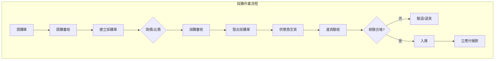
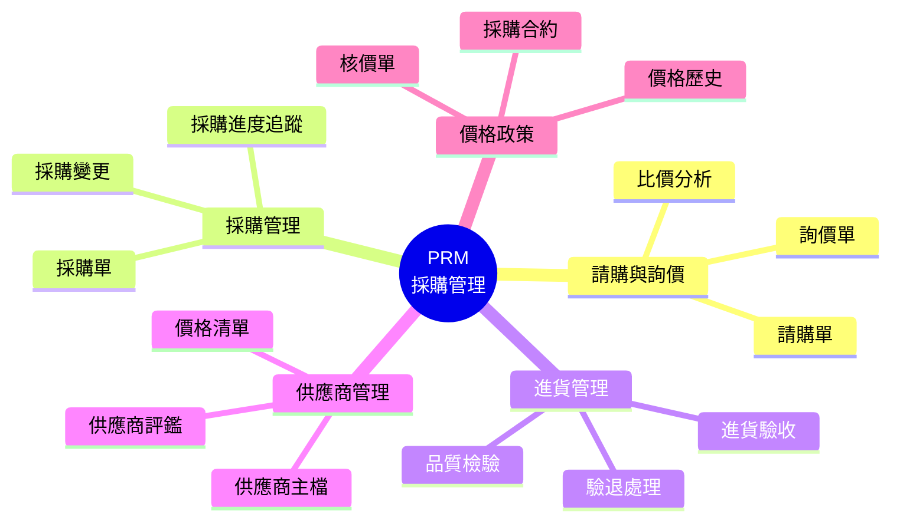
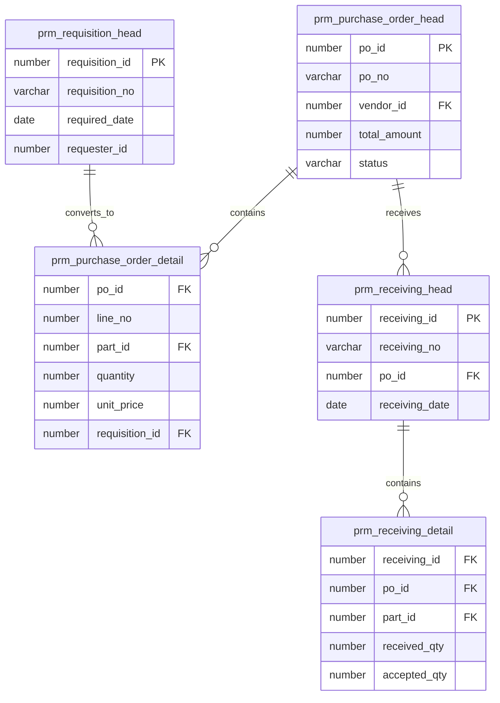

# PRM 採購管理系統 (Purchasing Management System)

## 系統概述

PRM (Purchasing Management) 是企業採購作業的核心系統，管理從請購、詢價、比價、採購到進貨驗收的完整採購流程，確保物料及時供應與成本控制。

### 系統目的
- 請購單管理
- 採購單管理
- 供應商管理與評鑑
- 詢價比價作業
- 進貨驗收管理
- 採購價格管理
- 採購分析報表

---

## 資料庫架構

### 一、請購管理 (Purchase Requisition)

#### 1.1 請購單

##### prm_requisition_head - 請購主檔
```sql
主要欄位:
- requisition_id (PK): 請購單ID
- requisition_no: 請購單號
- requisition_date: 請購日期
- requisition_type: 請購類型
- department_id: 請購部門ID
- requester_id: 請購人員ID
- required_date: 需求日期
- priority: 優先順序
- status: 狀態（草稿/送審/核准/結案）
```

**功能說明:**
- 請購單管理
- 部門請購需求
- 審核流程控制
- 優先順序管理

##### prm_requisition_detail - 請購明細
```sql
主要欄位:
- requisition_id: 請購單ID
- line_no: 行號
- part_id: 料號ID
- requisition_qty: 請購數量
- unit_id: 單位ID
- required_date: 需求日期
- purpose: 用途
- specification: 規格說明
- suggested_vendor_id: 建議供應商ID
- suggested_price: 建議單價
- pr_to_po_qty: 已轉採購量
```

**功能說明:**
- 請購明細資料
- 料品需求數量
- 需求日期控制
- 轉採購追蹤

---

#### 1.2 請購審核

##### prm_requisition_approval - 請購審核
```sql
功能說明:
- 請購單審核記錄
- 多層級審核
- 審核意見記錄
```

---

### 二、詢價比價 (RFQ & Quotation)

#### 2.1 詢價單

##### prm_rfq_head - 詢價主檔
```sql
主要欄位:
- rfq_id (PK): 詢價單ID
- rfq_no: 詢價單號
- rfq_date: 詢價日期
- buyer_id: 採購人員ID
- rfq_type: 詢價類型
- quote_deadline: 報價截止日
- status: 狀態
```

**功能說明:**
- 詢價單管理
- 多家供應商詢價
- 報價截止日控制

##### prm_rfq_detail - 詢價明細
```sql
主要欄位:
- rfq_id: 詢價單ID
- line_no: 行號
- part_id: 料號ID
- rfq_qty: 詢價數量
- required_date: 需求日期
- specification: 規格要求
```

**功能說明:**
- 詢價明細資料
- 規格需求說明
```

##### prm_rfq_vendor - 詢價供應商
```sql
功能說明:
- 詢價對象供應商清單
- 發送詢價通知
```

---

#### 2.2 供應商報價

##### prm_quotation_head - 報價主檔
```sql
主要欄位:
- quotation_id (PK): 報價單ID
- quotation_no: 報價單號
- rfq_id: 詢價單ID
- vendor_id: 供應商ID
- quotation_date: 報價日期
- valid_from: 有效起日
- valid_to: 有效迄日
- payment_term_id: 付款條件ID
- delivery_term: 交貨條件
- status: 狀態
```

**功能說明:**
- 供應商報價單
- 報價有效期管理
- 付款交貨條件

##### prm_quotation_detail - 報價明細
```sql
主要欄位:
- quotation_id: 報價單ID
- line_no: 行號
- part_id: 料號ID
- quote_qty: 報價數量
- unit_price: 單價
- currency_id: 幣別ID
- lead_time: 交期
- moq: 最小訂購量
- remark: 備註
```

**功能說明:**
- 報價明細資料
- 價格與交期
- MOQ 限制
```

---

#### 2.3 比價分析

##### prm_price_comparison - 比價分析
```sql
功能說明:
- 多家供應商比價
- 價格比較分析
- 最佳供應商建議
```

---

### 三、採購單管理 (Purchase Order)

#### 3.1 採購單

##### prm_purchase_order_head - 採購單主檔
```sql
主要欄位:
- po_id (PK): 採購單ID
- po_no: 採購單號
- po_date: 採購日期
- vendor_id: 供應商ID
- buyer_id: 採購人員ID
- currency_id: 幣別ID
- exchange_rate: 匯率
- payment_term_id: 付款條件ID
- delivery_address: 交貨地址
- contact_person: 聯絡人
- total_amount: 總金額
- tax_amount: 稅額
- status: 狀態（草稿/核准/發出/部分收貨/結案）
```

**功能說明:**
- 採購單管理
- 供應商訂單
- 金額匯率控制
- 採購狀態追蹤

##### prm_purchase_order_detail - 採購單明細
```sql
主要欄位:
- po_id: 採購單ID
- line_no: 行號
- part_id: 料號ID
- po_qty: 採購數量
- unit_id: 單位ID
- unit_price: 單價
- amount: 金額
- required_date: 需求日期
- promised_date: 承諾交期
- received_qty: 已收貨量
- rejected_qty: 退貨量
- requisition_id: 來源請購單ID
- requisition_line_no: 來源請購行號
```

**功能說明:**
- 採購明細資料
- 價格數量
- 交期管理
- 收貨追蹤
- 請購單追溯
```

---

#### 3.2 採購單變更

##### prm_po_change_head - 採購變更主檔
```sql
功能說明:
- 採購單變更記錄
- 變更原因追蹤
- 變更審核
```

##### prm_po_change_detail - 採購變更明細
```sql
功能說明:
- 變更明細內容
- 變更前後對照
```

---

### 四、進貨驗收 (Receiving & Inspection)

#### 4.1 進貨單

##### prm_receiving_head - 進貨主檔
```sql
主要欄位:
- receiving_id (PK): 進貨單ID
- receiving_no: 進貨單號
- receiving_date: 進貨日期
- po_id: 採購單ID
- vendor_id: 供應商ID
- warehouse_id: 倉庫ID
- invoice_no: 發票號碼
- status: 狀態
```

**功能說明:**
- 進貨單管理
- 與採購單整合
- 發票核對

##### prm_receiving_detail - 進貨明細
```sql
主要欄位:
- receiving_id: 進貨單ID
- line_no: 行號
- po_id: 採購單ID
- po_line_no: 採購單行號
- part_id: 料號ID
- received_qty: 進貨數量
- location_id: 儲位ID
- lot_number: 批號
- inspect_qty: 檢驗數量
- accept_qty: 合格數量
- reject_qty: 不良數量
- unit_price: 單價
```

**功能說明:**
- 進貨明細資料
- 檢驗數量記錄
- 批號管理
- 儲位分配
```

---

#### 4.2 品質檢驗

##### prm_inspection_head - 檢驗主檔
```sql
功能說明:
- 進貨檢驗單
- 檢驗標準設定
```

##### prm_inspection_detail - 檢驗明細
```sql
功能說明:
- 檢驗項目明細
- 檢驗結果記錄
- 合格/不良判定
```

##### prm_inspection_result - 檢驗結果
```sql
功能說明:
- 檢驗結果彙總
- 品質統計分析
```

---

#### 4.3 退貨管理

##### prm_return_head - 退貨主檔
```sql
主要欄位:
- return_id (PK): 退貨單ID
- return_no: 退貨單號
- return_date: 退貨日期
- vendor_id: 供應商ID
- receiving_id: 來源進貨單ID
- return_reason: 退貨原因
- status: 狀態
```

**功能說明:**
- 退貨單管理
- 不良品退貨
- 退貨原因追蹤

##### prm_return_detail - 退貨明細
```sql
功能說明:
- 退貨明細資料
- 退貨數量
- 不良原因
```

---

### 五、供應商管理 (Vendor Management)

#### 5.1 供應商基本資料

##### prm_vendor - 供應商主檔
```sql
主要欄位:
- vendor_id (PK): 供應商ID
- vendor_no: 供應商編號
- vendor_name: 供應商名稱
- vendor_type: 供應商類型
- tax_id: 統一編號
- contact_person: 聯絡人
- phone: 電話
- email: 電子郵件
- payment_term_id: 付款條件ID
- currency_id: 幣別ID
- credit_limit: 信用額度
- status: 狀態（合格/停用）
```

**功能說明:**
- 供應商基本資料（使用 CMM 模組）
- 供應商分類
- 信用額度控制

---

#### 5.2 供應商評鑑

##### prm_vendor_evaluation - 供應商評鑑
```sql
主要欄位:
- evaluation_id (PK): 評鑑ID
- vendor_id: 供應商ID
- evaluation_date: 評鑑日期
- evaluation_period: 評鑑期間
- quality_score: 品質分數
- delivery_score: 交期分數
- price_score: 價格分數
- service_score: 服務分數
- total_score: 總分
- grade: 等級
```

**功能說明:**
- 定期供應商評鑑
- 多面向評分
- 等級評定

##### prm_vendor_evaluation_item - 評鑑項目
```sql
功能說明:
- 評鑑項目定義
- 評分標準設定
```

---

#### 5.3 供應商績效

##### prm_vendor_performance - 供應商績效
```sql
功能說明:
- 供應商績效統計
- 準時交貨率
- 品質合格率
- 價格競爭力
```

---

### 六、採購價格管理 (Price Management)

#### 6.1 採購價格

##### prm_purchase_price - 採購價格主檔
```sql
主要欄位:
- price_id (PK): 價格ID
- part_id: 料號ID
- vendor_id: 供應商ID
- unit_price: 單價
- currency_id: 幣別ID
- moq: 最小訂購量
- valid_from: 有效起日
- valid_to: 有效迄日
- price_type: 價格類型（標準/合約/促銷）
```

**功能說明:**
- 採購價格記錄
- 價格有效期管理
- MOQ 設定

##### prm_price_history - 價格歷史
```sql
功能說明:
- 價格變動歷史
- 價格趨勢分析
```

---

#### 6.2 合約價格

##### prm_contract_head - 採購合約主檔
```sql
主要欄位:
- contract_id (PK): 合約ID
- contract_no: 合約編號
- vendor_id: 供應商ID
- contract_date: 合約日期
- valid_from: 有效起日
- valid_to: 有效迄日
- total_amount: 合約總額
- status: 狀態
```

**功能說明:**
- 採購合約管理
- 長期合約價格
- 合約金額控制

##### prm_contract_detail - 合約明細
```sql
功能說明:
- 合約料品明細
- 合約價格
- 數量限制
```

---

### 七、採購分析 (Purchase Analysis)

#### 7.1 採購統計

##### prm_purchase_statistics - 採購統計
```sql
功能說明:
- 採購金額統計
- 採購數量統計
- 供應商別統計
- 料品別統計
```

---

#### 7.2 ABC 分析

##### prm_abc_analysis - ABC 分析
```sql
功能說明:
- 採購金額 ABC 分析
- 重點料品識別
- 重點供應商識別
```

---

### 八、其他功能

#### 8.1 採購預算

##### prm_budget - 採購預算
```sql
功能說明:
- 採購預算設定
- 預算執行控制
- 預算差異分析
```

---

#### 8.2 採購申請

##### prm_purchase_request - 採購申請
```sql
功能說明:
- 非料品採購申請
- 服務採購
- 資產採購
```

---

## 主要程式套件 (Packages)

### 1. prm_requisition_pkg
**功能:**
- 請購單處理
- 請購轉採購
- 請購審核

**主要程序:**
```sql
- create_requisition: 建立請購單
- approve_requisition: 審核請購單
- convert_to_po: 轉採購單
```

### 2. prm_po_pkg
**功能:**
- 採購單處理
- 採購單變更
- 採購單結案

**主要程序:**
```sql
- create_po: 建立採購單
- modify_po: 修改採購單
- close_po: 結案採購單
- print_po: 列印採購單
```

### 3. prm_receiving_pkg
**功能:**
- 進貨處理
- 檢驗處理
- 庫存更新

**主要程序:**
```sql
- create_receiving: 建立進貨單
- inspect_receiving: 檢驗進貨
- post_receiving: 過帳進貨
```

---

## 主要函數 (Functions)

### 採購查詢
- `f_prm_get_po_balance`: 取得採購單未交量
- `f_prm_get_vendor_price`: 取得供應商價格
- `f_prm_check_budget`: 檢查預算

### 供應商評鑑
- `f_prm_calc_quality_score`: 計算品質分數
- `f_prm_calc_delivery_score`: 計算交期分數
- `f_prm_get_vendor_grade`: 取得供應商等級

---

## 系統流程

### 1. 請購到採購流程
```
1. 建立請購單 (prm_requisition_head)
2. 輸入請購明細 (prm_requisition_detail)
3. 送出審核
4. 主管審核 (prm_requisition_approval)
5. 核准後轉採購
6. 採購人員建立採購單 (prm_purchase_order_head)
7. 選擇供應商與價格
8. 採購單審核
9. 發出採購單給供應商
```

### 2. 詢價比價流程
```
1. 建立詢價單 (prm_rfq_head)
2. 輸入詢價明細 (prm_rfq_detail)
3. 選擇詢價供應商 (prm_rfq_vendor)
4. 發送詢價通知
5. 供應商報價 (prm_quotation_head/detail)
6. 比價分析 (prm_price_comparison)
7. 選擇最佳供應商
8. 建立採購單
```

### 3. 進貨驗收流程
```
1. 供應商送貨
2. 建立進貨單 (prm_receiving_head)
3. 輸入進貨明細 (prm_receiving_detail)
4. 核對採購單
5. 品質檢驗 (prm_inspection_head/detail)
6. 記錄檢驗結果
7. 合格品入庫 (更新 IVM 庫存)
8. 不良品退貨 (prm_return_head/detail)
9. 更新採購單收貨量
```

### 4. 供應商評鑑流程
```
1. 設定評鑑期間
2. 收集績效資料 (prm_vendor_performance)
3. 計算各項分數
   - 品質分數（合格率）
   - 交期分數（準時率）
   - 價格分數（價格競爭力）
   - 服務分數（配合度）
4. 建立評鑑記錄 (prm_vendor_evaluation)
5. 計算總分與等級
6. 評鑑結果通知
7. 改善追蹤
```

---

## 系統特色

1. **完整採購流程**: 從請購到進貨的完整管理
2. **多層級審核**: 彈性的審核流程設定
3. **詢價比價**: 多家供應商比價分析
4. **供應商評鑑**: 系統化供應商管理
5. **價格管理**: 完整的價格歷史追蹤
6. **品質管理**: 進貨檢驗與品質追蹤
7. **預算控制**: 採購預算管理
8. **整合性強**: 與庫存、財務緊密整合

---

## 整合介面

### 1. 與 IVM (庫存) 整合
```
PRM 進貨單 → IVM 進貨入庫 → 庫存增加
```

### 2. 與 APM (應付帳款) 整合
```
PRM 進貨單 → APM 應付帳款 → 付款處理
```

### 3. 與 GLM (總帳) 整合
```
PRM 進貨 → GLM 會計傳票 → 存貨科目
```

### 4. 與 WIP (生產) 整合
```
WIP MRP 需求 → PRM 請購單 → 採購
```

### 5. 與 CMM 整合
```
使用 CMM 供應商主檔 (cmm_vendor)
使用 CMM 付款條件 (cmm_pay_term)
```

---

## 關鍵控制點

### 1. 採購權限
- 採購金額權限控制
- 審核層級設定
- 供應商選擇限制

### 2. 價格控制
- 價格變動追蹤
- 價格審核機制
- 預算控制

### 3. 品質控制
- 進貨檢驗標準
- 不良品處理
- 供應商品質追蹤

### 4. 交期控制
- 需求日期管理
- 承諾交期追蹤
- 逾期預警

---

## 相關系統模組

- **IVM**: 進貨入庫整合
- **APM**: 應付帳款整合
- **GLM**: 會計傳票整合
- **WIP**: MRP 需求整合
- **CMM**: 供應商、付款條件

---

## 文件資訊

- **系統代碼**: PRM
- **系統名稱**: Purchasing Management System (採購管理系統)
- **資料來源**: s:\mis\prm\
- **建立日期**: 2026-01-21
- **文件版本**: 1.0

---

## 系統圖表 (System Diagrams)

### 1. 系統流程圖 (Flowchart)



### 2. 系統功能心智圖 (Mindmap)



### 3. 實體關聯圖 (ER Diagram)



