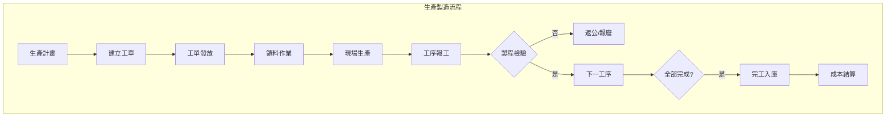
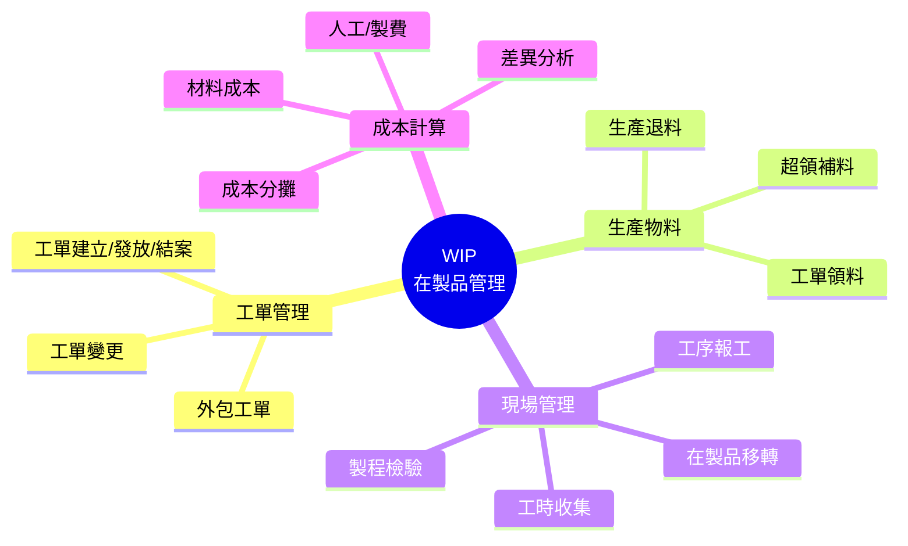
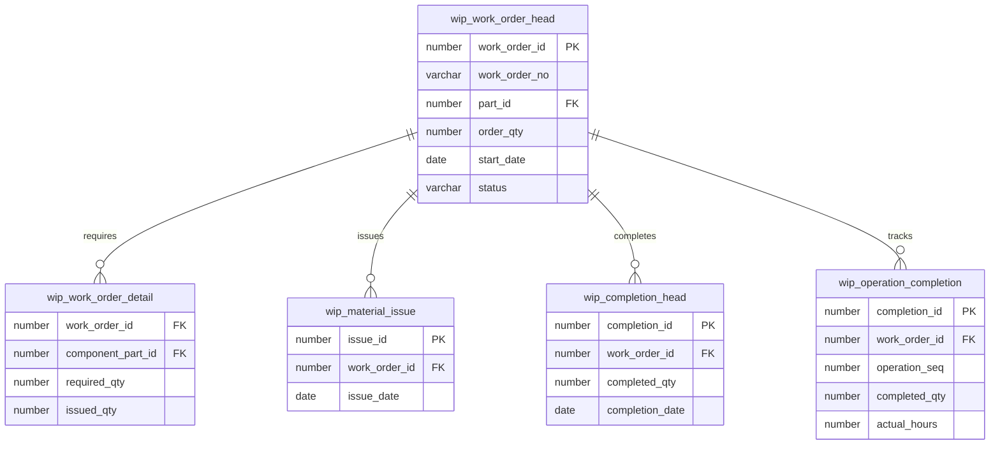

# WIP 在製品管理系統 (Work In Process Management System)

## 系統概述

WIP (Work In Process) 是生產製造管理的核心系統，管理從工單建立、生產排程、物料領用、生產報工到成品入庫的完整生產流程，是連接 BOM、庫存與成本的關鍵系統。

### 系統目的
- 工單管理
- 生產排程
- 物料領退料管理
- 生產報工管理
- 工時記錄
- 在製品追蹤
- 生產成本計算
- 生產進度管理

---

## 資料庫架構

### 一、工單管理 (Work Order)

#### 1.1 工單主檔

##### wip_work_order_head - 工單主檔
```sql
主要欄位:
- work_order_id (PK): 工單ID
- work_order_no: 工單號碼
- work_order_type: 工單類型
- work_order_date: 工單日期
- part_id: 生產料號ID
- order_qty: 工單數量
- completed_qty: 完工數量
- scrapped_qty: 報廢數量
- warehouse_id: 入庫倉庫ID
- required_date: 需求日期
- start_date: 開工日期
- complete_date: 完工日期
- sales_order_id: 來源銷售訂單ID
- bom_id: BOM ID
- routing_id: 製程路線ID
- status: 狀態（計劃/發放/生產中/完工/結案）
```

**功能說明:**
- 工單完整資料管理
- 工單類型（正常/返工/樣品/試產）
- BOM 與製程路線綁定
- 生產進度追蹤
- 來源單據追溯

##### wip_work_order_detail - 工單明細
```sql
主要欄位:
- work_order_id: 工單ID
- line_no: 行號
- component_part_id: 組件料號ID
- required_qty: 需求數量
- issued_qty: 已領用量
- scrapped_qty: 報廢量
- warehouse_id: 領料倉庫ID
- operation_seq: 作業序號
```

**功能說明:**
- 工單物料需求明細
- 由 BOM 展開產生
- 領料數量追蹤
```

---

#### 1.2 工單類型

##### wip_work_order_type - 工單類型
```sql
功能說明:
- 工單類型定義
- 正常生產/返工/樣品/試產等
- 類型控制參數
```

---

### 二、生產排程 (Production Schedule)

#### 2.1 主生產排程

##### wip_master_schedule - 主生產排程
```sql
主要欄位:
- schedule_id (PK): 排程ID
- part_id: 料號ID
- schedule_date: 排程日期
- planned_qty: 計劃數量
- work_order_qty: 已開工單量
- available_qty: 可用量
```

**功能說明:**
- MPS 主生產排程
- 產能規劃
- 工單建議

---

#### 2.2 工序排程

##### wip_operation_schedule - 工序排程
```sql
主要欄位:
- schedule_id (PK): 排程ID
- work_order_id: 工單ID
- operation_seq: 工序序號
- work_center_id: 工作中心ID
- scheduled_start_date: 排程開始日期
- scheduled_end_date: 排程結束日期
- actual_start_date: 實際開始日期
- actual_end_date: 實際結束日期
- status: 狀態
```

**功能說明:**
- 工序層級排程
- 工作中心產能分配
- 實際進度追蹤
```

---

### 三、物料領退料 (Material Issue & Return)

#### 3.1 領料管理

##### wip_material_issue_head - 領料主檔
```sql
主要欄位:
- issue_id (PK): 領料單ID
- issue_no: 領料單號
- issue_date: 領料日期
- work_order_id: 工單ID
- warehouse_id: 倉庫ID
- department_id: 領料部門ID
- requester_id: 領料人員ID
- status: 狀態
```

**功能說明:**
- 生產領料單
- 與工單整合
- 領料審核控制

##### wip_material_issue_detail - 領料明細
```sql
主要欄位:
- issue_id: 領料單ID
- line_no: 行號
- part_id: 料號ID
- issue_qty: 領料數量
- unit_id: 單位ID
- location_id: 儲位ID
- lot_number: 批號
- work_order_id: 工單ID
- operation_seq: 工序序號
```

**功能說明:**
- 領料明細資料
- 批號追蹤
- 工序領料
```

---

#### 3.2 退料管理

##### wip_material_return_head - 退料主檔
```sql
主要欄位:
- return_id (PK): 退料單ID
- return_no: 退料單號
- return_date: 退料日期
- work_order_id: 工單ID
- warehouse_id: 倉庫ID
- return_reason: 退料原因
- status: 狀態
```

**功能說明:**
- 生產退料單
- 剩餘物料退庫
- 退料原因追蹤

##### wip_material_return_detail - 退料明細
```sql
功能說明:
- 退料明細資料
- 退料數量
```

---

#### 3.3 補料管理

##### wip_material_supplement - 補料單
```sql
功能說明:
- 生產補料申請
- 額外物料需求
- 非 BOM 料件領用
```

---

### 四、生產報工 (Production Reporting)

#### 4.1 工序報工

##### wip_operation_completion - 工序完工報告
```sql
主要欄位:
- completion_id (PK): 報工ID
- completion_no: 報工單號
- work_order_id: 工單ID
- operation_seq: 工序序號
- work_center_id: 工作中心ID
- completion_date: 報工日期
- completed_qty: 完工數量
- scrapped_qty: 報廢數量
- rework_qty: 返工數量
- employee_id: 作業人員ID
- actual_hours: 實際工時
- status: 狀態
```

**功能說明:**
- 工序完工報告
- 完工/報廢/返工數量
- 實際工時記錄
- 作業人員追蹤

##### wip_operation_labor - 工序人工
```sql
功能說明:
- 工序人工明細
- 多人作業記錄
- 工時分配
```

---

#### 4.2 工單完工

##### wip_completion_head - 完工主檔
```sql
主要欄位:
- completion_id (PK): 完工單ID
- completion_no: 完工單號
- work_order_id: 工單ID
- completion_date: 完工日期
- completed_qty: 完工數量
- warehouse_id: 入庫倉庫ID
- location_id: 儲位ID
- lot_number: 批號
- status: 狀態
```

**功能說明:**
- 工單完工入庫
- 成品入庫管理
- 批號產生

##### wip_completion_detail - 完工明細
```sql
功能說明:
- 完工明細資料
- 序號記錄（如需要）
```

---

### 五、工時管理 (Labor Time)

#### 5.1 工時記錄

##### wip_labor_time - 工時記錄
```sql
主要欄位:
- labor_time_id (PK): 工時ID
- work_order_id: 工單ID
- operation_seq: 工序序號
- employee_id: 員工ID
- work_date: 工作日期
- start_time: 開始時間
- end_time: 結束時間
- work_hours: 工作時數
- setup_hours: 整備時數
- run_hours: 加工時數
- idle_hours: 閒置時數
```

**功能說明:**
- 詳細工時記錄
- 時間分類（整備/加工/閒置）
- 工時成本計算基礎

---

#### 5.2 工時彙總

##### wip_labor_summary - 工時彙總
```sql
功能說明:
- 工時統計彙總
- 部門別/人員別工時
- 工時效率分析
```

---

### 六、在製品追蹤 (WIP Tracking)

#### 6.1 在製品庫存

##### wip_inventory - 在製品庫存
```sql
主要欄位:
- work_order_id: 工單ID
- operation_seq: 工序序號
- part_id: 料號ID
- wip_qty: 在製數量
- work_center_id: 工作中心ID
- location: 位置
```

**功能說明:**
- 在製品數量追蹤
- 工序在製量
- 位置管理

---

#### 6.2 在製品移轉

##### wip_move - 在製品移轉
```sql
功能說明:
- 工序間移轉記錄
- 在製品流動追蹤
```

---

### 七、生產成本 (Production Cost)

#### 7.1 工單成本

##### wip_work_order_cost - 工單成本
```sql
主要欄位:
- work_order_id: 工單ID
- material_cost: 材料成本
- labor_cost: 人工成本
- overhead_cost: 製造費用
- total_cost: 總成本
- unit_cost: 單位成本
```

**功能說明:**
- 工單成本彙總
- 成本要素分類
- 單位成本計算

##### wip_cost_detail - 成本明細
```sql
功能說明:
- 成本明細記錄
- 材料/人工/費用明細
```

---

#### 7.2 差異分析

##### wip_variance - 成本差異
```sql
功能說明:
- 標準成本與實際成本差異
- 差異原因分析
- 差異處理
```

---

### 八、品質管理 (Quality Control)

#### 8.1 製程檢驗

##### wip_inspection - 製程檢驗
```sql
主要欄位:
- inspection_id (PK): 檢驗ID
- work_order_id: 工單ID
- operation_seq: 工序序號
- inspection_date: 檢驗日期
- inspected_qty: 檢驗數量
- accept_qty: 合格數量
- reject_qty: 不良數量
- inspector_id: 檢驗員ID
```

**功能說明:**
- 製程檢驗記錄
- 合格/不良判定
- 檢驗員追蹤

##### wip_defect - 不良記錄
```sql
功能說明:
- 不良品記錄
- 不良原因分類
- 不良數量統計
```

---

#### 8.2 返工管理

##### wip_rework - 返工單
```sql
主要欄位:
- rework_id (PK): 返工單ID
- original_work_order_id: 原工單ID
- rework_work_order_id: 返工工單ID
- rework_qty: 返工數量
- rework_reason: 返工原因
```

**功能說明:**
- 返工作業管理
- 返工原因追蹤
- 返工成本計算
```

---

### 九、報廢管理 (Scrap Management)

#### 9.1 報廢記錄

##### wip_scrap - 報廢記錄
```sql
主要欄位:
- scrap_id (PK): 報廢ID
- work_order_id: 工單ID
- operation_seq: 工序序號
- scrap_date: 報廢日期
- part_id: 料號ID
- scrap_qty: 報廢數量
- scrap_reason: 報廢原因
- scrap_type: 報廢類型
```

**功能說明:**
- 生產報廢記錄
- 報廢原因分析
- 報廢成本計算

---

### 十、外包管理 (Outsourcing)

#### 10.1 外包工單

##### wip_outsource_order - 外包工單
```sql
主要欄位:
- outsource_order_id (PK): 外包單ID
- work_order_id: 工單ID
- vendor_id: 外包廠商ID
- outsource_qty: 外包數量
- outsource_date: 外包日期
- required_date: 需求日期
- unit_price: 加工單價
```

**功能說明:**
- 外包加工管理
- 外包廠商追蹤
- 外包成本計算

##### wip_outsource_issue - 外包發料
```sql
功能說明:
- 外包發料記錄
- 物料交付外包商
```

##### wip_outsource_receipt - 外包收貨
```sql
功能說明:
- 外包收貨記錄
- 加工品驗收
```

---

## 主要程式套件 (Packages)

### 1. wip_work_order_pkg
**功能:**
- 工單處理
- BOM 展開
- 工單發放

**主要程序:**
```sql
- create_work_order: 建立工單
- release_work_order: 發放工單
- close_work_order: 結案工單
- explode_bom: 展開 BOM
```

### 2. wip_material_pkg
**功能:**
- 物料領退料處理
- 庫存更新
- 成本計算

**主要程序:**
```sql
- issue_material: 領料
- return_material: 退料
- backflush_material: 倒扣料
```

### 3. wip_completion_pkg
**功能:**
- 完工處理
- 成品入庫
- 工單成本結算

**主要程序:**
```sql
- report_completion: 報工
- complete_work_order: 完工入庫
- calculate_cost: 計算成本
```

---

## 主要函數 (Functions)

### 工單查詢
- `f_wip_get_wo_status`: 取得工單狀態
- `f_wip_get_completed_qty`: 取得完工數量
- `f_wip_get_wip_qty`: 取得在製數量

### 成本計算
- `f_wip_calc_material_cost`: 計算材料成本
- `f_wip_calc_labor_cost`: 計算人工成本
- `f_wip_calc_overhead`: 計算製造費用

### 進度查詢
- `f_wip_get_completion_rate`: 取得完工率
- `f_wip_get_operation_status`: 取得工序狀態

---

## 系統流程

### 1. 工單建立流程
```
1. 接收需求（銷售訂單/MPS）
2. 建立工單 (wip_work_order_head)
3. 選擇 BOM 與製程路線
4. BOM 展開產生物料需求 (wip_work_order_detail)
5. 工單審核
6. 工單發放
7. 產生領料單
```

### 2. 生產作業流程
```
1. 工單發放
2. 物料領用 (wip_material_issue)
3. 開始生產
4. 工序報工 (wip_operation_completion)
5. 記錄工時 (wip_labor_time)
6. 製程檢驗 (wip_inspection)
7. 工序完工
8. 移轉下一工序
9. 最終完工入庫 (wip_completion)
10. 工單結案
```

### 3. 成本計算流程
```
1. 收集材料成本（領料單）
2. 收集人工成本（工時記錄）
3. 計算製造費用（分攤基礎）
4. 彙總工單成本 (wip_work_order_cost)
5. 計算單位成本
6. 成品入庫成本
7. 成本差異分析 (wip_variance)
```

### 4. 外包作業流程
```
1. 建立外包工單 (wip_outsource_order)
2. 外包發料 (wip_outsource_issue)
3. 物料送交外包商
4. 外包加工
5. 外包收貨 (wip_outsource_receipt)
6. 檢驗入庫
7. 外包成本計算
```

---

## 系統特色

1. **完整生產管理**: 從工單到完工的全流程管理
2. **即時進度追蹤**: 工序層級的進度掌控
3. **精確成本計算**: 實際成本與標準成本分析
4. **彈性排程**: 支援工作中心產能排程
5. **批號追蹤**: 完整的批號追溯
6. **品質管理**: 製程檢驗與不良追蹤
7. **外包管理**: 外包加工完整管理
8. **整合性強**: 與 BOM、庫存、成本緊密整合

---

## 整合介面

### 1. 與 BOM 整合
```
BOM 結構 → 工單物料需求展開
製程路線 → 工序排程
```

### 2. 與 IVM (庫存) 整合
```
工單領料 → IVM 出庫 → 庫存減少
工單完工 → IVM 入庫 → 庫存增加
```

### 3. 與 GLM (總帳) 整合
```
工單成本 → GLM 會計傳票
在製品科目 → 成品科目
```

### 4. 與 OAM (訂單) 整合
```
銷售訂單 → 工單需求
工單完工 → 訂單交貨
```

### 5. 與 HRM 整合
```
工時記錄 → 人工成本計算
員工績效 → 生產效率分析
```

---

## 關鍵控制點

### 1. 工單控制
- 工單編號規則
- 工單審核權限
- 工單變更管制

### 2. 物料控制
- 領料權限控制
- 超領管制
- 批號先進先出

### 3. 成本控制
- 標準成本設定
- 實際成本追蹤
- 差異分析與處理

### 4. 品質控制
- 製程檢驗標準
- 不良品處理
- 返工管制

---

## 相關系統模組

- **BOM**: BOM 展開、製程路線
- **IVM**: 物料領退料、成品入庫
- **GLM**: 生產成本會計
- **OAM**: 訂單需求
- **HRM**: 工時與人工成本

---

## 文件資訊

- **系統代碼**: WIP
- **系統名稱**: Work In Process Management System (在製品管理系統)
- **資料來源**: s:\mis\wip\
- **建立日期**: 2026-01-21
- **文件版本**: 1.0

---

## 系統圖表 (System Diagrams)

### 1. 系統流程圖 (Flowchart)



### 2. 系統功能心智圖 (Mindmap)



### 3. 實體關聯圖 (ER Diagram)



