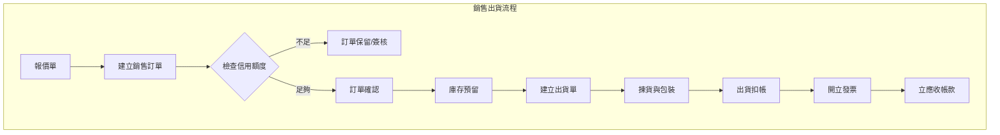
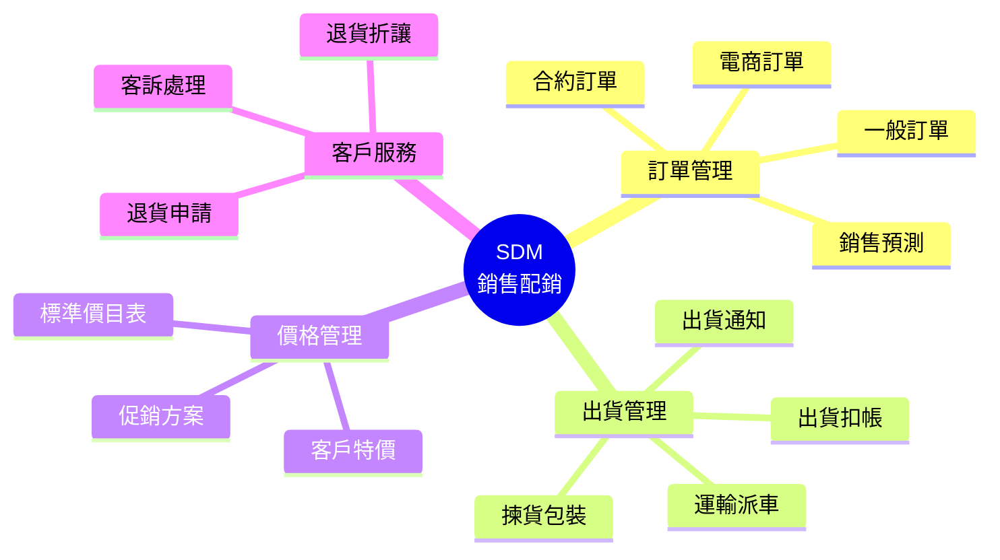
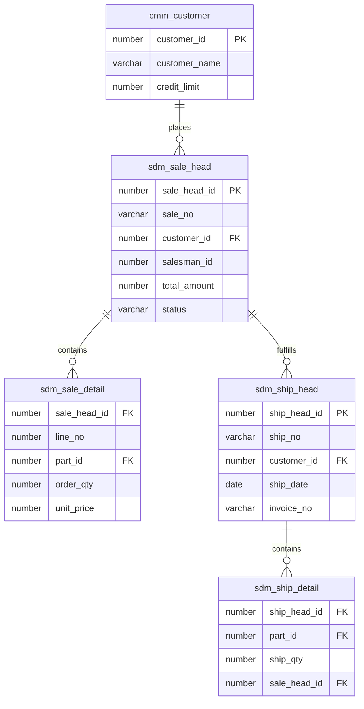

# SDM 銷售配銷管理系統 (Sales & Distribution Management System)

## 系統概述

SDM (Sales & Distribution Management) 是企業營收的核心系統，管理從銷售預測、報價、接單、出貨到退貨的完整銷售循環，並支援電子商務 (EC) 整合與多通路銷售。

### 系統目的
- 銷售訂單管理
- 出貨與配送管理
- 銷售報價管理
- 銷售合約管理
- 銷售預測管理
- 促銷活動管理
- 電子商務整合 (EC)
- 客戶信用控制

---

## 資料庫架構

### 一、銷售訂單 (Sales Order)

#### 1.1 訂單主檔

##### sdm_sale_head - 訂單主檔
```sql
主要欄位:
- sale_head_id (PK): 訂單ID
- sale_no: 訂單號碼
- order_date: 訂單日期
- order_type_id: 訂單類型ID
- customer_id: 客戶ID
- salesman_id: 業務員ID
- department_id: 銷售部門ID
- currency_id: 幣別ID
- exchange_rate: 匯率
- payment_term_id: 付款條件ID
- shipping_term: 出貨條件
- tax_type: 稅別
- total_amount: 總金額
- tax_amount: 稅額
- status: 狀態（草稿/確認/已轉出貨/結案）
- customer_po_no: 客戶採購單號
```

**功能說明:**
- 銷售訂單管理
- 支援多種訂單類型（一般/樣品/換貨/補貨）
- 信用額度檢查
- 價格與折扣管理

##### sdm_sale_detail - 訂單明細
```sql
主要欄位:
- sale_head_id: 訂單ID
- line_no: 行號
- part_id: 料號ID
- order_qty: 訂單數量
- unit_price: 單價
- amount: 金額
- discount_rate: 折扣率
- required_date: 需求日期
- promised_date: 承諾交期
- shipped_qty: 已出貨量
- warehouse_id: 指定出貨倉
- promotion_id: 促銷活動ID
```

**功能說明:**
- 訂單商品明細
- 數量與價格計算
- 出貨進度追蹤
- 促銷方案應用

##### sdm_sale_modify - 訂單變更
```sql
功能說明:
- 訂單內容變更記錄
- 變更原因追蹤
- 審核流程
```

---

#### 1.2 訂單類型

##### sdm_order_kind - 訂單類別
```sql
功能說明:
- 訂單性質定義（內銷/外銷/樣品/自用）
- 單據編碼規則
- 流程控制參數
```

##### sdm_sale_type - 銷售型態
```sql
功能說明:
- 銷售模式定義
- 經銷/直營/電商
```

---

### 二、出貨管理 (Shipment & Delivery)

#### 2.1 出貨單

##### sdm_ship_head - 出貨主檔
```sql
主要欄位:
- ship_head_id (PK): 出貨單ID
- ship_no: 出貨單號
- ship_date: 出貨日期
- customer_id: 客戶ID
- warehouse_id: 出貨倉庫ID
- ship_address: 送貨地址
- transport_method: 運送方式
- invoice_no: 發票號碼
- status: 狀態
```

**功能說明:**
- 出貨單管理
- 庫存扣帳觸發
- 應收帳款立帳基礎

##### sdm_ship_detail - 出貨明細
```sql
主要欄位:
- ship_head_id: 出貨單ID
- line_no: 行號
- sale_head_id: 來源訂單ID
- sale_line_no: 來源訂單行號
- part_id: 料號ID
- ship_qty: 出貨數量
- location_id: 儲位ID
- lot_number: 批號
- serial_number: 序號
```

**功能說明:**
- 出貨商品明細
- 批號序號指定
- 包裝明細關聯

---

#### 2.2 包裝管理

##### sdm_ship_pack_head - 包裝主檔
```sql
功能說明:
- 出貨包裝單（Packing List）
- 箱號管理
- 淨重/毛重/材積計算
```

##### sdm_ship_pack_detail - 包裝明細
```sql
功能說明:
- 裝箱明細
- 混箱處理
```

##### sdm_carton_box - 紙箱規格
```sql
功能說明:
- 標準紙箱尺寸
- 裝箱容量設定
```

---

#### 2.3 運輸管理

##### sdm_ship_transport - 運輸主檔
```sql
功能說明:
- 貨運安排
- 提單號碼 (B/L No)
- 貨櫃號碼
- 運費計算
```

##### sdm_transport_method_define - 運輸方式
```sql
功能說明:
- 海運/空運/陸運
- 快遞/貨運公司
```

---

### 三、報價管理 (Quotation)

#### 3.1 報價單

##### sdm_quote_head - 報價主檔
```sql
主要欄位:
- quote_id (PK): 報價單ID
- quote_no: 報價單號
- quote_date: 報價日期
- customer_id: 客戶ID
- salesman_id: 業務員ID
- valid_from: 有效起日
- valid_to: 有效迄日
- status: 狀態
```

**功能說明:**
- 客戶報價單
- 價格有效期控制
- 報價版本管理

##### sdm_quote_detail - 報價明細
```sql
主要欄位:
- quote_id: 報價單ID
- part_id: 料號ID
- quote_qty: 報價數量
- unit_price: 單價
- moq: 最小訂購量
```

**功能說明:**
- 報價商品明細
- 階梯式價格
```

---

### 四、銷售合約 (Sales Contract)

#### 4.1 合約管理

##### sdm_contract - 合約主檔
```sql
主要欄位:
- contract_id (PK): 合約ID
- contract_no: 合約編號
- customer_id: 客戶ID
- contract_date: 合約日期
- valid_from: 有效起日
- valid_to: 有效迄日
- total_amount: 合約總額
```

**功能說明:**
- 長期銷售合約
- 價格協議
- 數量承諾

##### sdm_contract_goods - 合約商品
```sql
功能說明:
- 合約約定商品
- 合約單價
- 累計出貨量控制
```

---

### 五、銷售預測 (Sales Forecast)

#### 5.1 產品預測

##### sdm_product_forecast - 產品預測
```sql
主要欄位:
- forecast_id (PK): 預測ID
- part_id: 料號ID
- forecast_period: 預測期間（月/週）
- forecast_qty: 預測數量
- version: 版本
- salesman_id: 業務員
```

**功能說明:**
- 銷售預測輸入
- MPS 需求來源
- 預測準確度分析

##### sdm_product_demand_forecast - 需求預測
```sql
功能說明:
- 依據歷史數據運算
- 季節性指數調整
```

---

### 六、客戶管理 (Customer Management)

#### 6.1 客戶資料擴充

雖然客戶主檔在 CMM，但 SDM 包含銷售相關擴充資料：

##### sdm_customer_sale_data - 客戶銷售資料
```sql
主要欄位:
- customer_id: 客戶ID
- salesman_id: 負責業務
- discount_rate: 預設折扣
- credit_limit: 信用額度
- payment_term: 付款條件
- shipping_method: 出貨方式
- price_list_id: 價目表ID
```

**功能說明:**
- 客戶交易條件設定
- 信用額度控管
- 業務歸屬

##### sdm_customer_ship_place - 送貨地點
```sql
功能說明:
- 客戶多個送貨地址
- 聯絡人資訊
```

---

### 七、電子商務整合 (E-Commerce)

#### 7.1 EC 訂單

##### sdm_ec_sale_head - EC 訂單主檔
```sql
功能說明:
- 來自 EC 平台的訂單
- 平台單號對照
- 金流狀態
```

##### sdm_tw_ec_api_define - EC API 定義
```sql
功能說明:
- 各大電商平台介面設定 (PChome, Momo, Yahoo...)
- 訂單下載排程
- 庫存同步設定
```

##### sdm_ec_mapping - EC 對照
```sql
功能說明:
- 平台料號與內部料號對照
- 平台狀態與內部狀態對照
```

---

### 八、促銷管理 (Promotion)

#### 8.1 促銷方案

##### sdm_promote_head - 促銷主檔
```sql
功能說明:
- 促銷活動定義
- 活動期間
-適用客戶範圍
```

##### sdm_promote_item - 促銷品項
```sql
功能說明:
- 特價商品
- 買一送一
- 滿額贈
```

---

### 九、退貨與折讓 (Return & Allowance)

#### 9.1 退貨管理

##### sdm_goods_back_head - 退貨主檔
```sql
主要欄位:
- back_id (PK): 退貨單ID
- back_no: 退貨單號
- back_date: 退貨日期
- customer_id: 客戶ID
- ship_head_id: 原出貨單ID
- reason: 退貨原因
```

**功能說明:**
- 客戶退貨處理
- 退貨入庫（良品/不良品）
- 原出貨單追溯

##### sdm_goods_back_detail - 退貨明細
```sql
功能說明:
- 退貨商品明細
- 退貨數量
- 換貨處理
```

---

### 十、數據分析 (Analysis)

#### 10.1 銷售分析

##### sdm_sale_bi - 銷售分析表
```sql
功能說明:
- 銷售業績統計
- 客戶/產品/業務員維度
- 毛利分析
```

##### sdm_ship_sale_qty_v - 出貨統計視圖
```sql
功能說明:
- 出貨數量金額統計
- 期間比較
```

---

## 主要程式套件 (Packages)

### 1. sdm_sale_head_pkg
**功能:**
- 訂單處理
- 信用額度檢查
- 價格計算

**主要程序:**
```sql
- create_order: 建立訂單
- check_credit: 檢查信用額度
- confirm_order: 確認訂單
```

### 2. sdm_ship_head_pkg
**功能:**
- 出貨處理
- 庫存扣帳
- 產生發票

**主要程序:**
```sql
- create_shipment: 建立出貨單
- confirm_shipment: 確認出貨
- auto_pack: 自動裝箱
```

### 3. sdm_ec_integration_pkg
**功能:**
- EC 訂單整合
- 庫存同步
- 狀態回寫

**主要程序:**
```sql
- download_orders: 下載訂單
- sync_inventory: 同步庫存
- upload_status: 上傳出貨狀態
```

---

## 主要函數 (Functions)

### 價格查詢
- `f_sdm_get_item_price`: 取得商品價格
- `f_sdm_get_discount`: 取得客戶折扣
- `f_sdm_get_promotion_price`: 取得促銷價

### 庫存查詢
- `f_sdm_get_available_qty`: 取得可接單量
- `f_sdm_check_stock`: 檢查庫存

### 額度查詢
- `f_sdm_get_credit_balance`: 取得剩餘信用額度
- `f_sdm_get_ar_balance`: 取得應收帳款餘額

---

## 系統流程

### 1. 一般銷售流程
```
1. 建立報價單 (sdm_quote_head)
2. 客戶確認報價
3. 建立銷售訂單 (sdm_sale_head)
4. 檢查信用額度與庫存
5. 訂單確認
6. 建立出貨單 (sdm_ship_head)
7. 倉庫揀貨與包裝
8. 出貨確認 (扣 IVM 庫存)
9. 產生應收帳款 (ARM)
10. 開立發票
```

### 2. EC 銷售流程
```
1. EC 平台消費者下單
2. 排程下載訂單 (sdm_tw_ec_api_define)
3. 轉換為內部訂單 (sdm_ec_sale_head)
4. 自動建立出貨單
5. 倉庫出貨
6. 回寫出貨狀態至 EC 平台
7. 同步庫存至 EC 平台
```

### 3. 退貨流程
```
1. 建立退貨申請 (sdm_goods_back_head)
2. 審核退貨原因
3. 收到退貨物品
4. 檢驗退貨品
5. 退貨入庫 (IVM 庫存增加)
6. 產生退貨折讓單 (ARM 沖帳)
```

---

## 系統特色

1. **多通路整合**: 整合實體通路與電子商務 (EC)
2. **彈性價格**: 支援標準價、合約價、促銷價、階梯價
3. **信用控管**: 即時信用額度檢查與鎖單機制
4. **預留機制**: 訂單庫存預留，確保交期
5. **完整追溯**: 訂單 -> 出貨 -> 發票 -> 收款 完整關聯
6. **包裝管理**: 支援複雜的裝箱與材積計算
7. **銷售預測**: 結合歷史數據的預測模型

---

## 整合介面

### 1. 與 IVM (庫存) 整合
```
銷售訂單 → 庫存預留
出貨確認 → 庫存扣帳 (減少)
銷退入庫 → 庫存加帳 (增加)
```

### 2. 與 ARM (應收) 整合
```
出貨單/發票 → 產生應收帳款 (AR Invoice)
```

### 3. 與 WIP (生產) 整合
```
銷售訂單 → MPS/MRP 需求來源
WIP 完工 → 滿足訂單交貨
```

### 4. 與 CMM (共用) 整合
```
使用客戶主檔、業務員資料、多語系產品資料
```

---

## 關鍵控制點

### 1. 價格控制
- 最低售價控制
- 折扣權限控管
- 報價有效期

### 2. 信用控制
- 信用額度超限鎖單
- 逾期帳款鎖單
- 臨時額度授權

### 3. 庫存控制
- 可接單量計算 (ATP)
- 庫存預留優先順序
- 缺貨處理機制

### 4. 毛利控制
- 訂單預估毛利檢查
- 低毛利警示

---

## 相關系統模組

- **IVM**: 出貨庫存整合
- **ARM**: 應收帳款整合
- **WIP**: 生產需求整合
- **CMM**: 客戶資料整合
- **OAM**: 可能關聯到行政審批

---

## 文件資訊

- **系統代碼**: SDM
- **系統名稱**: Sales & Distribution Management System (銷售配銷管理系統)
- **資料來源**: s:\mis\sdm\
- **建立日期**: 2026-01-21
- **文件版本**: 1.0

---

## 系統圖表 (System Diagrams)

### 1. 系統流程圖 (Flowchart)



### 2. 系統功能心智圖 (Mindmap)



### 3. 實體關聯圖 (ER Diagram)



