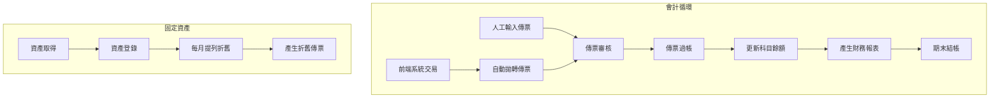
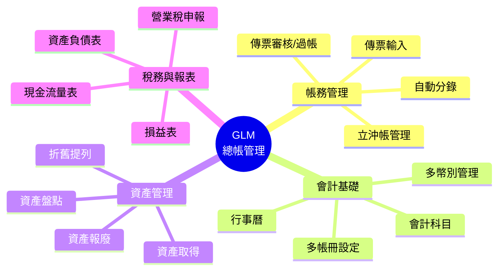
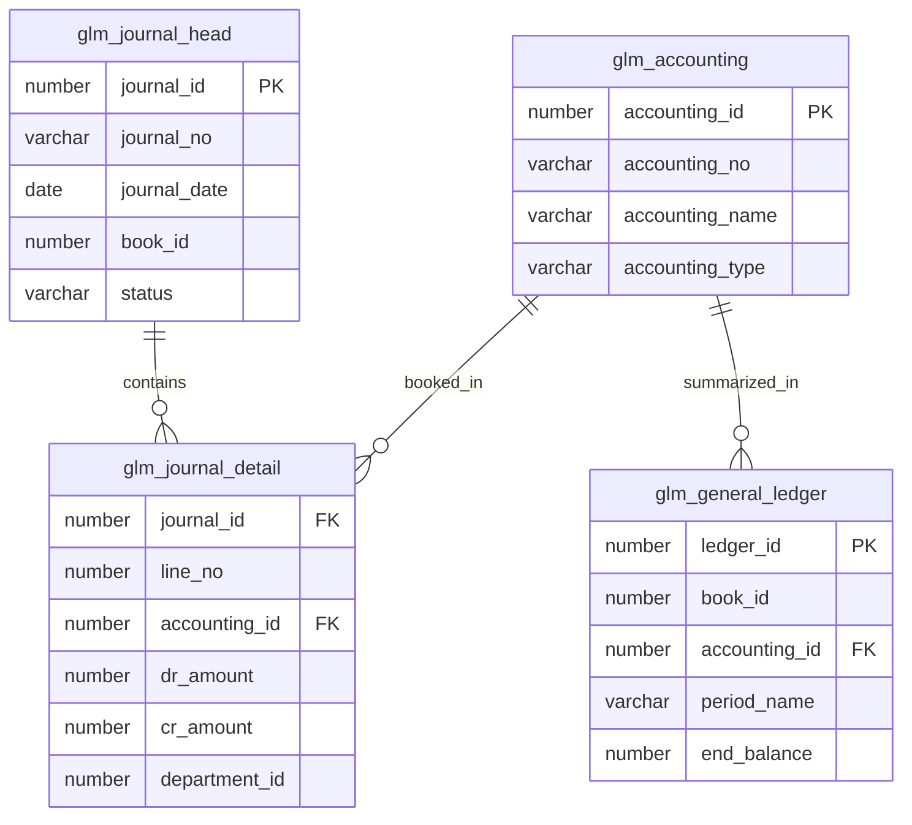

# GLM 總帳管理系統 (General Ledger Management System)

## 系統概述

GLM (General Ledger Management) 是 ERP 系統的財務核心，負責所有交易的紀錄、分類與彙總，提供財務報表、稅務申報、固定資產管理與立沖帳管理功能，確保財務數據的正確性與合規性。

### 系統目的
- 會計傳票管理
- 多帳冊/多公司管理
- 會計科目管理
- 總帳與明細帳彙總
- 固定資產管理
- 營業稅申報
- 財務報表產生
- 立沖帳管理

---

## 資料庫架構

### 一、傳票管理 (Journal Management)

#### 1.1 傳票主檔

##### glm_journal_head - 傳票主檔
```sql
主要欄位:
- journal_id (PK): 傳票ID
- journal_no: 傳票號碼
- journal_date: 傳票日期
- book_id: 帳冊ID
- period_name: 會計期間
- journal_type: 傳票類別（轉帳/現金/銀行）
- description: 摘要
- status: 狀態（草稿/過帳/結案/作廢）
- source_module: 來源模組
- source_ref_no: 來源單號
```

**功能說明:**
- 核心會計交易記錄
- 支援多來源自動拋轉
- 傳票審核與過帳狀態

##### glm_journal_detail - 傳票明細
```sql
主要欄位:
- journal_id: 傳票ID
- line_no: 行號
- accounting_id: 會計科目ID
- department_id: 部門ID
- dr_amount: 借方金額
- cr_amount: 貸方金額
- foreign_amount: 原幣金額
- currency_id: 幣別ID
- exchange_rate: 匯率
- project_id: 專案ID
- reference_no: 參考單號
- remark: 摘要
```

**功能說明:**
- 借貸平衡檢查
- 多維度分析（部門/專案）
- 外幣金額記錄

---

### 二、會計科目與帳冊 (Chart of Accounts & Books)

#### 2.1 會計科目

##### glm_accounting - 會計科目
```sql
主要欄位:
- accounting_id (PK): 科目ID
- accounting_no: 科目代號
- accounting_name: 科目名稱
- accounting_type: 科目類別（資產/負債/權益/收入/費用）
- parent_id: 上層科目ID
- is_control: 統馭科目
- is_active: 是否啟用
```

**功能說明:**
- 樹狀科目結構
- 多語系支援
- 科目屬性定義

##### glm_accounting_type - 科目類別
```sql
功能說明:
- 資產、負債、股東權益
- 營業收入、營業成本、營業費用
```

---

#### 2.2 帳冊管理

##### glm_book - 帳冊主檔
```sql
主要欄位:
- book_id (PK): 帳冊ID
- book_code: 帳冊代碼
- book_name: 帳冊名稱
- currency_id: 本位幣
- calendar_id: 會計行事曆
- chart_of_accounts_id: 會計科目表ID
```

**功能說明:**
- 支援多公司/多帳冊
- 不同的幣別與行事曆
- IFRS/GAAP 多帳冊平行處理

---

### 三、總帳彙總 (General Ledger Summary)

#### 3.1 總帳餘額

##### glm_general_ledger - 總帳餘額表
```sql
主要欄位:
- ledger_id (PK): 餘額ID
- book_id: 帳冊ID
- period_name: 會計期間
- accounting_id: 會計科目ID
- begin_dr: 期初借方
- begin_cr: 期初貸方
- period_dr: 本期借方
- period_cr: 本期貸方
- end_dr: 期末借方
- end_cr: 期末貸方
```

**功能說明:**
- 快速查詢科目餘額
- 試算表 (Trial Balance) 基礎
- 逐期累計更新

---

### 四、立沖帳管理 (Running Account)

#### 4.1 立沖帳

##### glm_running_account_head - 立沖帳主檔
```sql
主要欄位:
- running_id (PK): 立沖帳ID
- book_id: 帳冊ID
- accounting_id: 科目ID（如應收/應付/暫收/暫付）
- partner_id: 對象ID（客戶/廠商/員工）
- amount: 立帳金額
- balance: 未沖金額
- document_no: 原始單號
```

**功能說明:**
- 債權債務明細管理
- 沖銷狀態追蹤
- 帳齡分析基礎

##### glm_running_account_detail - 立沖帳明細
```sql
功能說明:
- 沖銷記錄
- 部分沖銷/完全沖銷
```

---

### 五、固定資產 (Fixed Assets)

#### 5.1 資產管理

##### glm_fixed_asset - 固定資產主檔
```sql
主要欄位:
- asset_id (PK): 資產ID
- asset_no: 資產編號
- asset_name: 資產名稱
- asset_kind_id: 資產類別
- acquire_date: 取得日期
- cost: 取得成本
- salvage_value: 殘值
- life_month: 耐用月數
- depreciate_method: 折舊方法
- department_id: 保管部門
- location_id: 存放地點
- status: 狀態
```

**功能說明:**
- 資產全生命週期管理
- 取得、改良、重估、報廢

#### 5.2 資產折舊

##### glm_fixed_asset_txn - 資產異動與折舊
```sql
主要欄位:
- txn_id (PK): 異動ID
- asset_id: 資產ID
- txn_type: 異動類型（折舊/改良/出售/報廢）
- txn_date: 異動日期
- amount: 金額
- accumulate_depn: 累計折舊
```

**功能說明:**
- 每月自動提列折舊
- 產生折舊傳票
- 資產淨值計算

---

### 六、稅務管理 (Tax Management)

#### 6.1 營業稅

##### glm_tw_vat - 台灣營業稅
```sql
主要欄位:
- vat_id (PK): 稅務ID
- invoice_no: 發票號碼
- invoice_date: 發票日期
- tax_code: 稅別碼（21/22/25...）
- sales_amount: 銷售額
- tax_amount: 稅額
- partner_id: 交易對象
- journal_id: 關聯傳票
```

**功能說明:**
- 進項/銷項發票管理
- 媒體申報檔產生 (401/403)
- 發票字軌管理

---

### 七、財務報表 (Financial Reports)

#### 7.1 報表設定

##### glm_report_setup_head - 報表格式設定
```sql
主要欄位:
- report_id (PK): 報表ID
- report_name: 報表名稱（資產負債/損益/現金流）
- report_type: 報表類型
```

##### glm_report_setup_detail - 報表行定義
```sql
功能說明:
- 定義報表每一行的公式
- 科目加總規則
- 借貸方向控制
```

---

## 主要程式套件 (Packages)

### 1. glm_journal_pkg
**功能:**
- 傳票處理
- 自動分錄
- 過帳處理

**主要程序:**
```sql
- create_journal: 建立傳票
- post_batch: 批次過帳
- reverse_journal: 迴轉傳票
- validate_journal: 檢查傳票
```

### 2. glm_asset_pkg
**功能:**
- 固定資產處理
- 折舊計算
- 資產處分

**主要程序:**
```sql
- calculate_depreciation: 計算折舊
- retire_asset: 資產報廢
- transfer_asset: 資產移轉
```

### 3. glm_closing_pkg
**功能:**
- 月結與年結
- 匯兌損益重估
- 結轉下期

**主要程序:**
```sql
- monthly_close: 月結
- yearly_close: 年結
- revalue_currency: 幣別重估
```

---

## 主要函數 (Functions)

### 餘額查詢
- `f_glm_get_account_balance`: 取得科目餘額
- `f_glm_get_period_net`: 取得期間淨額

### 日期與期間
- `f_glm_get_period_name`: 依日期取得會計期間
- `f_glm_is_period_open`: 檢查期間是否開啟

---

## 系統流程

### 1. 傳票處理流程
```
1. 各系統 (SDM/PRM/ARM/APM) 產生交易
2. 自動拋轉或人工輸入傳票 (glm_journal_head)
3. 檢查借貸平衡與額度
4. 傳票審核
5. 傳票過帳 (更新 glm_general_ledger)
6. 產生財務報表
```

### 2. 月結流程
```
1. 確認所有傳票已過帳
2. 固定資產提列折舊
3. 外幣存款/應收付重評價
4. 計算本期損益
5. 關閉會計期間
6. 開啟下期期間
```

### 3. 固定資產流程
```
1. 取得資產 (驗收/立帳)
2. 建立資產主檔 (glm_fixed_asset)
3. 設定折舊參數
4. 每月執行折舊 (glm_asset_pkg)
5. 產生折舊傳票
6. 資產盤點/移轉/報廢
```

---

## 系統特色

1. **多維度架構**: 支援多公司、多帳冊、多幣別、多部門專案分析
2. **彈性科目**: 樹狀科目結構，支援彈性編碼與統馭關係
3. **自動分錄**: 高度整合前端系統，自動產生會計分錄
4. **即時過帳**: 支援即時過帳或批次過帳模式
5. **立沖帳**: 強大的債權債務沖銷功能，解決未達帳問題
6. **報表產生器**: 內建彈性報表設定，可自定義資產負債表與損益表格式

---

## 整合介面

### 1. 與 SDM/ARM 整合
```
出貨/發票 → 應收立帳傳票 (Dr. 應收帳款 / Cr. 銷貨收入)
收款 → 應收沖帳傳票 (Dr. 銀行存款 / Cr. 應收帳款)
```

### 2. 與 PRM/APM 整合
```
進貨/發票 → 應付立帳傳票 (Dr. 進貨成本 / Cr. 應付帳款)
付款 → 應付沖帳傳票 (Dr. 應付帳款 / Cr. 銀行存款)
```

### 3. 與 IVM/WIP 整合
```
庫存異動 → 成本傳票 (Dr. 銷貨成本 / Cr. 存貨)
領料/完工 → 生產成本傳票
```

---

## 關鍵控制點

### 1. 借貸平衡
- 傳票存檔強制檢查借貸平衡
- 批次過帳前再檢核

### 2. 期間控制
- 關帳期間禁止異動
- 未來期間過帳限制

### 3. 科目權限
- 銀行科目/敏感科目存取限制
- 部門費用科目限制

### 4. 變更軌跡
- 所有傳票修改需留存修訂記錄 (Audit Trail)
- 刪除傳票需保留作廢記錄

---

## 文件資訊

- **系統代碼**: GLM
- **系統名稱**: General Ledger Management System (總帳管理系統)
- **資料來源**: s:\mis\glm\
- **建立日期**: 2026-01-21
- **文件版本**: 1.0

---

## 系統圖表 (System Diagrams)

### 1. 系統流程圖 (Flowchart)



### 2. 系統功能心智圖 (Mindmap)



### 3. 實體關聯圖 (ER Diagram)



