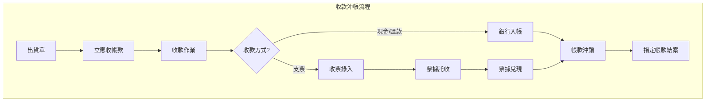
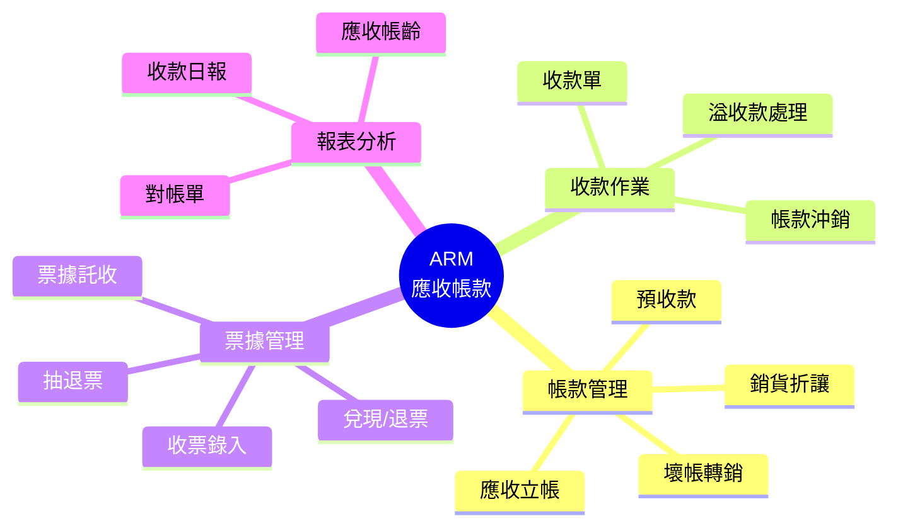
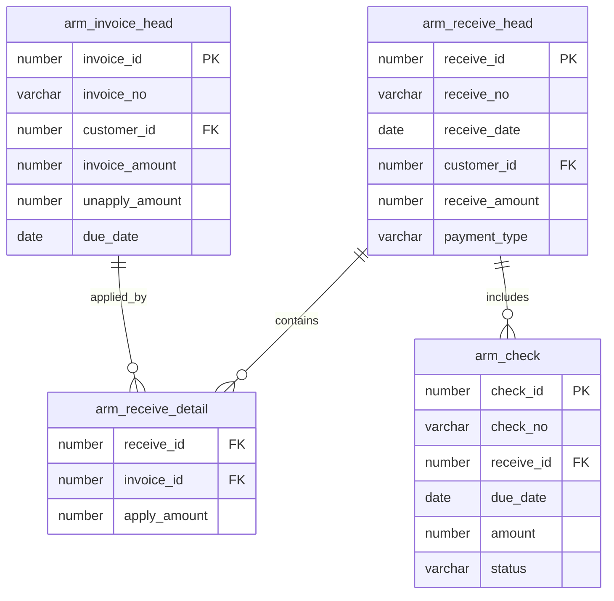

# ARM 應收帳款管理系統 (Accounts Receivable Management System)

## 系統概述

ARM (Accounts Receivable Management) 負責管理企業的收款作業，從應收帳款的立帳、收款沖銷、票據託收兌現到帳齡分析，確保企業現金流的穩定與應收帳款的回收。

### 系統目的
- 應收帳款立帳 (Invoice)
- 收款與沖銷 (Receipt & Apply)
- 票據管理 (Check Management)
- 預收款管理
- 銷貨折讓處理
- 帳齡分析
- 催收管理

---

## 資料庫架構

### 一、應收帳款 (AR Invoice)

#### 1.1 應收帳款主檔

##### arm_invoice_head - 應收帳款主檔
```sql
主要欄位:
- invoice_id (PK): 帳款ID
- invoice_no: 帳款單號
- invoice_date: 帳款日期
- customer_id: 客戶ID
- department_id: 銷售部門ID
- salesman_id: 業務員ID
- currency_id: 幣別ID
- exchange_rate: 匯率
- invoice_amount: 帳款金額
- tax_amount: 稅額
- total_amount: 總金額
- unapply_amount: 未沖銷金額
- due_date: 到期日
- source_type: 來源類型（出貨/其他）
- source_ref_no: 來源單號（出貨單號）
- status: 狀態
```

**功能說明:**
- 應收帳款立帳
- 記錄出貨產生的應收款
- 追蹤未沖銷餘額

##### arm_invoice_detail - 應收帳款明細
```sql
主要欄位:
- invoice_id: 帳款ID
- line_no: 行號
- item_description: 項目說明
- quantity: 數量
- unit_price: 單價
- amount: 金額
- revenue_account_id: 收入科目ID
```

**功能說明:**
- 帳款明細內容
- 會計科目對應

---

### 二、收款管理 (Collection & Application)

#### 2.1 收款單

##### arm_receive_head - 收款主檔
```sql
主要欄位:
- receive_id (PK): 收款ID
- receive_no: 收款單號
- receive_date: 收款日期
- customer_id: 客戶ID
- department_id: 收款部門ID
- collector_id: 收款人員ID
- currency_id: 幣別ID
- receive_amount: 收款金額
- bank_account_id: 存入銀行帳號
- payment_type: 付款方式（現金/匯款/支票/預收）
- status: 狀態（草稿/確認/過帳）
```

**功能說明:**
- 客戶收款記錄
- 支援多種收款方式
- 產生收款傳票

##### arm_receive_detail - 收款沖帳明細
```sql
主要欄位:
- receive_id: 收款ID
- line_no: 行號
- invoice_id: 沖銷帳款ID
- apply_amount: 沖銷金額
- discount_amount: 發生折讓金額
- write_off_amount: 轉銷壞帳金額
```

**功能說明:**
- 指定沖銷應收帳款 (Apply)
- 支援部分沖銷
- 記錄沖銷歷程

---

### 三、票據管理 (Check Management)

#### 3.1 應收票據

##### arm_check - 應收票據主檔
```sql
主要欄位:
- check_id (PK): 票據ID
- check_no: 支票號碼
- receive_id: 來源收款單ID
- customer_id: 客戶ID
- bank_id: 發票銀行
- due_date: 到期日
- amount: 金額
- status: 狀態（收票/託收/兌現/退票/作廢）
```

**功能說明:**
- 應收支票管理
- 票據生命週期追蹤
- 票齡分析

#### 3.2 票據作業

##### arm_check_process - 票據作業異動
```sql
功能說明:
- 票據託收記錄
- 票據兌現記錄 (轉銀行存款)
- 票據退票處理
```

---

### 四、折讓與調整 (Allowance & Adjustment)

#### 4.1 銷貨折讓

##### arm_discount_invoice_head - 折讓單主檔
```sql
主要欄位:
- discount_id (PK): 折讓ID
- discount_no: 折讓單號
- discount_date: 折讓日期
- customer_id: 客戶ID
- invoice_id: 原帳款ID
- reason: 折讓原因
- total_amount: 折讓金額
```

**功能說明:**
- 處理銷貨退回或折讓
- 開立折讓證明單 (Credit Note)
- 沖減應收帳款

##### arm_discount_invoice_detail - 折讓明細
```sql
功能說明:
- 折讓商品明細
- 稅額處理
```

---

### 五、預收款管理 (Prepayment)

#### 5.1 客戶預收

##### arm_customer_add_value - 預收款 (或儲值金)
```sql
主要欄位:
- record_id (PK): 記錄ID
- customer_id: 客戶ID
- txn_date: 異動日期
- txn_type: 異動類型（入金/扣款）
- amount: 金額
- balance: 餘額
```

**功能說明:**
- 管理客戶預付貨款
- 儲值金管理
- 後續出貨沖抵

---

### 六、費用管理 (Other Fees)

#### 6.1 其他費用

##### arm_fee_doc_apply - 費用申請
```sql
功能說明:
- 非貨款類收款（如運費、手續費）
- 雜項收入處理
```

---

## 主要程式套件 (Packages)

### 1. arm_invoice_pkg
**功能:**
- 帳款處理
- 產生會計分錄
- 餘額更新

**主要程序:**
```sql
- create_invoice: 建立應收帳款
- post_invoice: 過帳
- update_balance: 更新餘額
```

### 2. arm_receive_pkg
**功能:**
- 收款處理
- 自動沖銷
- 票據處理

**主要程序:**
```sql
- create_receive: 建立收款單
- apply_invoice: 沖銷帳款
- process_check: 票據異動
```

---

## 主要函數 (Functions)

### 餘額查詢
- `f_arm_get_invoice_balance`: 取得帳款未沖金額
- `f_arm_get_customer_balance`: 取得客戶總應收餘額

### 帳齡分析
- `f_arm_get_aging_bucket`: 取得帳齡區間
- `f_arm_calc_overdue_days`: 計算逾期天數

---

## 系統流程

### 1. 應收立帳流程
```
1. SDM 出貨確認
2. 自動產生應收帳款 (arm_invoice_head)
3. 確認發票資訊
4. 帳款過帳 (Dr. 應收帳款 / Cr. 銷貨收入)
```

### 2. 收款沖帳流程 (現金/匯款)
```
1. 收到客戶款項
2. 建立收款單 (arm_receive_head)
3. 選擇沖銷帳款 (arm_receive_detail)
4. 確認沖銷金額
5. 收款過帳 (Dr. 銀行存款 / Cr. 應收帳款)
```

### 3. 票據作業流程
```
1. 收到客戶支票
2. 建立收款單 (錄入支票資訊 arm_check)
3. 產生應收票據 (Dr. 應收票據 / Cr. 應收帳款)
4. 票據託收 (Dr. 託收票據 / Cr. 應收票據)
5. 票據兌現 (Dr. 銀行存款 / Cr. 託收票據)
   或 票據退票 (Dr. 應收帳款 / Cr. 託收票據)
```

### 4. 壞帳處理
```
1. 確定無法收回之帳款
2. 建立壞帳轉銷單
3. 沖銷應收帳款
4. 產生分錄 (Dr. 備抵呆帳 / Cr. 應收帳款)
```

---

## 系統特色

1. **多幣別收款**: 支援原幣收款與匯差自動計算
2. **彈性沖銷**: 支援指定沖銷、先進先出 (FIFO) 自動沖銷
3. **票據生命週期**: 完整的票據托收、兌現、退票管理流程
4. **預收沖抵**: 自動管理預收款與後續出貨沖抵
5. **帳齡分析**: 即時的帳齡分析報表，協助催收

---

## 整合介面

### 1. 與 SDM (銷售) 整合
```
SDM 出貨/發票 → 產生 ARM 應收帳款
```

### 2. 與 GLM (總帳) 整合
```
應收立帳 → 產生傳票
收款沖帳 → 產生傳票
票據異動 → 產生傳票
匯兌損益 → 產生傳票
```

### 3. 與 Tax (稅務) 整合
```
應收發票 → 營業稅申報資料
```

---

## 關鍵控制點

### 1. 沖銷控制
- 禁止超額沖銷
- 沖銷日期不得早於立帳日期

### 2. 票據控制
- 票據號碼重複檢查
- 到期日檢核
- 退票記錄追蹤

### 3. 權限控制
- 收款與沖銷職能分離
- 壞帳轉銷核決權限

---

## 文件資訊

- **系統代碼**: ARM
- **系統名稱**: Accounts Receivable Management System (應收帳款管理系統)
- **資料來源**: s:\mis\arm\
- **建立日期**: 2026-01-21
- **文件版本**: 1.0

---

## 系統圖表 (System Diagrams)

### 1. 系統流程圖 (Flowchart)



### 2. 系統功能心智圖 (Mindmap)



### 3. 實體關聯圖 (ER Diagram)



