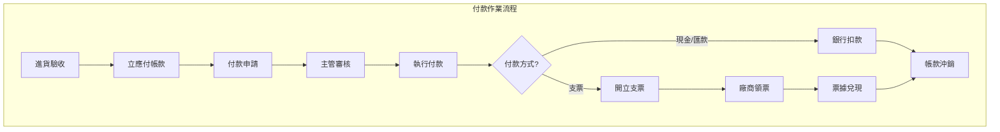
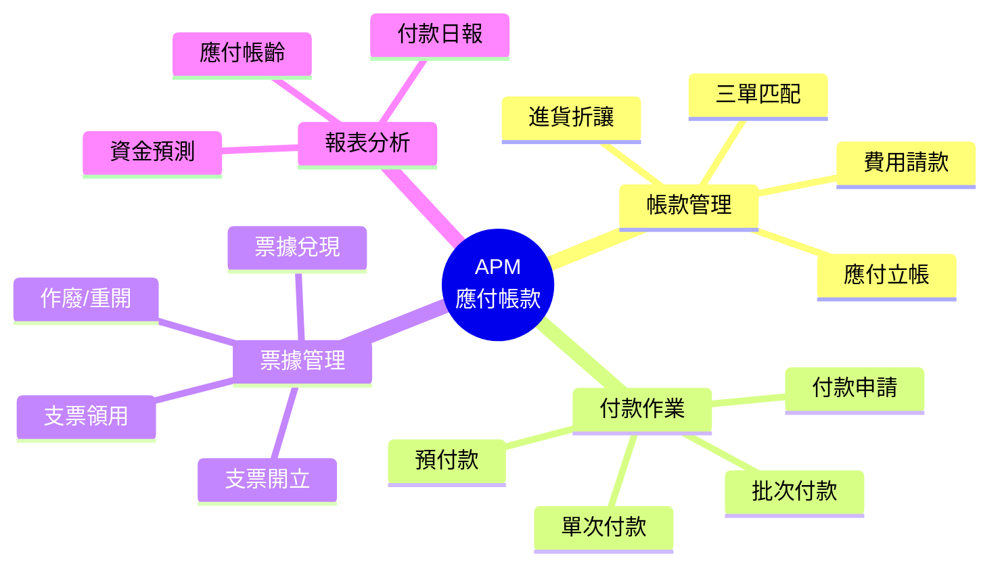
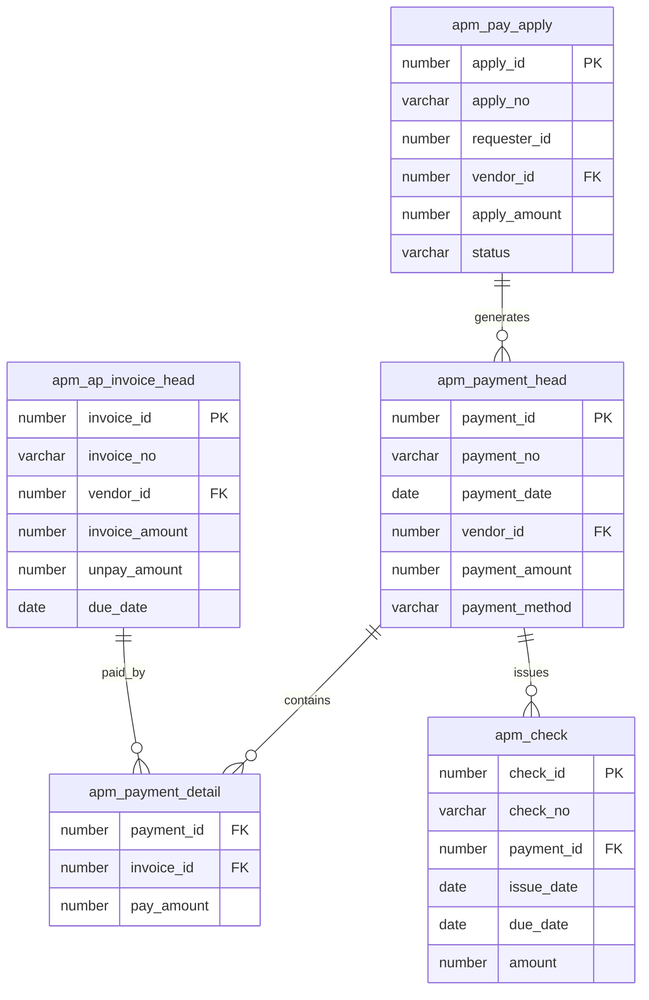

# APM 應付帳款管理系統 (Accounts Payable Management System)

## 系統概述

APM (Accounts Payable Management) 負責管理企業的對外付款作業，從應付帳款的立帳、付款申請、審核、開立支票或匯款到預付款管理，確保付款流程的合規性與資金調度的效率。

### 系統目的
- 應付帳款立帳 (Invoice)
- 付款申請與審核 (Payment Application)
- 付款作業與沖銷 (Payment & Apply)
- 應付票據管理 (Check Management)
- 預付款管理
- 進貨折讓處理
- 帳齡分析與資金預測

---

## 資料庫架構

### 一、應付帳款 (AP Invoice)

#### 1.1 應付帳款主檔

##### apm_ap_invoice_head - 應付帳款主檔
```sql
主要欄位:
- invoice_id (PK): 帳款ID
- invoice_no: 帳款單號（通常為供應商發票號）
- invoice_date: 帳款日期
- vendor_id: 供應商ID
- department_id: 採購部門ID
- currency_id: 幣別ID
- exchange_rate: 匯率
- invoice_amount: 帳款金額
- tax_amount: 稅額
- total_amount: 總金額
- unpay_amount: 未付金額
- due_date: 到期日
- purchase_order_id: 來源採購單ID
- receiving_id: 來源進貨單ID
- status: 狀態
```

**功能說明:**
- 應付帳款立帳
- 勾稽 PRM 進貨驗收單
- 三單匹配核對 (PO/Receiving/Invoice)

##### apm_ap_invoice_detail - 應付帳款明細
```sql
主要欄位:
- invoice_id: 帳款ID
- line_no: 行號
- expense_account_id: 費用/存貨科目ID
- amount: 金額
- project_id: 專案ID
- cost_center_id: 成本中心ID
```

**功能說明:**
- 帳款明細與科目分配
- 費用歸屬

---

### 二、付款管理 (Payment Processing)

#### 2.1 付款申請

##### apm_pay_apply - 付款申請單
```sql
主要欄位:
- apply_id (PK): 申請ID
- apply_no: 申請單號
- apply_date: 申請日期
- requester_id: 申請人ID
- vendor_id: 供應商ID
- apply_amount: 申請金額
- due_date: 預計付款日
- payment_method: 付款方式（匯款/支票/現金）
- status: 狀態（送審/核准/已付款）
```

**功能說明:**
- 內部付款請款流程
- 主管審核機制
- 選擇欲支付的應付帳款

#### 2.2 付款作業

##### apm_payment_head - 付款主檔
```sql
主要欄位:
- payment_id (PK): 付款ID
- payment_no: 付款單號
- payment_date: 付款日期
- vendor_id: 供應商ID
- bank_account_id: 付款銀行帳號
- payment_amount: 付款總額
- payment_method: 付款方式
- check_no: 支票號碼（若為支票付款）
- status: 狀態
```

**功能說明:**
- 實際執行付款
- 產生銀行存款支付傳票
- 支援批次付款

##### apm_payment_detail - 付款沖銷明細
```sql
主要欄位:
- payment_id: 付款ID
- invoice_id: 沖銷帳款ID
- pay_amount: 支付金額
- discount_amount: 現金折扣金額
```

**功能說明:**
- 指定沖銷應付帳款
- 記錄沖銷金額

---

### 三、票據管理 (Check Management)

#### 3.1 應付票據

##### apm_check - 應付票據主檔
```sql
主要欄位:
- check_id (PK): 票據ID
- check_no: 支票號碼
- bank_account_id: 銀行帳號
- vendor_id: 受款人
- issue_date: 開票日
- due_date: 到期日
- amount: 金額
- status: 狀態（開立/已領取/兌現/作廢）
```

**功能說明:**
- 應付支票管理
- 支票列印
- 票據兌現追蹤

#### 3.2 票據異動

##### apm_check_process - 票據異動
```sql
功能說明:
- 領票記錄
- 兌現過帳
- 作廢重開
```

---

### 四、預付款管理 (Prepayment)

#### 4.1 預付貨款

##### apm_prepay - 預付款主檔
```sql
主要欄位:
- prepay_id (PK): 預付ID
- prepay_no: 預付單號
- prepay_date: 預付日期
- vendor_id: 供應商ID
- po_id: 關聯採購單ID
- amount: 預付金額
- balance: 未沖金額
```

**功能說明:**
- 採購訂金或預付貨款
- 後續進貨立帳時沖抵

---

### 五、折讓與調整 (Allowance & Adjustment)

#### 5.1 進貨折讓

##### apm_discount_invoice_head - 用款/折讓單 (Debit Note)
```sql
主要欄位:
- discount_id (PK): 折讓ID
- discount_no: 折讓單號
- vendor_id: 供應商ID
- invoice_id: 原帳款ID
- amount: 折讓金額
- reason: 原因
```

**功能說明:**
- 進貨退回或折讓處理
- 沖減應付帳款

---

## 主要程式套件 (Packages)

### 1. apm_invoice_pkg
**功能:**
- 應付立帳處理
- 三單匹配核對
- 傳票產生

**主要程序:**
```sql
- create_invoice: 建立應付帳款
- validate_invoice: 校驗發票
- post_invoice: 過帳
```

### 2. apm_payment_pkg
**功能:**
- 付款處理
- 沖銷作業
- 票據處理

**主要程序:**
```sql
- create_payment: 建立付款
- apply_invoice: 沖銷帳款
- void_payment: 作廢付款
```

---

## 主要函數 (Functions)

### 餘額查詢
- `f_apm_get_unpay_amount`: 取得帳款未付金額
- `f_apm_get_vendor_balance`: 取得供應商總應付餘額

### 資金預測
- `f_apm_get_cash_requirement`: 計算未來資金需求
- `f_apm_calc_due_date`: 計算到期日（依付款條件）

---

## 系統流程

### 1. 應付立帳流程
```
1. PRM 進貨驗收
2. 收到供應商發票
3. 建立應付帳款 (apm_ap_invoice_head)
4. 核對採購與驗收單 (三單匹配)
5. 帳款過帳 (Dr. 進貨成本/存貨 / Cr. 應付帳款)
```

### 2. 付款申請流程
```
1. 查詢到期帳款
2. 建立付款申請單 (apm_pay_apply)
3. 選擇欲支付帳款
4. 主管審核核准
```

### 3. 付款作業流程
```
1. 依核准申請單執行付款 (apm_payment_head)
2. 開立支票或準備匯款
3. 沖銷應付帳款 (apm_payment_detail)
4. 付款過帳 (Dr. 應付帳款 / Cr. 應付票據或銀行存款)
```

### 4. 預付與沖銷流程
```
1. 建立預付款申請
2. 執行預付款 (Dr. 預付貨款 / Cr. 銀行存款)
3. 後續進貨立帳
4. 執行預付沖銷 (Dr. 應付帳款 / Cr. 預付貨款)
```

---

## 系統特色

1. **三單匹配**: 嚴格的採購、驗收、發票核對機制，防止溢付
2. **付款排程**: 依到期日自動建議付款清單，優化資金調度
3. **多幣別付款**: 完整的外幣付款與匯損益處理
4. **預付沖銷**: 自動化的預付款與發票沖銷機制
5. **票據列印**: 整合支票列印功能

---

## 整合介面

### 1. 與 PRM (採購) 整合
```
PRM 進貨/驗收 → 產生 APM 應付帳款
```

### 2. 與 GLM (總帳) 整合
```
應付立帳 → 產生傳票
付款沖帳 → 產生傳票
票據兌現 → 產生傳票
```

### 3. 與 Tax (稅務) 整合
```
進項發票 → 營業稅申報資料
```

---

## 關鍵控制點

### 1. 付款控制
- 禁止重複付款
- 付款金額不得大於應付餘額
- 簽核權限控制

### 2. 單據匹配
- 發票與驗收單金額差異容許值設定
- 無驗收單之費用請款檢核

### 3. 票據保管
- 空白支票號碼連號管理
- 作廢支票實體控管

---

## 文件資訊

- **系統代碼**: APM
- **系統名稱**: Accounts Payable Management System (應付帳款管理系統)
- **資料來源**: s:\mis\apm\
- **建立日期**: 2026-01-21
- **文件版本**: 1.0

---

## 系統圖表 (System Diagrams)

### 1. 系統流程圖 (Flowchart)



### 2. 系統功能心智圖 (Mindmap)



### 3. 實體關聯圖 (ER Diagram)



