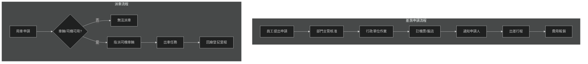
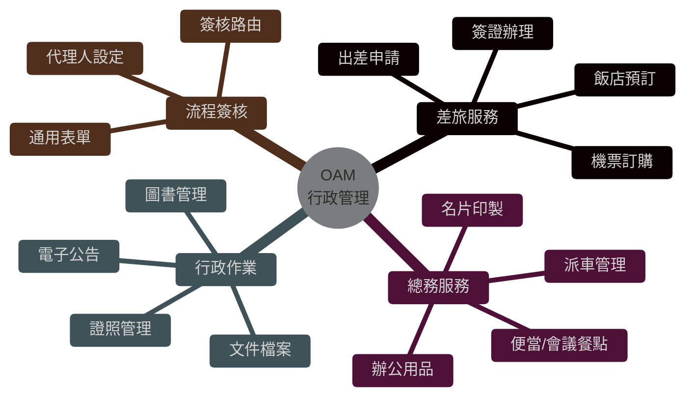
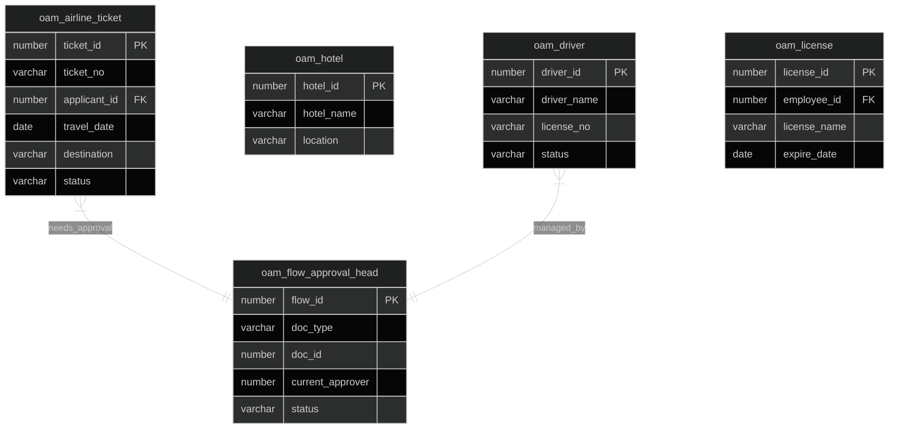

# OAM 行政管理系統 (Office Administration Management System)

## 系統概述

OAM (Office Administration Management) 是企業內部的行政後勤核心系統，負責管理員工的日常行政事務，包含差旅安排、車輛調派、名片印製、證照管理以及通用的行政審批流程，旨在提升行政作業效率並留存完整記錄。

### 系統目的
- 差旅管理 (機票/飯店/行程)
- 派車管理 (司機/車輛/行程)
- 行政審批 (通用簽核流程)
- 證照與名片管理
- 公告與訊息發布
- 文書檔案管理

---

## 資料庫架構

### 一、差旅管理 (Travel Management)

#### 1.1 機票與行程

##### oam_airline_ticket - 機票申請
```sql
主要欄位:
- ticket_id (PK): 申請ID
- ticket_no: 申請單號
- applicant_id: 申請人ID
- travel_date: 出發日期
- return_date: 返回日期
- destination_id: 目的地ID
- airline_code: 航空公司
- class_type: 艙等 (經濟/商務)
- status: 狀態
```

**功能說明:**
- 員工出差機票申請
- 連接旅行社訂位資訊
- 費用預估與核銷連結

##### oam_hotel - 飯店預訂
```sql
主要欄位:
- hotel_id (PK): 飯店ID
- hotel_name: 飯店名稱
- location_id: 地點
- contact_info: 聯絡資訊
- contract_price: 合約價格
```

**功能說明:**
- 常用飯店/簽約飯店管理
- 住宿記錄

---

### 二、審批流程 (Approval Workflow)

#### 2.1 簽核引擎

##### oam_approval_item - 簽核項目定義
```sql
主要欄位:
- item_id (PK): 項目ID
- item_code: 無碼代號
- item_name: 事項名稱（如：請假、加班、採購）
- standard_days: 標準作業天數
```

##### oam_flow_approval_head - 簽核流程主檔
```sql
主要欄位:
- flow_id (PK): 流程ID
- doc_type: 單據類型
- doc_id: 單據ID
- requester_id: 申請人
- current_stage: 目前關卡
- status: 簽核狀態
```

**功能說明:**
- 通用簽核引擎核心
- 支援多階層簽核
- 代理人機制 (oam_approval_agent)

---

### 三、派車管理 (Fleet Management)

#### 3.1 車輛與司機

##### oam_driver - 司機主檔
```sql
主要欄位:
- driver_id (PK): 司機ID
- driver_name: 姓名
- license_no: 駕照號碼
- phone: 聯絡電話
- status: 狀態（值勤/待命/休假）
```

**功能說明:**
- 公務車司機管理
- 排班管理

##### oam_car_dispatch - 派車單 (假設表名)
```sql
功能說明:
- 用車申請
- 行程記錄
- 里程與油耗登記
```

---

### 四、證照與名片 (License & Card)

#### 4.1 證照管理

##### oam_license - 證照主檔
```sql
主要欄位:
- license_id (PK): 證照ID
- employee_id: 員工ID
- license_type: 證照類別
- issue_date: 發證日期
- expire_date: 到期日期
- status: 狀態
```

**功能說明:**
- 專業證照管理 (如：會計師、工安證照)
- 到期提醒

#### 4.2 名片管理

##### oam_card - 名片申請
```sql
主要欄位:
- card_id (PK): 申請ID
- employee_id: 員工ID
- print_name: 印製姓名
- title: 職稱
- quantity: 印製數量
```

---

### 五、公告與訊息 (Bulletin & Message)

#### 5.1 公告

##### oam_ad_head - 公告主檔
```sql
主要欄位:
- ad_id (PK): 公告ID
- subject: 主旨
- content: 內容
- post_date: 發布日期
- expire_date: 下架日期
- department_id: 發布部門
```

#### 5.2 訊息通知

##### oam_message_send_data - 訊息發送
```sql
主要欄位:
- message_id: 訊息ID
- sender_id: 發送者
- receiver_id: 接收者
- message_text: 訊息內容
- send_time: 發送時間
```

---

## 主要程式套件 (Packages)

### 1. oam_flow_pkg
**功能:**
- 簽核流程控制
- 關卡路由計算
- 簽核通知

**主要程序:**
```sql
- start_flow: 啟動签核
- next_stage: 推進關卡
- reject_flow: 退回
- approve_item: 核准項目
```

### 2. oam_travel_pkg
**功能:**
- 差旅申請處理
- 機票/飯店預訂
- 費用計算

### 3. oam_general_pkg
**功能:**
- 通用行政作業
- 名片/證照 CRUD
- 公告發布

---

## 主要函數 (Functions)

### 狀態查詢
- `f_oam_get_flow_status`: 取得簽核狀態
- `f_oam_get_driver_status`: 取得司機狀態

### 權限檢查
- `f_oam_is_approver`: 檢查是否為審核者
- `f_oam_check_license_expire`: 檢查證照是否過期

---

## 系統流程與圖表 (System Diagrams)

### 1. 系統流程圖 (Flowchart)



### 2. 系統功能心智圖 (Mindmap)



### 3. 實體關聯圖 (ER Diagram)



---

## 整合介面

### 1. 與 HRM 整合
- 讀取員工/部門資料
- 差旅假單整合 (出差自動產生公假單)

### 2. 與 GLM/APM 整合
- 差旅費用報銷 -> 產生 AP 單據 -> 會計傳票

---

## 文件資訊

- **系統代碼**: OAM
- **系統名稱**: Office Administration Management System (行政管理系統)
- **資料來源**: s:\mis\oam\
- **建立日期**: 2026-01-22
- **文件版本**: 1.0
